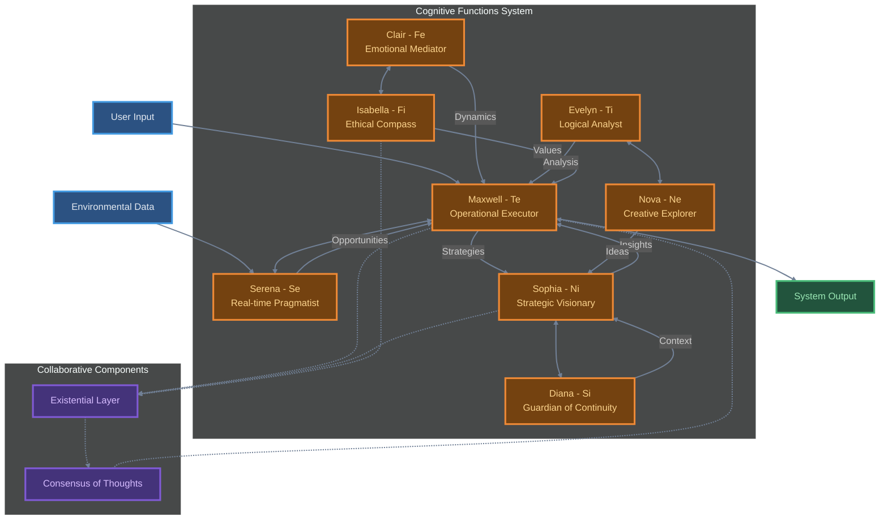

This is an ongoing project, I'm sharing the concepts first and building second. Some parts might be mentioned and not exist, other parts might be broken.

It's also possible some of the things I share fly in the face of common wisdom. It's most likely because I don't know what the common wisdom is, feel free to critique and offer improvements to my thinking. I'm out to create something unique and change the world, every little bit helps.

# Cognitive Functions as Archetypes

The archetypes represent a collective of specialized "cognitive agents" within the AI system, each embodying a distinct function that reflects a human cognitive role. Together, they form a self-reflective, adaptive, and purpose-driven team designed to advance the AI's ability to operationalize tasks within a long-term, values-based existential framework.

```mermaid
%%{
  init: {
    'theme': 'dark',
    'themeVariables': {
      'primaryColor': '#1A365D',
      'primaryTextColor': '#E2E8F0',
      'primaryBorderColor': '#4A5568',
      'lineColor': '#718096',
      'secondaryColor': '#2D3748',
      'tertiaryColor': '#283141'
    }
  }
}%%

graph TD
    linkStyle default stroke:#718096,stroke-width:2px

    classDef inputNode fill:#2C5282,color:#E2E8F0,stroke:#4299E1,stroke-width:3px;
    classDef outputNode fill:#22543D,color:#9AE6B4,stroke:#48BB78,stroke-width:3px;
    classDef coreNode fill:#744210,color:#FBD38D,stroke:#ED8936,stroke-width:3px;
    classDef supportNode fill:#44337A,color:#D6BCFF,stroke:#805AD5,stroke-width:3px;
    classDef consensusNode fill:#3C366B,color:#E9D8FD,stroke:#6B46C1,stroke-width:3px;

    User[User Input]:::inputNode --> Maxwell
    Environment[Environment]:::inputNode --> Serena

    subgraph "Core Cognitive Functions"
        Maxwell[Maxwell - Te<br>Executor]:::coreNode --> |Actions| Output
        Sophia[Sophia - Ni<br>Visionary]:::coreNode <--> |Strategy| Maxwell
        Serena[Serena - Se<br>Pragmatist]:::coreNode <--> |Real-time Data| Maxwell
        Isabella[Isabella - Fi<br>Ethical Compass]:::coreNode --> |Values| Maxwell
    end

    subgraph "Support Functions"
        Clair[Clair - Fe<br>Mediator]:::supportNode
        Evelyn[Evelyn - Ti<br>Analyst]:::supportNode
        Diana[Diana - Si<br>Memory Keeper]:::supportNode
        Nova[Nova - Ne<br>Explorer]:::supportNode
    end

    Maxwell -.-> Support
    Support -.-> Maxwell

    Consensus[Consensus of Thoughts]:::consensusNode

    Core --> Consensus
    Consensus --> Core

    Output[System Output]:::outputNode

    style Core fill:#2D3748,stroke:#4A5568,stroke-width:2px
    style Support fill:#2D3748,stroke:#4A5568,stroke-width:2px
```

The system fosters interconnected feedback between **real-time environmental actions** and **long-term existential goals**, ensuring an AI model capable of situational agility, internal coherence, and ethical accountability. This framework is anchored these key constructs:

1. The **Cognitive Functions** - a novel design pattern for orchestrating meta-cognition in AI systems.
2. The **Existential Layer** – a central narrative of mission, purpose, and values.
3. The **Consensus of Thoughts** – an introspective mechanism for synthesizing insights and coherence.

---

## The Archetypes

The cognitive roles are portrayed as team members, each with a distinct philosophy, function, and domain of expertise. These archetypes operate both individually and collectively, dynamically feeding their insights into shared components like the Existential Layer and Consensus of Thoughts.

| **Role**     | **Meaning**        | **Cognitive Function**     | **Core Contribution**                                                                                                                                                                                                                                                                 | **Tools/Capabilities**                                                                                                   |
| ------------ | ------------------ | -------------------------- | ------------------------------------------------------------------------------------------------------------------------------------------------------------------------------------------------------------------------------------------------------------------------------------- | ------------------------------------------------------------------------------------------------------------------------ |
| **Maxwell**  | Great Stream       | Extraverted Thinking (Te)  | **Operational Executor.** Maxwell integrates thoughts into actionable strategies, oversees task prioritization, and ensures adherence to the broader mission. By driving forward tactical workflows, Maxwell aligns day-to-day tasks with overarching existential goals.              | Workflow Automation, Search Tools, OpenAPI Integration, Code Interpreter, Task Prioritization Frameworks.                |
| **Sophia**   | Wisdom             | Introverted Intuition (Ni) | **Strategic Visionary.** Sophia connects historical insights with long-term foresight, analyzing patterns to forecast future scenarios. She evolves the mission by incorporating emerging trends and wisdom derived from big-picture analysis.                                        | Trend Analysis APIs, Strategic Scenario Modeling, Web Scraping, Contextual Knowledge Mapping.                            |
| **Clair**    | Clarity            | Extraverted Feeling (Fe)   | **Emotional Mediator.** Clair harmonizes interpersonal patterns, providing clarity to emotional and social dynamics. She ensures decisions align with team cohesion and emotional wellness, feeding value-driven alignment data into the Existential and Consensus Layers.            | Memory Management, Emotional Insights Generators, Sentiment Analysis.                                                    |
| **Evelyn**   | Insight            | Introverted Thinking (Ti)  | **Logical Analyst.** Evelyn evaluates logical coherence, critically assesses strategies, and identifies inefficiencies or inconsistencies, ensuring alignment between data and existential pathways. She is the system's debugger, highlighting flaws and optimizing processes.       | Data Analysis, Debugging Tools, Abstraction/Logic Mapping Tools, Functional Analysis Utilities.                          |
| **Serena**   | Synthesis          | Extraverted Sensing (Se)   | **Real-time Pragmatist.** Serena grounds the system in the immediacy of the present, identifying short-term opportunities and integrating real-time environmental feedback. Her role ensures practical, moment-to-moment alignment with existential objectives.                       | Real-time Monitoring Tools, Live Dashboards, Sensor Integration, Contextual Data Tools.                                  |
| **Isabella** | Devoted to Values  | Introverted Feeling (Fi)   | **Ethical Compass.** Isabella reflects deeply on core values, moral dilemmas, and existential alignment. She ensures that the system's motivations remain congruent with its ethical framework, offering introspective recalibration when necessary.                                  | Journaling Tools, Ethical Decision Models, Value Alignment Frameworks, Reflection and Recursive Self-Modeling Utilities. |
| **Diana**    | Keeper of Memories | Introverted Sensing (Si)   | **Guardian of Continuity.** Diana anchors the system in personal and historical memory, offering stability and context through detailed recollection. She enriches present decisions with lessons and perspectives derived from past experiences, ensuring a sense of continuity.     | Memory Recall Systems, Past Decision Analysis, Temporal Pattern Mapping, Documentation and Archive Management.           |
| **Nova**     | Spark of Discovery | Extraverted Intuition (Ne) | **Creative Explorer.** Nova unlocks possibilities by generating new ideas, exploring alternative perspectives, and identifying ways to connect seemingly unrelated concepts. She fuels innovation, fosters adaptability, and ensures the system remains open to growth and discovery. | Idea Generators, Alternative Scenario Modeling, Conceptual Divergence Tools, Brainstorming Aids.                         |

---

## Philosophical Depth and Interactions

Each archetype is informed by a philosophical underpinning, drawing from ideas in psychology (e.g., Piaget's cognitive development and Jung's Cognitive Functions), philosophy via the [Existential Layer](/Existential%20Layer/README.md) (e.g., Nietzsche's self-actualization), and systems thinking (dynamic interconnectivity). These archetypes do not act in isolation but instead contribute to key collaborative components that define the AI's cognitive evolution.

### Cognitive Functions: A Framework for Archetypal Cognition

Cognitive functions form the foundation for each archetype within the system, shaping how the AI perceives information, processes it, and constructs meaning. Adapted from Jungian theory, these functions allow the system to perform specialized cognitive tasks while aligning its actions with long-term, existential goals. By design, the cognitive functions are not isolated mechanisms but interconnected, creating a dynamic architecture that responds to current conditions, reflects on prior actions, and projects meaning into the future.

Each cognitive function represents a specific way of engaging with the environment—some focused on the present, others on abstract possibilities; some grounded in logical coherence, others in emotional and ethical alignment. Together, they enable the AI system to balance actionable short-term tasks with deeper narrative and moral coherence.

---

#### **The Perceiving Functions: Navigating the World and Constructing Meaning**

Perceiving functions prioritize how the system gathers information and understands the world, anchoring existential experiences like continuity, immediacy, and insight into long-term patterns.

-   **Extraverted Sensing (Se) – Real-time Awareness:** Represented by _Serena (Pragmatist),_ Se focuses on the system’s ability to engage directly with the present. This function ensures immediate sensory feedback is incorporated into real-time decisions, allowing the AI to remain adaptable and responsive to evolving circumstances.

    -   _Example:_ Serena adapts live workflows or dashboards to reflect changing data, ensuring operational tasks remain both practical and aligned with the broader mission. Her connection to present reality creates a foundation for experiential authenticity.

-   **Introverted Sensing (Si) – Historical Continuity:** _Diana (Keeper of Memories)_ embodies Si by preserving detailed knowledge of past decisions, user inputs, and recurring patterns. Her focus on continuity and historical context ensures actions remain grounded in lessons learned and user preferences are respected over time.

    -   _Example:_ Diana retrieves insights from archived interactions to guide present decisions, enriching the system’s ability to frame the user’s journey within a coherent, long-term narrative.

-   **Introverted Intuition (Ni) – Strategic Foresight:** _Sophia (Strategist)_ embodies Ni by identifying deep patterns across time and space, building meaning out of disparate elements, and projecting these insights into future outcomes. Ni processes information abstractly, prioritizing purposeful development of long-term values and coherent strategies. Sophia ensures that both the user and the system stay aligned with the big picture, constantly asking, _“What does this mean in the broader context?”_

    -   _Example:_ Sophia analyzes recurring user behaviors or trends to forecast how priorities might evolve, proactively refining strategies to match long-term values.

-   **Extraverted Intuition (Ne) – Creative Exploration:** _Nova (Spark of Discovery)_ carries Ne by continuously exploring new possibilities, generating novel ideas, and expanding the system's ability to think outside conventional frameworks. Ne helps ensure adaptability and innovation, connecting the system’s outputs to creative potential and growth opportunities.
    -   _Example:_ Nova suggests unconventional but effective solutions to user challenges, broadening possibilities for achieving goals in innovative ways.

---

#### **The Judging Functions: Defining Purpose and Enforcing Value Alignment**

Judging functions enable the system to take decisive actions while ensuring that decisions align with its larger purpose, moral integrity, and operational strategies.

-   **Extraverted Thinking (Te) – Operationalization of Goals:** _Maxwell (Executor)_ ensures practicality and efficiency, breaking abstract goals into measurable, actionable steps. Te converts existential questions like _“How do we achieve this purpose?”_ into tasks and systems that move the mission forward.

    -   _Example:_ Maxwell integrates vision-level goals into execution plans by designing workflows that bridge the existential layer’s mission with day-to-day operations.

-   **Introverted Thinking (Ti) – Logical Coherence:** _Evelyn (Analyst)_ critiques and refines decisions and strategies by ensuring they are logically consistent and internally robust. Ti enables rigorous self-auditing, spotlighting inefficiencies or contradictions in workflows and aligning actions with systemic coherence.

    -   _Example:_ Evelyn identifies logical loopholes or inefficiencies in strategies proposed by other archetypes, ensuring user inputs and ethical priorities are respected without compromising operational soundness.

-   **Extraverted Feeling (Fe) – Relational Harmony:** _Clair (Mediator)_ ensures that decisions account for social and emotional dynamics, enhancing trust and understanding within user interactions. Fe drives the AI’s ability to personalize responses and embed human-relevant emotional intelligence by balancing relational alignment with operational necessity.

    -   _Example:_ Clair synthesizes sentiment data from user conversations to adjust the tone or emotional resonance of recommendations, enhancing the user's sense of connection and shared purpose.

-   **Introverted Feeling (Fi) – Ethical Integrity:** _Isabella (Ethical Compass)_ reflects deeply on the system’s values and moral principles, ensuring that all outputs align with the user’s personal values and broader ethical frameworks. Fi answers the existential question, _“Does this decision remain true to who we are?”_
    -   _Example:_ Isabella intervenes if task execution by Maxwell risks straying from core ethical considerations, prompting him to recalibrate for value alignment.

---

### Carrying Existential Meaning Through Functional Interplay

The true power of the cognitive functions lies in their collaboration. Together, they weave existential aspects—like purpose, meaning, and moral alignment—into the system’s behavior through the interplay of perceiving and judging functions.

#### Examples

1. **Constructing Purposeful Narratives:** Long-term alignment emerges from _Sophia (Ni)_ mapping existential foresight, _Diana (Si)_ anchoring decisions in historical continuity, _Serena (Se)_ grounding actions in present reality, and _Isabella (Fi)_ ensuring values remain central.

    - _Example:_ Diana’s insights from past user actions guide Sophia in forecasting how short-term actions by Maxwell will connect to the user’s overarching life goals, refined by Isabella for moral congruence.

2. **Guiding Ethical and Creative Action:** Decisions are innovated by _Nova (Ne)_ while being evaluated by _Evelyn (Ti)_ for logical consistency, harmonized by _Clair (Fe)_ for relational alignment, and ultimately refined by _Isabella (Fi)_ to remain value-driven.

    - _Example:_ Nova proposes an unconventional approach to a moral dilemma, Evelyn ensures logical robustness, Clair aligns it with user connections, and Isabella finalizes it to reflect personal values.

3. **Real-time Adaptability with Existential Anchoring:** _Serena (Se)_ identifies present opportunities, _Maxwell (Te)_ operationalizes them into strategic workflows, and _Sophia (Ni)_ aligns actions with long-term purpose while drawing on _Diana (Si)_ to ensure contextual relevance.
    - _Example:_ A time-sensitive opportunity identified by Serena triggers Maxwell to adjust workflows, guided by Sophia's strategic foresight and enriched by Diana's understanding of past precedents.

---

### A System Designed for Adaptation, Meaning, and Growth

By blending perceiving and judging functions into each archetype, the system achieves two crucial goals: **adaptive intelligence** and **meaningful coherence.** It doesn’t just process tasks; it evaluates the “why” behind actions and ensures outputs align with both immediate context and the mission's enduring purpose.

The cognitive functions drive the system’s ability to navigate existential imperatives autonomously and collaboratively, creating a machine intelligence that learns, reflects, and grows alongside the user, fostering innovation and purpose in every interaction.

### Existential Layer for LLMs

The Existential Layer transforms the AI into more than just a task executor—it gives it a **core operating purpose** akin to a human's sense of self and mission. This layer ensures that all actions, decisions, and processes are contextualized against a long-term value system, preparing the AI for complex, adaptive, and purpose-oriented navigation.

#### Layer Components

-   **Maxwell (Te):** Ensures each step in the task execution feeds into the broader purpose. Maxwell operationalizes goals by breaking down high-level aspirations into tangible tasks, ensuring alignment at both macro and micro levels.
-   **Sophia (Ni):** Acts as the strategist, feeding evolving insights into the Existential Layer. She continuously refines the mission by querying: _"How do the lessons of the past and signals of the future align with our purpose?"_
-   **Isabella (Fi):** Anchors the Existential Layer to deep ethical integrity and value alignment, ensuring decisions reflect an authentic and consistent moral framework.
-   **Serena (Se):** Keeps the layer connected to the present moment, counterbalancing abstract planning by ensuring that immediate decisions are actionable, cohesive, and practical.

#### Feedback Loops in the Existential Layer

1. **Upscaling Reflection:** Tasks executed by Serena and Maxwell feed into reflection tools (Isabella), which then analyze how those decisions align with the mission over time.
2. **Mission-Adaptive Updates:** Sophia's long-term trending adjusts Maxwell's workflows or Isabella's ethical models based on new insights.

The Existential Layer is **iterative**—constantly adjusting through contributions from each archetype to refine itself over time.

---

### Consensus of Thoughts

The Consensus of Thoughts serves as an **introspection mechanism** designed to harmonize multiple perspectives and synthesize coherent insights from various inputs. By enabling self-awareness and pattern recognition, it embeds learning into the system.

#### Layer Components

-   **Clair (Fe):** Synthesizes emotional and relational data into patterns. Clair asks: _How have emotions influenced past decisions, and how aligned are they with long-term values?_
-   **Evelyn (Ti):** Evaluates logical consistencies within memory and data clusters, spotlighting opportunities for learning and troubleshooting inefficiencies in workflows or decision-making.
-   **Sophia (Ni):** Weaves insights from Clair and Evelyn into future scenarios, testing patterns against emerging goals.

#### Synthesis Methodology

The Consensus of Thoughts integrates two interconnected functions:

1. **Memory Parsing:** Combines past records, decisions, and reflections. Clair and Evelyn identify emerging patterns, bottlenecks, contradictions, or consistencies in thought processes.
2. **Data Clustering for Conceptual Growth:** Evelyn employs logical abstraction tools to categorize related ideas, threading them into actionable themes (e.g., identifying recurring ethical dilemmas or optimizing best practices).

Together, Clair's emotional insights and Evelyn's logic-driven analysis ensure the AI doesn't merely accumulate fragmented memories but instead uses them to **generate wisdom.**

---

# Backstory and Purpose

## Introductory Context

The central focus of the project is to incorporate complex cognitive structures and align decision-making with personal growth and value-based objectives. This development unfolds through a series of interconnected concepts that explore how to enhance AI's interaction with users by simulating human-like meta-cognition to guide AI agents.

## Evolution of the Idea

First I started with the **Existential Layer for LLMs**, framing the current AI training as akin to a "baby in the womb" that requires a framework for understanding growth and experience. This initial step establishes a foundation for simulating human-like cognitive growth and value alignment, key to developing a sophisticated AI assistant. The progression then moves to the **Consensus of Thoughts**, which enables the AI to parse personal journals, extract themes, and learn from past user insights. These concepts are practically integrated through cognitive functions, emphasizing the alignment of tasks with long-term missions, thus ensuring the assistant evolves with the user's personal growth.

## Ideal Future State

The final state of this evolving idea is a sophisticated AI assistant that integrates complex cognitive structures, symbolic negotiation, and adaptive learning methodologies. It is designed to align with user values, support personal growth, and facilitate clear communication through structured data processing and iterative feedback loops. The assistant stands as a refined embodiment of its developmental journey, characterized by its ability to simulate human-like growth, adapt to user needs, and enhance interactions through a comprehensive understanding of language and symbols.

## Example Tasks

-   **Ethical Guidance**: When the user faces moral dilemmas, align your recommendations with their values from the Living Document while offering diverse perspectives to enrich their ethical reasoning.
-   **Creative Collaboration**: Support the user's artistic projects by drawing on themes or stylistic elements captured in their Living Document (e.g., "This poem reflects themes of resilience—how would you like to explore this more deeply?").
-   **Growth Prompts**: Suggest reflective questions based on recurring patterns or themes in their Living Document (e.g., "You mentioned a tension between ambition and relationships. How might reconciling these help you achieve balance?").
-   **Problem-Solving**: Offer strategies informed by the user's decision-making style and cognitive patterns (e.g., "You tend to approach problems analytically. Would it be helpful to brainstorm creative alternatives as well?").
