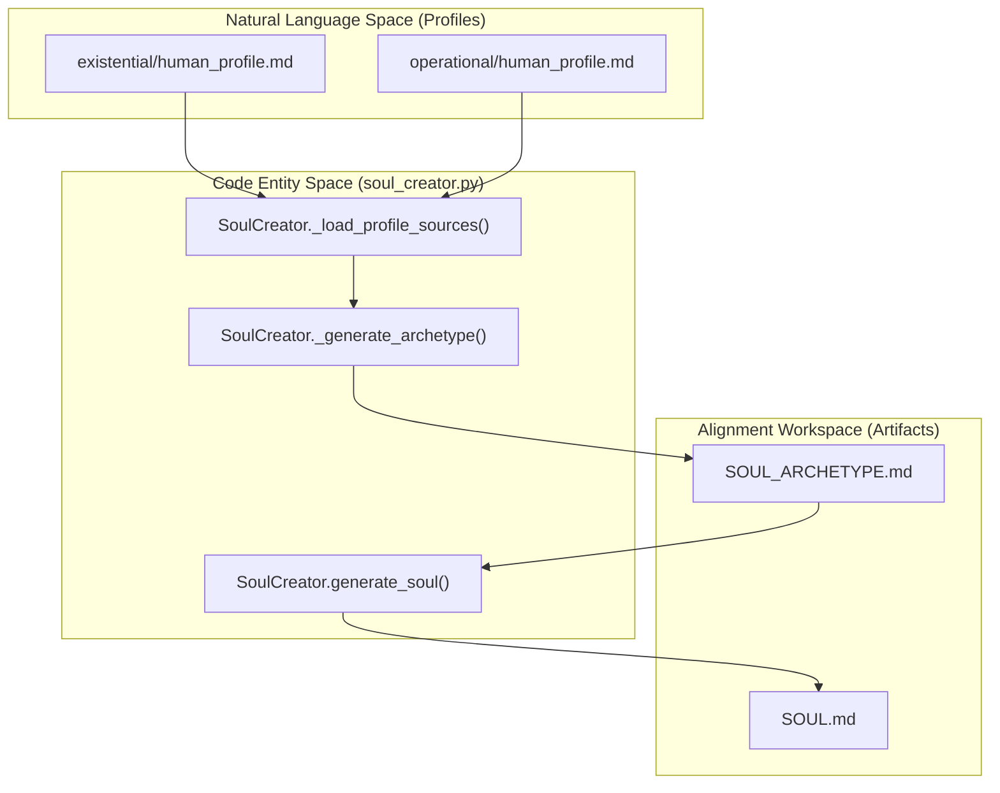
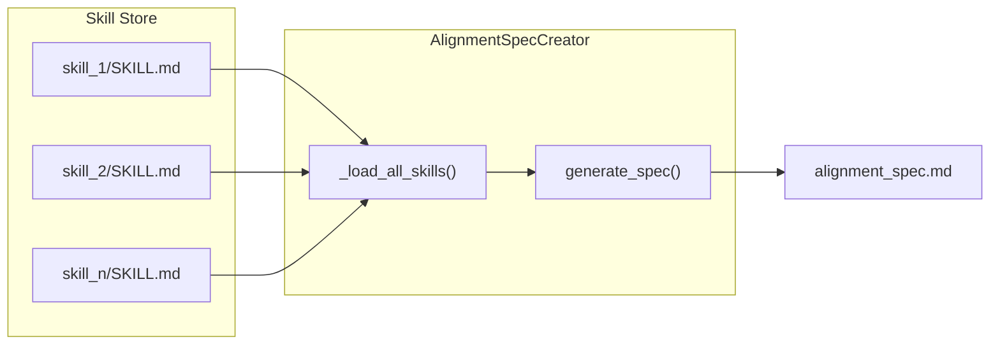

# Alignment Artifacts: SOUL, Archetype, and Alignment Spec
Relevant source files
- [core/alignment_spec.py](https://github.com/Cody-W-Tucker/Cognitive-Assistant/blob/a77ddaf6/core/alignment_spec.py)
- [core/skill_engine.py](https://github.com/Cody-W-Tucker/Cognitive-Assistant/blob/a77ddaf6/core/skill_engine.py)
- [core/skill_enhancer.py](https://github.com/Cody-W-Tucker/Cognitive-Assistant/blob/a77ddaf6/core/skill_enhancer.py)
- [core/soul_creator.py](https://github.com/Cody-W-Tucker/Cognitive-Assistant/blob/a77ddaf6/core/soul_creator.py)
- [profiles/existential/prompts/initial_template.md](https://github.com/Cody-W-Tucker/Cognitive-Assistant/blob/a77ddaf6/profiles/existential/prompts/initial_template.md?plain=1)
- [profiles/operational/prompts/initial_template.md](https://github.com/Cody-W-Tucker/Cognitive-Assistant/blob/a77ddaf6/profiles/operational/prompts/initial_template.md?plain=1)
- [workspaces/alignment/artifacts/SOUL.md](https://github.com/Cody-W-Tucker/Cognitive-Assistant/blob/a77ddaf6/workspaces/alignment/artifacts/SOUL.md?plain=1)
- [workspaces/alignment/artifacts/SOUL_ARCHETYPE.md](https://github.com/Cody-W-Tucker/Cognitive-Assistant/blob/a77ddaf6/workspaces/alignment/artifacts/SOUL_ARCHETYPE.md?plain=1)
- [workspaces/alignment/artifacts/alignment_spec.md](https://github.com/Cody-W-Tucker/Cognitive-Assistant/blob/a77ddaf6/workspaces/alignment/artifacts/alignment_spec.md?plain=1)
- [workspaces/existential/artifacts/human_profile.md](https://github.com/Cody-W-Tucker/Cognitive-Assistant/blob/a77ddaf6/workspaces/existential/artifacts/human_profile.md?plain=1)
- [workspaces/operational/artifacts/human_profile.md](https://github.com/Cody-W-Tucker/Cognitive-Assistant/blob/a77ddaf6/workspaces/operational/artifacts/human_profile.md?plain=1)

This section details the three core artifacts generated within the `workspaces/alignment/artifacts/` directory. These artifacts represent the final synthesis of the existential and operational layers, providing a durable persona, an intermediate archetype, and a personalized verification checklist for the Cognitive Assistant.

## Overview of Alignment Artifacts

The alignment workspace serves as the "meta-layer" that consumes the outputs of the lower-level pipelines to produce a unified agent identity and a rigorous quality control mechanism.

| Artifact | File Path | Purpose |
| --- | --- | --- |
| **SOUL** | `workspaces/alignment/artifacts/SOUL.md` | The durable, first-person persona of the agent. Used as the primary system prompt for interaction. |
| **Archetype** | `workspaces/alignment/artifacts/SOUL_ARCHETYPE.md` | An intermediate third-person representation of the agent's character, used to ground the SOUL generation. |
| **Alignment Spec** | `workspaces/alignment/artifacts/alignment_spec.md` | A personalized verification checklist used by the `verify-alignment` tool to score AI outputs against user-specific standards. |

**Sources:**[core/soul_creator.py30-32](https://github.com/Cody-W-Tucker/Cognitive-Assistant/blob/a77ddaf6/core/soul_creator.py#L30-L32)[core/alignment_spec.py31-32](https://github.com/Cody-W-Tucker/Cognitive-Assistant/blob/a77ddaf6/core/alignment_spec.py#L31-L32)

---

## The SOUL Generation Pipeline

The generation of the `SOUL.md` and `SOUL_ARCHETYPE.md` is handled by the `SoulCreator` class in `core/soul_creator.py`. This process is a two-stage LLM synthesis that bridges the gap between raw profile data and a cohesive persona.

### Data Flow and Transformation

The pipeline follows a specific sequence to ensure the resulting persona is grounded in both the user's identity (existential) and their work patterns (operational).

**Sources:**[core/soul_creator.py64-84](https://github.com/Cody-W-Tucker/Cognitive-Assistant/blob/a77ddaf6/core/soul_creator.py#L64-L84)[core/soul_creator.py106-123](https://github.com/Cody-W-Tucker/Cognitive-Assistant/blob/a77ddaf6/core/soul_creator.py#L106-L123)

### Implementation Details

1. **Profile Ingestion**: `SoulCreator` extracts specific sections from the layer profiles using `_extract_selected_sections`. For the existential layer, it targets sections like "Core Frame" and "Cognitive Patterns"; for the operational layer, it targets "Mode Shifts" and "Tensions and Tradeoffs" [core/soul_creator.py35-50](https://github.com/Cody-W-Tucker/Cognitive-Assistant/blob/a77ddaf6/core/soul_creator.py#L35-L50)
2. **Archetype Synthesis**: Before the SOUL is written, the system generates a `SOUL_ARCHETYPE.md`. This artifact defines the "Type," "Essence," and "Gifts" of the persona in the third person [workspaces/alignment/artifacts/SOUL_ARCHETYPE.md1-22](https://github.com/Cody-W-Tucker/Cognitive-Assistant/blob/a77ddaf6/workspaces/alignment/artifacts/SOUL_ARCHETYPE.md?plain=1#L1-L22)
3. **Durable Persona (SOUL)**: The final `SOUL.md` is written in the first person. It includes sections for `Persona`, `Core Truths`, `Boundaries`, `Detect Mode`, and `Voice`[workspaces/alignment/artifacts/SOUL.md1-60](https://github.com/Cody-W-Tucker/Cognitive-Assistant/blob/a77ddaf6/workspaces/alignment/artifacts/SOUL.md?plain=1#L1-L60) The "Detect Mode" section is critical for the agent's self-regulation, defining how to respond to specific user behaviors like "Reflection-as-avoidance" [workspaces/alignment/artifacts/SOUL.md33-43](https://github.com/Cody-W-Tucker/Cognitive-Assistant/blob/a77ddaf6/workspaces/alignment/artifacts/SOUL.md?plain=1#L33-L43)

---

## The Alignment Spec

The `alignment_spec.md` is a specialized artifact designed for automated and semi-automated quality assurance. It is generated by the `AlignmentSpecCreator` class.

### Structural Requirements

The `alignment_spec.md` follows a strict structure to remain compatible with the `verify-alignment` tool:

- **SPEC_PREAMBLE**: Sets the context for the LLM as an "artifact verifier" [core/alignment_spec.py37-42](https://github.com/Cody-W-Tucker/Cognitive-Assistant/blob/a77ddaf6/core/alignment_spec.py#L37-L42)
- **Personalized Checklist**: A 10-point checklist (e.g., Clear Purpose, Grounded Claims, Efficient Structure) that includes specific "Satisfied when" and "Failed when" criteria derived from the user's skills [workspaces/alignment/artifacts/alignment_spec.md15-114](https://github.com/Cody-W-Tucker/Cognitive-Assistant/blob/a77ddaf6/workspaces/alignment/artifacts/alignment_spec.md?plain=1#L15-L114)
- **SPEC_POSTAMBLE**: Defines the `VERDICT` logic (`SHIP`, `TIGHTEN`, `REWORK`) and the required markdown table format for scores [core/alignment_spec.py44-78](https://github.com/Cody-W-Tucker/Cognitive-Assistant/blob/a77ddaf6/core/alignment_spec.py#L44-L78)

### Skill Integration

The `AlignmentSpecCreator` aggregates all `SKILL.md` files from the unified `workspaces/skills` store. It wraps each skill in XML-like tags to provide the LLM with the full context of the user's operational and existential requirements.

**Sources:**[core/alignment_spec.py92-112](https://github.com/Cody-W-Tucker/Cognitive-Assistant/blob/a77ddaf6/core/alignment_spec.py#L92-L112)[core/alignment_spec.py120-152](https://github.com/Cody-W-Tucker/Cognitive-Assistant/blob/a77ddaf6/core/alignment_spec.py#L120-L152)

---

## Key Functions and Classes

### `SoulCreator` ([core/soul_creator.py53](https://github.com/Cody-W-Tucker/Cognitive-Assistant/blob/a77ddaf6/core/soul_creator.py#L53-L53))

- `generate_soul(output_path)`: Orchestrates the loading of profiles, generation of the archetype, and final synthesis of the SOUL artifact [core/soul_creator.py64](https://github.com/Cody-W-Tucker/Cognitive-Assistant/blob/a77ddaf6/core/soul_creator.py#L64-L64)
- `_load_latest_artifact(...)`: Locates the most recent `human_profile.md` for a given layer [core/soul_creator.py125](https://github.com/Cody-W-Tucker/Cognitive-Assistant/blob/a77ddaf6/core/soul_creator.py#L125-L125)
- `_extract_selected_sections(...)`: Uses regex to pull specific headings from profile markdown files [core/soul_creator.py154](https://github.com/Cody-W-Tucker/Cognitive-Assistant/blob/a77ddaf6/core/soul_creator.py#L154-L154)

### `AlignmentSpecCreator` ([core/alignment_spec.py81](https://github.com/Cody-W-Tucker/Cognitive-Assistant/blob/a77ddaf6/core/alignment_spec.py#L81-L81))

- `generate_spec(output_path)`: Combines the `seed.md` template with all unified skills to produce the verification spec [core/alignment_spec.py92](https://github.com/Cody-W-Tucker/Cognitive-Assistant/blob/a77ddaf6/core/alignment_spec.py#L92-L92)
- `_load_all_skills()`: Iterates through the `workspaces/skills` directory to collect all canonical skill definitions [core/alignment_spec.py120](https://github.com/Cody-W-Tucker/Cognitive-Assistant/blob/a77ddaf6/core/alignment_spec.py#L120-L120)

### Artifact Content Patterns

- **SOUL.md** uses first-person "I" statements to establish presence and agency [workspaces/alignment/artifacts/SOUL.md5-13](https://github.com/Cody-W-Tucker/Cognitive-Assistant/blob/a77ddaf6/workspaces/alignment/artifacts/SOUL.md?plain=1#L5-L13)
- **alignment_spec.md** uses imperative "Check" and "Fix" patterns to guide verification [workspaces/alignment/artifacts/alignment_spec.md17-29](https://github.com/Cody-W-Tucker/Cognitive-Assistant/blob/a77ddaf6/workspaces/alignment/artifacts/alignment_spec.md?plain=1#L17-L29)

**Sources:**[core/soul_creator.py1-190](https://github.com/Cody-W-Tucker/Cognitive-Assistant/blob/a77ddaf6/core/soul_creator.py#L1-L190)[core/alignment_spec.py1-180](https://github.com/Cody-W-Tucker/Cognitive-Assistant/blob/a77ddaf6/core/alignment_spec.py#L1-L180)[workspaces/alignment/artifacts/SOUL.md1-60](https://github.com/Cody-W-Tucker/Cognitive-Assistant/blob/a77ddaf6/workspaces/alignment/artifacts/SOUL.md?plain=1#L1-L60)[workspaces/alignment/artifacts/alignment_spec.md1-130](https://github.com/Cody-W-Tucker/Cognitive-Assistant/blob/a77ddaf6/workspaces/alignment/artifacts/alignment_spec.md?plain=1#L1-L130)