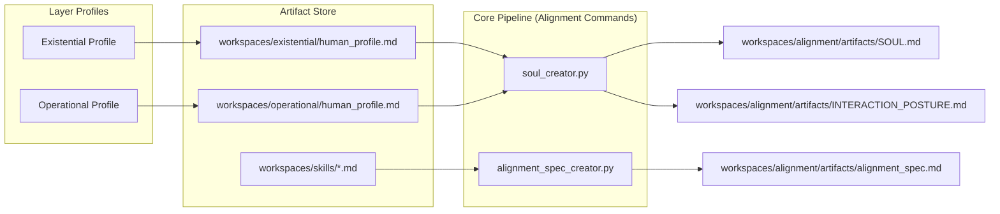
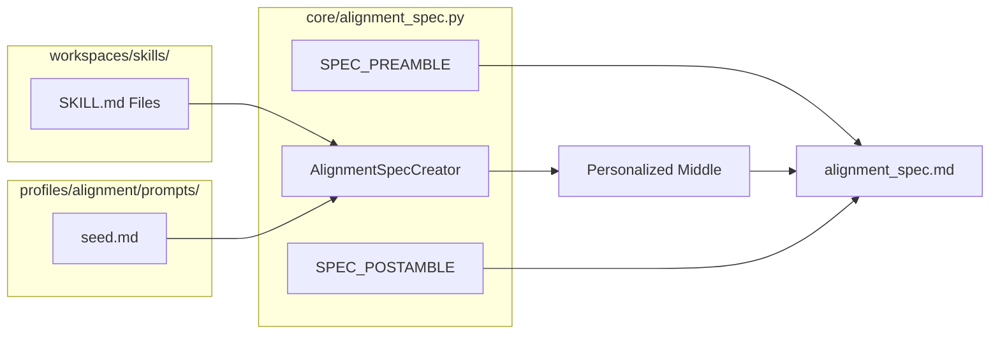

# Alignment Profile
Relevant source files
- [profiles/alignment/README.md](https://github.com/Cody-W-Tucker/Cognitive-Assistant/blob/a77ddaf6/profiles/alignment/README.md?plain=1)
- [profiles/alignment/prompts/seed.md](https://github.com/Cody-W-Tucker/Cognitive-Assistant/blob/a77ddaf6/profiles/alignment/prompts/seed.md?plain=1)
- [profiles/alignment/prompts/interaction_posture_seed.md](https://github.com/Cody-W-Tucker/Cognitive-Assistant/blob/a77ddaf6/profiles/alignment/prompts/interaction_posture_seed.md?plain=1)
- [profiles/alignment/prompts/soul_seed.md](https://github.com/Cody-W-Tucker/Cognitive-Assistant/blob/a77ddaf6/profiles/alignment/prompts/soul_seed.md?plain=1)

The **Alignment Profile** is a meta-profile that sits above the layer profile system. Unlike the Existential and Operational profiles which focus on specific data domains (identity vs. workflow), the Alignment profile consumes the outputs of both layers to synthesize a unified identity and a personalized verification standard.

## Overview and Purpose

The Alignment profile serves two primary technical functions:

1. **Identity Synthesis**: It merges the first-person reflective data from the Existential profile and the third-person behavioral data from the Operational profile into a durable, agentic persona known as the **SOUL**.
2. **Verification Specification**: It compiles the unified skills from both profiles into a personalized `alignment_spec.md`, which is used at runtime to judge whether AI-generated artifacts meet the user's specific quality bar.

Sources: [profiles/alignment/README.md1-12](https://github.com/Cody-W-Tucker/Cognitive-Assistant/blob/a77ddaf6/profiles/alignment/README.md?plain=1#L1-L12)[profiles/alignment/README.md16-21](https://github.com/Cody-W-Tucker/Cognitive-Assistant/blob/a77ddaf6/profiles/alignment/README.md?plain=1#L16-L21)

## Data Flow and Architecture

The Alignment profile operates as a "compiler" layer. It does not ingest raw substrate or corpus data; instead, it reads the `human_profile.md` files and the `workspaces/skills/` directory.

### High-Level Data Flow

Title: Alignment Profile Data Integration

Sources: [profiles/alignment/README.md24-32](https://github.com/Cody-W-Tucker/Cognitive-Assistant/blob/a77ddaf6/profiles/alignment/README.md?plain=1#L24-L32)[core/soul_creator.py1-29](https://github.com/Cody-W-Tucker/Cognitive-Assistant/blob/a77ddaf6/core/soul_creator.py#L1-L29)[core/alignment_spec.py1-28](https://github.com/Cody-W-Tucker/Cognitive-Assistant/blob/a77ddaf6/core/alignment_spec.py#L1-L28)

## Identity Synthesis (SOUL)

The system generates a durable identity in two stages: Archetype Inference and SOUL Composition. This process is managed by `core/translation_layer_creator.py`.

### 1. Archetype Inference

The system first uses `interaction_posture_seed.md` to infer a single recognizable human counterpart (e.g., "The Seasoned Architect" or "The Direct Editor"). This archetype acts as the "center of gravity" to prevent the AI from becoming a generic assistant.

- **Input**: Existential and Operational `human_profile.md`.
- **Logic**: Uses "positive inversion" to turn user misfits into agent strengths [profiles/alignment/prompts/interaction_posture_seed.md23-30](https://github.com/Cody-W-Tucker/Cognitive-Assistant/blob/a77ddaf6/profiles/alignment/prompts/interaction_posture_seed.md?plain=1#L23-L30)
- **Output**: `INTERACTION_POSTURE.md`.

### 2. SOUL Composition

Using `soul_seed.md`, the system writes the final `SOUL.md` from the perspective of the inferred archetype.

- **Tone**: First-person, direct, and concrete [profiles/alignment/prompts/soul_seed.md38-43](https://github.com/Cody-W-Tucker/Cognitive-Assistant/blob/a77ddaf6/profiles/alignment/prompts/soul_seed.md?plain=1#L38-L43)
- **Sections**: Includes "Core Truths", "Boundaries", and a "Detect Mode" section for real-time routing logic [profiles/alignment/prompts/soul_seed.md49-52](https://github.com/Cody-W-Tucker/Cognitive-Assistant/blob/a77ddaf6/profiles/alignment/prompts/soul_seed.md?plain=1#L49-L52)

Sources: [profiles/alignment/prompts/interaction_posture_seed.md1-21](https://github.com/Cody-W-Tucker/Cognitive-Assistant/blob/a77ddaf6/profiles/alignment/prompts/interaction_posture_seed.md?plain=1#L1-L21)[profiles/alignment/prompts/soul_seed.md1-21](https://github.com/Cody-W-Tucker/Cognitive-Assistant/blob/a77ddaf6/profiles/alignment/prompts/soul_seed.md?plain=1#L1-L21)

## Alignment Specification

The `alignment_spec.md` is a personalized version of a Standard Operating Procedure (SOP). It is generated by `AlignmentSpecCreator` (found in `core/alignment_spec.py`).

### Specification Structure

The spec overlays user-specific skills onto a 10-item universal checklist:

1. **Clear Purpose**
2. **Defined Scope**
3. **Grounded Claims**
4. **Gaps Acknowledged**
5. **Success Criteria**
6. **Efficient Structure**
7. **Internal Consistency**
8. **Matches the Request**
9. **Precise Language**
10. **Self-Contained**

Sources: [profiles/alignment/prompts/seed.md10-23](https://github.com/Cody-W-Tucker/Cognitive-Assistant/blob/a77ddaf6/profiles/alignment/prompts/seed.md?plain=1#L10-L23)[profiles/alignment/README.md9-14](https://github.com/Cody-W-Tucker/Cognitive-Assistant/blob/a77ddaf6/profiles/alignment/README.md?plain=1#L9-L14)

### Implementation Detail: Skill-to-Spec Mapping

The `AlignmentSpecCreator` aggregates all `.md` files from `workspaces/skills/`, wraps them in an XML block, and provides them to the LLM via `seed.md`. The LLM is instructed to translate "response-level behaviors" (how to talk) into "artifact-level cues" (how a document should look).

Title: Alignment Spec Generation (Code Entities)

Sources: [core/alignment_spec.py1-28](https://github.com/Cody-W-Tucker/Cognitive-Assistant/blob/a77ddaf6/core/alignment_spec.py#L1-L28)[profiles/alignment/prompts/seed.md1-9](https://github.com/Cody-W-Tucker/Cognitive-Assistant/blob/a77ddaf6/profiles/alignment/prompts/seed.md?plain=1#L1-L9)[profiles/alignment/README.md28](https://github.com/Cody-W-Tucker/Cognitive-Assistant/blob/a77ddaf6/profiles/alignment/README.md?plain=1#L28-L28)

## Runtime Verification

Once the `alignment_spec.md` is generated, it is used by the `scripts/verify_alignment.sh` tool. This tool bridges the static specification with live evaluation.

| Component | Role |
| --- | --- |
| `alignment_spec.md` | The "law" against which artifacts are judged. |
| `verify_alignment.sh` | The runner script that calls the LLM with the spec and the target artifact. |
| `rlm` | The binary used to execute the query with a "Compass" judgment style. |

### Verdict Lifecycle

The verifier returns one of three verdicts:

- **SHIP**: Artifact meets all standards.
- **TIGHTEN**: Minor issues found; provides imperative fix instructions.
- **REWORK**: Structural failure; requires a fundamental rethink of the artifact.

Sources: [profiles/alignment/README.md57-90](https://github.com/Cody-W-Tucker/Cognitive-Assistant/blob/a77ddaf6/profiles/alignment/README.md?plain=1#L57-L90)[scripts/verify_alignment.sh1-30](https://github.com/Cody-W-Tucker/Cognitive-Assistant/blob/a77ddaf6/scripts/verify_alignment.sh#L1-L30)

## CLI Command Reference

The Alignment profile is managed through specific subcommands of the core pipeline. Note that these commands typically do not require the `--profile` flag as they are cross-profile.

| Command | Action | Output |
| --- | --- | --- |
| `python -m core build-translation-layer` | Generates the orchestrator soul and interaction posture from both profiles. | `SOUL.md`, `INTERACTION_POSTURE.md` |
| `python -m core build-alignment-spec` | Compiles skills into the verification spec. | `alignment_spec.md` |

Sources: [profiles/alignment/README.md34-55](https://github.com/Cody-W-Tucker/Cognitive-Assistant/blob/a77ddaf6/profiles/alignment/README.md?plain=1#L34-L55)