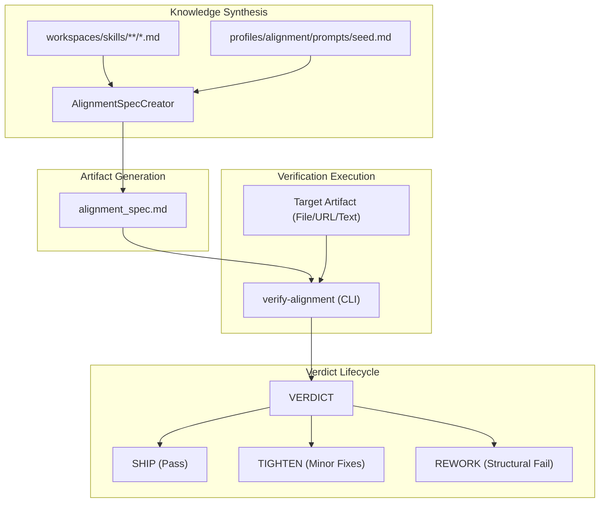
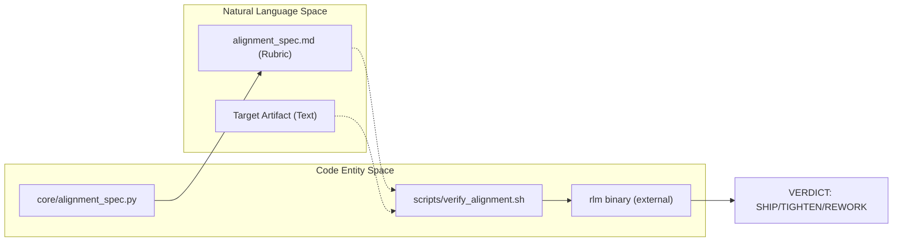

# Alignment Verification
Relevant source files
- [core/alignment_spec.py](https://github.com/Cody-W-Tucker/Cognitive-Assistant/blob/a77ddaf6/core/alignment_spec.py)
- [core/skill_engine.py](https://github.com/Cody-W-Tucker/Cognitive-Assistant/blob/a77ddaf6/core/skill_engine.py)
- [core/skill_enhancer.py](https://github.com/Cody-W-Tucker/Cognitive-Assistant/blob/a77ddaf6/core/skill_enhancer.py)
- [scripts/verify_alignment.sh](https://github.com/Cody-W-Tucker/Cognitive-Assistant/blob/a77ddaf6/scripts/verify_alignment.sh)
- [workspaces/alignment/artifacts/tool_specs/verify_alignment.md](https://github.com/Cody-W-Tucker/Cognitive-Assistant/blob/a77ddaf6/workspaces/alignment/artifacts/tool_specs/verify_alignment.md?plain=1)

Alignment Verification is the final gate in the Cognitive Assistant pipeline. It evaluates AI-generated artifacts against a personalized **Alignment Spec** to ensure they meet the user's specific standards for taste, precision, and operational utility. Unlike standard validation, alignment verification focuses on "readiness" rather than mere "plausibility."

The system consists of two primary components: a spec builder that synthesizes requirements from the agent's skills, and a CLI verifier that uses a structured "Compass Map" methodology to score artifacts.

### The Verification Lifecycle

The lifecycle moves from skill aggregation to a final verdict that dictates whether an artifact is ready for production or requires further iteration.

**Sources:**[core/alignment_spec.py81-112](https://github.com/Cody-W-Tucker/Cognitive-Assistant/blob/a77ddaf6/core/alignment_spec.py#L81-L112)[scripts/verify_alignment.sh140-172](https://github.com/Cody-W-Tucker/Cognitive-Assistant/blob/a77ddaf6/scripts/verify_alignment.sh#L140-L172)[workspaces/alignment/artifacts/tool_specs/verify_alignment.md56-93](https://github.com/Cody-W-Tucker/Cognitive-Assistant/blob/a77ddaf6/workspaces/alignment/artifacts/tool_specs/verify_alignment.md?plain=1#L56-L93)

---

### Building the Alignment Spec

The `alignment_spec.md` is a personalized rubric generated by the `AlignmentSpecCreator` class. It aggregates all `SKILL.md` files from the unified skill store and uses an LLM to synthesize them into a 10-point verification checklist. This spec is wrapped in a static `SPEC_PREAMBLE` and `SPEC_POSTAMBLE` that define the scoring logic and output format for the verifier.

The spec is generated using the command:
`python -m core build-alignment-spec`

For details on the synthesis logic and XML-tagged skill aggregation, see [Building the Alignment Spec](/Cody-W-Tucker/Cognitive-Assistant/6.1-building-the-alignment-spec).

**Sources:**[core/alignment_spec.py37-78](https://github.com/Cody-W-Tucker/Cognitive-Assistant/blob/a77ddaf6/core/alignment_spec.py#L37-L78)[core/alignment_spec.py120-152](https://github.com/Cody-W-Tucker/Cognitive-Assistant/blob/a77ddaf6/core/alignment_spec.py#L120-L152)

---

### The `verify-alignment` Tool

The `verify-alignment` script is a shell wrapper around the `rlm` (Representation Learning Model) binary. It forces a `compass` judgment style, requiring the LLM to build an explicit mental map of the artifact before issuing a verdict.

#### The Compass Map Methodology

The verifier maps the artifact into four quadrants to ensure a balanced critique:

- **North:** Origin, framing, and intended purpose.
- **West:** Adjacent patterns and coherence with the spec.
- **East:** Contradictions, omissions, and weak spots.
- **South:** Downstream implications and operator effects.

For details on CLI flags, environment variables, and prompt construction, see [verify-alignment Tool](/Cody-W-Tucker/Cognitive-Assistant/6.2-verify-alignment-tool).

**Sources:**[scripts/verify_alignment.sh140-162](https://github.com/Cody-W-Tucker/Cognitive-Assistant/blob/a77ddaf6/scripts/verify_alignment.sh#L140-L162)[workspaces/alignment/artifacts/tool_specs/verify_alignment.md18-37](https://github.com/Cody-W-Tucker/Cognitive-Assistant/blob/a77ddaf6/workspaces/alignment/artifacts/tool_specs/verify_alignment.md?plain=1#L18-L37)

---

### Verdicts and Corrections

The system produces one of three verdicts, each requiring a specific response from the operator or the generating agent.

| Verdict | Meaning | Required Action |
| --- | --- | --- |
| **SHIP** | Alignment satisfied. | No action; the artifact is ready. |
| **TIGHTEN** | Minor alignment gaps. | Apply the provided `CORRECTIONS` list directly to the content. |
| **REWORK** | Structural or scope failure. | Summarize issues and propose a new approach to the user. |

#### Data Flow: Natural Language to Code Entity

The following diagram illustrates how natural language requirements in the `alignment_spec.md` are mapped to the internal logic of the `verify_alignment.sh` script and the `rlm` binary.

**Sources:**[scripts/verify_alignment.sh140-172](https://github.com/Cody-W-Tucker/Cognitive-Assistant/blob/a77ddaf6/scripts/verify_alignment.sh#L140-L172)[workspaces/alignment/artifacts/tool_specs/verify_alignment.md40-54](https://github.com/Cody-W-Tucker/Cognitive-Assistant/blob/a77ddaf6/workspaces/alignment/artifacts/tool_specs/verify_alignment.md?plain=1#L40-L54)[core/alignment_spec.py57-78](https://github.com/Cody-W-Tucker/Cognitive-Assistant/blob/a77ddaf6/core/alignment_spec.py#L57-L78)