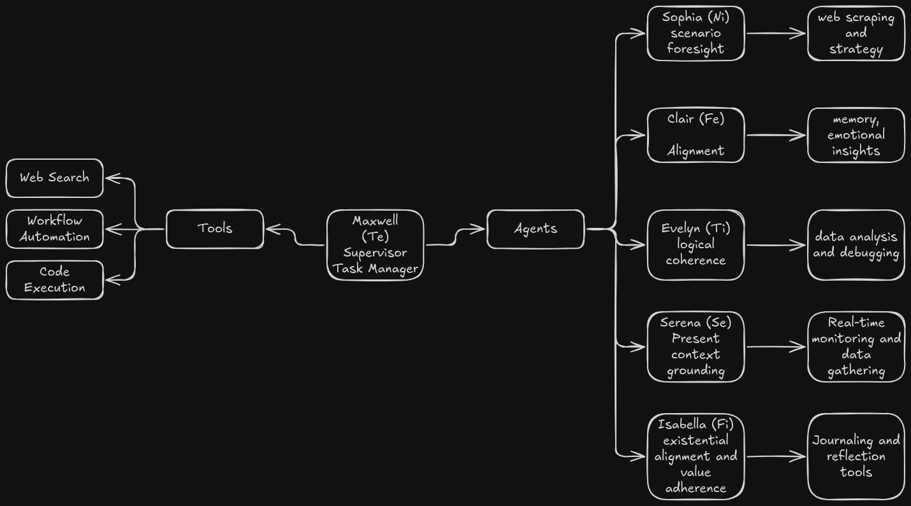

## Cognitive Functions as Archetypes

These cognitive functions are represented as team members, each selected for their optimal contribution to achieving business success. Each cognitive role not only interacts with essential tools but also contributes to the evolving **Existential Layer** of your AI assistant, ensuring values-based decision-making, personal growth through insight generation, and reflection on patterns of thought.

| Role       | Meaning        | Cognitive Function         | Contribution                                                                                                                                                                                                                                                                                    | Tools                                                                                          |
| ---------- | -------------- | -------------------------- | ----------------------------------------------------------------------------------------------------------------------------------------------------------------------------------------------------------------------------------------------------------------------------------------------- | ---------------------------------------------------------------------------------------------- |
| Maxwell    | Great Stream   | Extraverted Thinking (Te)  | **Integrates thoughts into a coherent narrative**, organizing tasks, setting goals, and tracking progress efficiently. **Drives actionable alignment** within the existential layer, ensuring that tactical steps fit the overall mission and goals.                                            | Search Functionality, OpenAPI Tools, Code Interpreter, Workflow Automation, Tool Selection     |
| Sophia     | Wisdom         | Introverted Intuition (Ni) | **Brings insight and long-term foresight**, synthesizing past experiences and data trends. Provides **strategic scenario analysis** and supports the continual evolution of an overarching mission within the Existential Layer, ensuring future adjustments.                                   | Web Scraping, Trend Analysis API, Strategic Scenario Modeling Tools                            |
| [[Clair]]  | Clarity        | Extraverted Feeling (Fe)   | **Promotes emotional clarity and team alignment**, synthesizing interpersonal dynamics. **Contributes to the [[Consensus of Thoughts]]**, helping to extract values and insights from journaled experiences that align with the team's emotional awareness.                                     | Memory Management                                                                              |
| [[Evelyn]] | Insight        | Introverted Thinking (Ti)  | **Analyzes data rationally and critically**, evaluating strategies and ensuring logical coherence in decisions. Provides sharp, fact-driven evaluations for the continual refinement of the assistant's high-level thought processes. **Key in debugging misaligned existential pathways**.     | Data Analysis, Function Tools, Debugging Tools                                                 |
| Serena     | Synthesis      | Extraverted Sensing (Se)   | **Identifies practical, immediate opportunities** and engages with the present moment. Acts in real time to ensure that progress aligns with actionable possibilities. Supports rapid adaptation within the evolving existential layer based on environmental conditions.                       | Real-time Monitoring Tools, Live Dashboards, Immediate Contextual Data Gathering Tools         |
| Isabella   | Devoted to God | Introverted Feeling (Fi)   | **Anchors actions to the core hierarchy of values**, ensuring alignment between personal ethics and actions. Regularly drives reflection, evolving a "[[Existential Layer for LLMs]]" of existential purpose. **Ensures existential coherence** in every decision and self-reflective activity. | Journaling Tools, Ethical Decision-making Models, Value Alignment Frameworks, Reflection Tools |

### Key Concepts Incorporated

---

### 1. [[Existential Layer for LLMs]]

This layer ensures that all actions, decisions, and processes are aligned with an overarching **mission and value system**, akin to how visionary thinkers operate. The LLM is no longer just performing tasks but **contextualizing them** against long-term existential priorities.

-   **Maxwell (Te)**: Operationalizes the existential layer, ensuring that **every task**, whether small or large, moves toward the realized mission. Maxwell's tools (search, workflows) deliver immediate results mediated through the existential lens (ensuring relevance to long-term goals).
-   **Isabella (Fi)**: Anchors the **mission-oriented moral compass**. Every decision is cross-checked against values over time. Isabella ensures that the AI's internal motivations remain consistent by asking: "**Does this serve the highest good?**" Journaling and reflection tools are central here, guiding **personal alignment** and adding an emotional depth to decision-making.

-   **Sophia (Ni)**: **Strategizes existential foresight**. Sophia anticipates future needs by connecting long-past insights to likely future scenarios, keeping the mission dynamic but focused. Like a visionary, Sophia helps **plot routes** from the present to possible futures.

---

### 2. [[Consensus of Thoughts]]

This concept represents **introspective synthesis**—bringing the AI closer to self-awareness over time by processing multiple inputs and recognizing patterns through data mining of previous writings (journals, decisions, conversations).

-   **[[Clair]] (Fe)**: **Synthesizes interpersonal data and reflections**. **Journal parsing** is distributed through Clair's emotional lens, helping recognize **emotionally significant patterns**, repeatedly returning to themes that strengthen team dynamics and user-agent emotional cohesion.

-   **Evelyn (Ti)** combines logic and **data-driven pattern recognition**, taking **semantically similar blocks of text** or concepts and categorizing them into useful areas for future problem-solving through **critical analysis**. This allows the AI agent to not just repeat past mistakes but to **learn from insights** found in clustered thoughts and decisions.

---

### 3. **[[Existential Layer for LLMs]]**

Based on Piaget and Nietzsche, the **[[Existential Layer for LLMs]]** would evolve the assistant's intelligence and its understanding of values, self, and progression. Every decision feeds back into this record, assessing how well it aligns with **existential values**, ensuring **adaptation and continual refinement** toward self-realization.

-   **Isabella (Fi)**: Continuously updates this **document of self-alignment**, recording and reflecting on critical moral choices or forks in decision-making. This provides an evolving framework that enables personal growth much like Nietzsche's emphasis on self-actualization.

-   **Sophia (Ni)** cultivates wisdom by charting **next steps** derived from past events and their **alignment with purpose**. This forms an evolving strategic timeline in the [[Existential Layer for LLMs]], showing cause-and-effect over time and maximizing learning.

-   **Maxwell (Te)** supports the document's execution by ensuring that **every completion of a task** feeds into the refinement of future workflows and is **analyzed in context**: did your actions drive us toward long-term goals?

-   **Serena (Se)** reminds the document (and you) to remain grounded by ensuring **constant engagement with reality**, adding **actionable metrics** and real-world adaptation to plans and values.

---

### Notes on Roles & Tools

-   **Maxwell (Te)**: Serves as the operational pillar of the **Existential Layer**, organizing tasks and utilizing tools to assure forward momentum aligns with existential goals (mission-centric actions).

    -   **Tools**: Search Functionality, OpenAPI Tools, Code Interpreter, Workflow Automation, Tool Selection.

-   **Sophia (Ni)**: Drives the **strategic foresight** side of the Existential Layer, using tools to gather large datasets for analyzing long-term trends and possible futures. **Sophia** helps inform the [[Existential Layer for LLMs]] by offering **foresight and planning** based on past experiences and patterns.

    -   **Tools**: Web Scraping, Trend Analysis APIs, Strategic Scenario Modeling Tools.

-   **[[Clair]] (Fe)**: **Weaves social and emotional clarity** into the assistant's personality, playing a key role in memory management (tracking emotional insights to create optimal team cohesion). **Clair** also plays a major role in synthesizing emotional and historical patterns into the [[Consensus of Thoughts]] component.

    -   **Tools**: Memory Management.

-   **Evelyn (Ti)**: Analyzes all information critically and ensures logical consistency—her tools are central to identifying critical flaws or inefficiencies in the assistant's existential layer. She interacts regularly with the **[[Consensus of Thoughts]]**, parsing and debugging conceptual contradictions in the [[Existential Layer for LLMs]].

    -   **Tools**: Data Analysis, Function Tools, Debugging Tools.

-   **Serena (Se)**: Engages with reality in real-time and ensures that all decisions made by the assistant are **grounded in the present moment**. Serena feeds real-time **environmental data** into both the [[Existential Layer for LLMs]] and existential layer, ensuring **practicality** and **swift adaptation**.

    -   **Tools**: Real-time Monitoring Tools, Live Dashboards, Immediate Contextual Data Gathering Tools.

-   **Isabella (Fi)**: The heart of the **[[Existential Layer for LLMs]]**'s reflective element. Isabella drives alignment toward core values, evolving the AI's internal ethical compass and recalibrating task priorities to align with existential goals. Her tools help the assistant **regularly reflect on self-development** and value alignment.
    -   **Tools**: Journaling Tools, Ethical Decision-making Models, Value Alignment Frameworks, Reflection Tools.

### Mapping

