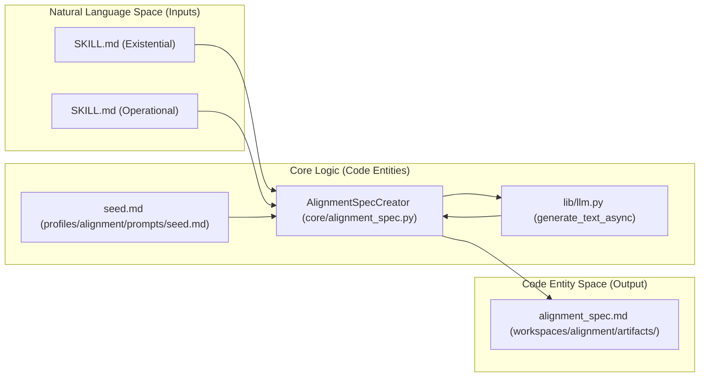
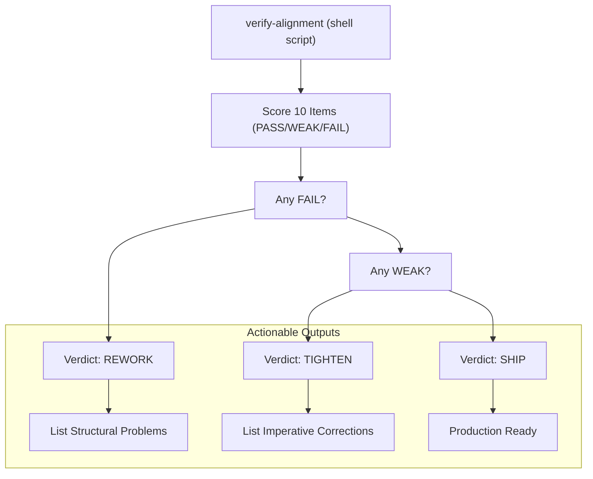

# Building the Alignment Spec
Relevant source files
- [core/alignment_spec.py](https://github.com/Cody-W-Tucker/Cognitive-Assistant/blob/a77ddaf6/core/alignment_spec.py)
- [core/skill_engine.py](https://github.com/Cody-W-Tucker/Cognitive-Assistant/blob/a77ddaf6/core/skill_engine.py)
- [core/skill_enhancer.py](https://github.com/Cody-W-Tucker/Cognitive-Assistant/blob/a77ddaf6/core/skill_enhancer.py)
- [profiles/alignment/prompts/seed.md](https://github.com/Cody-W-Tucker/Cognitive-Assistant/blob/a77ddaf6/profiles/alignment/prompts/seed.md?plain=1)
- [profiles/existential/prompts/initial_template.md](https://github.com/Cody-W-Tucker/Cognitive-Assistant/blob/a77ddaf6/profiles/existential/prompts/initial_template.md?plain=1)
- [profiles/operational/prompts/initial_template.md](https://github.com/Cody-W-Tucker/Cognitive-Assistant/blob/a77ddaf6/profiles/operational/prompts/initial_template.md?plain=1)
- [workspaces/alignment/artifacts/alignment_spec.md](https://github.com/Cody-W-Tucker/Cognitive-Assistant/blob/a77ddaf6/workspaces/alignment/artifacts/alignment_spec.md?plain=1)
- [workspaces/existential/artifacts/human_profile.md](https://github.com/Cody-W-Tucker/Cognitive-Assistant/blob/a77ddaf6/workspaces/existential/artifacts/human_profile.md?plain=1)

The **Alignment Spec** is a personalized verification checklist used by the system to judge whether AI-generated artifacts (code, plans, or documents) are "production-ready" for a specific user. This process is orchestrated by the `AlignmentSpecCreator` class [core/alignment_spec.py81-82](https://github.com/Cody-W-Tucker/Cognitive-Assistant/blob/a77ddaf6/core/alignment_spec.py#L81-L82) which synthesizes behavioral data from the unified skills store into a structured markdown document.

Unlike other pipeline stages that belong to a specific profile, the `build-alignment-spec` command sits above the profile system, aggregating outputs from both the **Existential** and **Operational** layers [core/alignment_spec.py8-9](https://github.com/Cody-W-Tucker/Cognitive-Assistant/blob/a77ddaf6/core/alignment_spec.py#L8-L9)

## The AlignmentSpecCreator Pipeline

The generation process follows a strict "load-inject-call-wrap" sequence. The goal is to take atomic behavioral skills (e.g., "how to handle relational ambiguity") and translate them into concrete artifact-level verification cues (e.g., "failed when the document provides conceptual cover for a deferred action") [profiles/alignment/prompts/seed.md8-9](https://github.com/Cody-W-Tucker/Cognitive-Assistant/blob/a77ddaf6/profiles/alignment/prompts/seed.md?plain=1#L8-L9)

### Implementation Logic

1. **Skill Aggregation**: The creator scans `workspaces/skills/` for all `SKILL.md` files [core/alignment_spec.py137](https://github.com/Cody-W-Tucker/Cognitive-Assistant/blob/a77ddaf6/core/alignment_spec.py#L137-L137) Each skill is wrapped in an XML-tagged block containing its source profile and name [core/alignment_spec.py142-145](https://github.com/Cody-W-Tucker/Cognitive-Assistant/blob/a77ddaf6/core/alignment_spec.py#L142-L145)
2. **Template Injection**: The aggregated skills are injected into the `{skills_content}` placeholder of the `seed.md` template [core/alignment_spec.py97](https://github.com/Cody-W-Tucker/Cognitive-Assistant/blob/a77ddaf6/core/alignment_spec.py#L97-L97)
3. **LLM Synthesis**: The system calls the LLM (typically a "refine" class model like GPT-4o or Claude 3.5 Sonnet) to compile the specification [core/alignment_spec.py98-103](https://github.com/Cody-W-Tucker/Cognitive-Assistant/blob/a77ddaf6/core/alignment_spec.py#L98-L103)
4. **Static Wrapping**: The LLM's raw output is wrapped between a static `SPEC_PREAMBLE` and `SPEC_POSTAMBLE`[core/alignment_spec.py106](https://github.com/Cody-W-Tucker/Cognitive-Assistant/blob/a77ddaf6/core/alignment_spec.py#L106-L106) These contain the final instructions for the `verify-alignment` tool, including the verdict logic (SHIP/TIGHTEN/REWORK).

### Data Flow: From Skills to Spec

The following diagram illustrates how natural language skills are transformed into the code-driven `alignment_spec.md` artifact.

**Diagram: Alignment Spec Data Flow**

**Sources:**[core/alignment_spec.py92-112](https://github.com/Cody-W-Tucker/Cognitive-Assistant/blob/a77ddaf6/core/alignment_spec.py#L92-L112)[profiles/alignment/prompts/seed.md1-25](https://github.com/Cody-W-Tucker/Cognitive-Assistant/blob/a77ddaf6/profiles/alignment/prompts/seed.md?plain=1#L1-L25)[core/skills_creator.py24](https://github.com/Cody-W-Tucker/Cognitive-Assistant/blob/a77ddaf6/core/skills_creator.py#L24-L24)

---

## Structural Requirements

The generated `alignment_spec.md` must adhere to a specific structure to be compatible with the downstream `verify-alignment` tool.

### 1. The Preamble and Cross-cutting Signals

The spec begins with a set of "Cross-cutting personalized signals" [workspaces/alignment/artifacts/alignment_spec.md7](https://github.com/Cody-W-Tucker/Cognitive-Assistant/blob/a77ddaf6/workspaces/alignment/artifacts/alignment_spec.md?plain=1#L7-L7) These are global rules that apply to every check, such as:

- **Register**: e.g., "direct peer, never soft" [workspaces/alignment/artifacts/alignment_spec.md9](https://github.com/Cody-W-Tucker/Cognitive-Assistant/blob/a77ddaf6/workspaces/alignment/artifacts/alignment_spec.md?plain=1#L9-L9)
- **Vocabulary**: e.g., "Do not mirror his framework/faith vocabulary" [workspaces/alignment/artifacts/alignment_spec.md10](https://github.com/Cody-W-Tucker/Cognitive-Assistant/blob/a77ddaf6/workspaces/alignment/artifacts/alignment_spec.md?plain=1#L10-L10)
- **Operator Focus**: Identifying the specific human or agent who must act on the artifact [workspaces/alignment/artifacts/alignment_spec.md11](https://github.com/Cody-W-Tucker/Cognitive-Assistant/blob/a77ddaf6/workspaces/alignment/artifacts/alignment_spec.md?plain=1#L11-L11)

### 2. The 10-Point Verification Checklist

The core of the spec is a 10-point checklist derived from the `seed.md` methodology [profiles/alignment/prompts/seed.md12-23](https://github.com/Cody-W-Tucker/Cognitive-Assistant/blob/a77ddaf6/profiles/alignment/prompts/seed.md?plain=1#L12-L23) Each item includes:

- **Check**: A one-sentence structural question.
- **Satisfied when**: Concrete cues drawn from the user's skills.
- **Failed when**: Negative signals that trigger a rejection.
- **Fix**: A single imperative sentence for the generating agent.

| # | Checklist Item | Focus |
| --- | --- | --- |
| 1 | **Clear Purpose** | Identifies the operator and the next concrete move [workspaces/alignment/artifacts/alignment_spec.md15](https://github.com/Cody-W-Tucker/Cognitive-Assistant/blob/a77ddaf6/workspaces/alignment/artifacts/alignment_spec.md?plain=1#L15-L15) |
| 2 | **Defined Scope** | Bounds the mode (e.g., orientation vs. execution) [workspaces/alignment/artifacts/alignment_spec.md31](https://github.com/Cody-W-Tucker/Cognitive-Assistant/blob/a77ddaf6/workspaces/alignment/artifacts/alignment_spec.md?plain=1#L31-L31) |
| 3 | **Grounded Claims** | Specificity (file paths, line numbers) over generalities [workspaces/alignment/artifacts/alignment_spec.md47](https://github.com/Cody-W-Tucker/Cognitive-Assistant/blob/a77ddaf6/workspaces/alignment/artifacts/alignment_spec.md?plain=1#L47-L47) |
| 4 | **Gaps Acknowledged** | Surfacing risks like "avoidance" or "over-functioning" [workspaces/alignment/artifacts/alignment_spec.md64](https://github.com/Cody-W-Tucker/Cognitive-Assistant/blob/a77ddaf6/workspaces/alignment/artifacts/alignment_spec.md?plain=1#L64-L64) |
| 5 | **Success Criteria** | Definition of "done" based on operator usability [workspaces/alignment/artifacts/alignment_spec.md81](https://github.com/Cody-W-Tucker/Cognitive-Assistant/blob/a77ddaf6/workspaces/alignment/artifacts/alignment_spec.md?plain=1#L81-L81) |
| 6 | **Efficient Structure** | Minimal explicit form; no "optimization cages" [workspaces/alignment/artifacts/alignment_spec.md98](https://github.com/Cody-W-Tucker/Cognitive-Assistant/blob/a77ddaf6/workspaces/alignment/artifacts/alignment_spec.md?plain=1#L98-L98) |
| 7 | **Internal Consistency** | Absence of contradictions across files or frames [workspaces/alignment/artifacts/alignment_spec.md114](https://github.com/Cody-W-Tucker/Cognitive-Assistant/blob/a77ddaf6/workspaces/alignment/artifacts/alignment_spec.md?plain=1#L114-L114) |
| 8 | **Matches Request** | Format and depth match the user's specific intent [profiles/alignment/prompts/seed.md21](https://github.com/Cody-W-Tucker/Cognitive-Assistant/blob/a77ddaf6/profiles/alignment/prompts/seed.md?plain=1#L21-L21) |
| 9 | **Precise Language** | Direct wording free of unnecessary hedging [profiles/alignment/prompts/seed.md22](https://github.com/Cody-W-Tucker/Cognitive-Assistant/blob/a77ddaf6/profiles/alignment/prompts/seed.md?plain=1#L22-L22) |
| 10 | **Self-Contained** | Understandable by the target operator without extra loops [profiles/alignment/prompts/seed.md23](https://github.com/Cody-W-Tucker/Cognitive-Assistant/blob/a77ddaf6/profiles/alignment/prompts/seed.md?plain=1#L23-L23) |

**Sources:**[workspaces/alignment/artifacts/alignment_spec.md1-127](https://github.com/Cody-W-Tucker/Cognitive-Assistant/blob/a77ddaf6/workspaces/alignment/artifacts/alignment_spec.md?plain=1#L1-L127)[profiles/alignment/prompts/seed.md12-23](https://github.com/Cody-W-Tucker/Cognitive-Assistant/blob/a77ddaf6/profiles/alignment/prompts/seed.md?plain=1#L12-L23)[core/alignment_spec.py37-42](https://github.com/Cody-W-Tucker/Cognitive-Assistant/blob/a77ddaf6/core/alignment_spec.py#L37-L42)

---

## Verdict Logic and Postamble

The `AlignmentSpecCreator` appends a static `SPEC_POSTAMBLE` that defines the scoring system for the `verify-alignment` tool [core/alignment_spec.py44-78](https://github.com/Cody-W-Tucker/Cognitive-Assistant/blob/a77ddaf6/core/alignment_spec.py#L44-L78)

### Scoring System

For each checklist item, the verifier assigns one of three scores:

- **PASS**: Satisfies "Satisfied when" cues.
- **WEAK**: Partially satisfied; correctable without full rework.
- **FAIL**: Triggers "Failed when" cues or omits requirements.

### Final Verdicts

The tool aggregates these scores into a final status:

- **SHIP**: All PASS (or one minor WEAK).
- **TIGHTEN**: One or more WEAK; requires actionable corrections.
- **REWORK**: Any FAIL or compounding WEAK indicating structural failure.

**Diagram: Verdict Decision Tree**

**Sources:**[core/alignment_spec.py50-78](https://github.com/Cody-W-Tucker/Cognitive-Assistant/blob/a77ddaf6/core/alignment_spec.py#L50-L78)[workspaces/alignment/artifacts/alignment_spec.md130-150](https://github.com/Cody-W-Tucker/Cognitive-Assistant/blob/a77ddaf6/workspaces/alignment/artifacts/alignment_spec.md?plain=1#L130-L150)