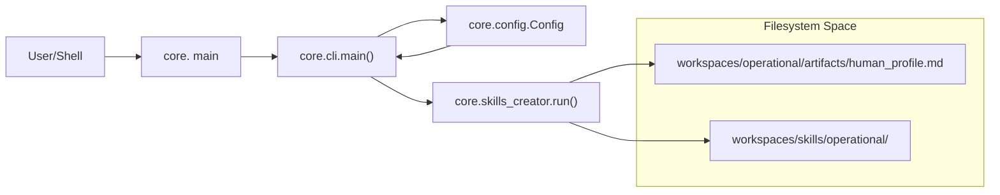
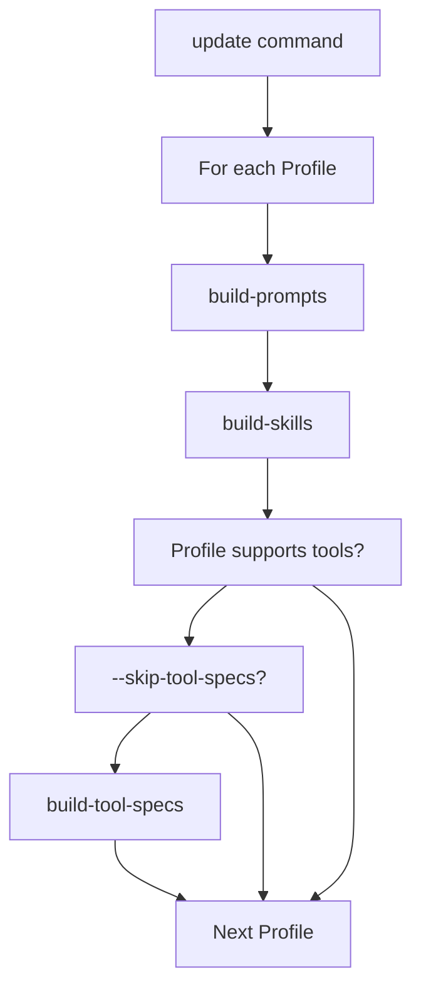

# CLI and Command Reference
Relevant source files
- [AGENTS.md](https://github.com/Cody-W-Tucker/Cognitive-Assistant/blob/a77ddaf6/AGENTS.md?plain=1)
- [core/__main__.py](https://github.com/Cody-W-Tucker/Cognitive-Assistant/blob/a77ddaf6/core/__main__.py)
- [core/cli.py](https://github.com/Cody-W-Tucker/Cognitive-Assistant/blob/a77ddaf6/core/cli.py)
- [profiles/existential/prompts/rlm_query_template.md](https://github.com/Cody-W-Tucker/Cognitive-Assistant/blob/a77ddaf6/profiles/existential/prompts/rlm_query_template.md?plain=1)
- [profiles/operational/prompts/rlm_query_template.md](https://github.com/Cody-W-Tucker/Cognitive-Assistant/blob/a77ddaf6/profiles/operational/prompts/rlm_query_template.md?plain=1)

The Cognitive Assistant system is controlled via a unified command-line interface (CLI) exposed through the `core` module. This interface serves as the entry point for the entire pipeline, managing data ingestion, RLM (Retrieval-Augmented Language Model) querying, profile synthesis, and artifact generation.

The CLI is designed around a "Layer Profile" architecture [core/cli.py1-18](https://github.com/Cody-W-Tucker/Cognitive-Assistant/blob/a77ddaf6/core/cli.py#L1-L18) where most commands require a `--profile` flag to determine the configuration, data paths, and logic gates to apply [core/cli.py35-39](https://github.com/Cody-W-Tucker/Cognitive-Assistant/blob/a77ddaf6/core/cli.py#L35-L39)

## Entry Point and Common Flags

The primary entry point is `python -m core <command>`.

| Flag | Description | Requirement |
| --- | --- | --- |
| `--profile` | The name of the layer profile (e.g., `existential`, `operational`). | Required for most subcommands. |
| `--help` | Displays help information for the command or subcommand. | Optional. |

The `main` function in `core/cli.py` handles argument parsing and dispatches to specific module runners [core/cli.py178-211](https://github.com/Cody-W-Tucker/Cognitive-Assistant/blob/a77ddaf6/core/cli.py#L178-L211)

## Command Reference

### Profile Discovery and Health

#### `list-profiles`

Prints the names of all registered profiles defined in `core/config.py`[core/cli.py140-142](https://github.com/Cody-W-Tucker/Cognitive-Assistant/blob/a77ddaf6/core/cli.py#L140-L142)

- **Implementation**: Calls `list_profiles()` from the config factory [core/cli.py182-185](https://github.com/Cody-W-Tucker/Cognitive-Assistant/blob/a77ddaf6/core/cli.py#L182-L185)

#### `health-check`

Validates the environment, prompt templates, directory structures, and provider connectivity [core/cli.py134-137](https://github.com/Cody-W-Tucker/Cognitive-Assistant/blob/a77ddaf6/core/cli.py#L134-L137)

- **Gating**: Profile-aware; it checks paths and templates specific to the active profile [AGENTS.md42-43](https://github.com/Cody-W-Tucker/Cognitive-Assistant/blob/a77ddaf6/AGENTS.md?plain=1#L42-L43)
- **Sources**: [core/cli.py134-137](https://github.com/Cody-W-Tucker/Cognitive-Assistant/blob/a77ddaf6/core/cli.py#L134-L137)[AGENTS.md68-70](https://github.com/Cody-W-Tucker/Cognitive-Assistant/blob/a77ddaf6/AGENTS.md?plain=1#L68-L70)

---

### Data Ingestion

#### `ingest-substrate`

Projects schema graph and focus-bundle exports into JSONL packets for the **existential** profile [core/cli.py48-51](https://github.com/Cody-W-Tucker/Cognitive-Assistant/blob/a77ddaf6/core/cli.py#L48-L51)

- **Flags**:

- `--graph`: Path to `graph.json`.
- `--focus`: Path to focus-bundle (can be repeated).
- `--output-dir`: Defaults to `workspaces/<profile>/data/ready/substrate`.
- **Sources**: [core/cli.py52-68](https://github.com/Cody-W-Tucker/Cognitive-Assistant/blob/a77ddaf6/core/cli.py#L52-L68)

#### `ingest-corpus`

Normalizes intake exports into `ready/*.jsonl` for **operational** profiles [core/cli.py43-46](https://github.com/Cody-W-Tucker/Cognitive-Assistant/blob/a77ddaf6/core/cli.py#L43-L46) This command handles batch processing of artifact traces.

- **Sources**: [core/cli.py43-46](https://github.com/Cody-W-Tucker/Cognitive-Assistant/blob/a77ddaf6/core/cli.py#L43-L46)[AGENTS.md36](https://github.com/Cody-W-Tucker/Cognitive-Assistant/blob/a77ddaf6/AGENTS.md?plain=1#L36-L36)

---

### Synthesis and Generation

#### `ask-questions`

Iterates through a profile's `questions.csv`, running RLM queries to generate answers based on ingested data [core/cli.py70-73](https://github.com/Cody-W-Tucker/Cognitive-Assistant/blob/a77ddaf6/core/cli.py#L70-L73)

- **Data Flow**: Uses `rlm_query_template.md` from the profile's prompt directory to wrap the question and evidence [profiles/existential/prompts/rlm_query_template.md1-18](https://github.com/Cody-W-Tucker/Cognitive-Assistant/blob/a77ddaf6/profiles/existential/prompts/rlm_query_template.md?plain=1#L1-L18)[profiles/operational/prompts/rlm_query_template.md1-63](https://github.com/Cody-W-Tucker/Cognitive-Assistant/blob/a77ddaf6/profiles/operational/prompts/rlm_query_template.md?plain=1#L1-L63)

#### `build-prompts`

Generates the `human_profile.md` artifact by synthesizing the answers collected during `ask-questions`[core/cli.py74-77](https://github.com/Cody-W-Tucker/Cognitive-Assistant/blob/a77ddaf6/core/cli.py#L74-L77)

#### `build-skills`

Generates canonical `SKILL.md` files from the latest `human_profile.md`[core/cli.py79-82](https://github.com/Cody-W-Tucker/Cognitive-Assistant/blob/a77ddaf6/core/cli.py#L79-L82)

- **Output**: Writes to `workspaces/skills/<profile>/<skill>/SKILL.md`[AGENTS.md53-54](https://github.com/Cody-W-Tucker/Cognitive-Assistant/blob/a77ddaf6/AGENTS.md?plain=1#L53-L54)
- **Flags**: `--bio` (custom profile path), `--output` (custom output dir) [core/cli.py83-89](https://github.com/Cody-W-Tucker/Cognitive-Assistant/blob/a77ddaf6/core/cli.py#L83-L89)

#### `enhance-skill`

Refines an existing skill using source material (e.g., Hermes traces) [core/cli.py91-94](https://github.com/Cody-W-Tucker/Cognitive-Assistant/blob/a77ddaf6/core/cli.py#L91-L94)

- **Flags**: `--skill` (target name), `--hermes-path` (source material), `--apply` (write changes after diff) [core/cli.py95-105](https://github.com/Cody-W-Tucker/Cognitive-Assistant/blob/a77ddaf6/core/cli.py#L95-L105)

#### `build-tool-specs`

Generates `tool_specs/` (e.g., `memory.md`, `tasks.md`) from the profile.

- **Gating**: This is typically gated to the **operational** profile [AGENTS.md40](https://github.com/Cody-W-Tucker/Cognitive-Assistant/blob/a77ddaf6/AGENTS.md?plain=1#L40-L40)
- **Sources**: [core/cli.py107-122](https://github.com/Cody-W-Tucker/Cognitive-Assistant/blob/a77ddaf6/core/cli.py#L107-L122)

---

### Alignment and Meta-Commands

#### `build-translation-layer`

Synthesizes the orchestrator translation-layer artifacts
(`SOUL_ARCHETYPE.md` and `SOUL.md`) by combining outputs from both the
existential and operational profiles. This is the cross-profile bridge
between raw profile data and the specialist agent system.

- **Flags**: *(none — writes to canonical paths under `workspaces/alignment/artifacts/`)*
- **Sources**: `core/translation_layer_creator.py`

#### `build-agents`

Discovers distinct agent personas from the translation layer and
bounded profile evidence, then generates one soul document per persona.
Specialist agents inherit the orchestrator constitution rather than
re-deriving the user from raw psychometric profile material.

- **Sources**: `core/soul_creator.py`

#### `build-alignment-spec`

Generates the `alignment_spec.md` verification checklist [core/cli.py144-147](https://github.com/Cody-W-Tucker/Cognitive-Assistant/blob/a77ddaf6/core/cli.py#L144-L147) It aggregates all generated skills into a single specification for the verifier tool [AGENTS.md58-60](https://github.com/Cody-W-Tucker/Cognitive-Assistant/blob/a77ddaf6/AGENTS.md?plain=1#L58-L60)

#### `update`

A compound workflow that chains `build-prompts`, `build-skills`, and `build-tool-specs`[core/cli.py124-127](https://github.com/Cody-W-Tucker/Cognitive-Assistant/blob/a77ddaf6/core/cli.py#L124-L127)

- **Behavior**: If no profile is specified, it can iterate through all registered profiles [core/cli.py206-210](https://github.com/Cody-W-Tucker/Cognitive-Assistant/blob/a77ddaf6/core/cli.py#L206-L210)
- **Flags**: `--skip-tool-specs`[core/cli.py128-132](https://github.com/Cody-W-Tucker/Cognitive-Assistant/blob/a77ddaf6/core/cli.py#L128-L132)

## Command Logic and Data Flow

The following diagram illustrates how a CLI command (e.g., `build-skills`) flows from the user through the `core` configuration to the filesystem.

### CLI Dispatch to Entity Space

**Sources**: [core/__main__.py1-9](https://github.com/Cody-W-Tucker/Cognitive-Assistant/blob/a77ddaf6/core/__main__.py#L1-L9)[core/cli.py175-181](https://github.com/Cody-W-Tucker/Cognitive-Assistant/blob/a77ddaf6/core/cli.py#L175-L181)[core/cli.py210-211](https://github.com/Cody-W-Tucker/Cognitive-Assistant/blob/a77ddaf6/core/cli.py#L210-L211)[AGENTS.md53-56](https://github.com/Cody-W-Tucker/Cognitive-Assistant/blob/a77ddaf6/AGENTS.md?plain=1#L53-L56)

### The Update Workflow Gating

The `update` command implements logic to skip certain steps based on profile capabilities or user flags.

**Sources**: [core/cli.py124-132](https://github.com/Cody-W-Tucker/Cognitive-Assistant/blob/a77ddaf6/core/cli.py#L124-L132)[AGENTS.md35-41](https://github.com/Cody-W-Tucker/Cognitive-Assistant/blob/a77ddaf6/AGENTS.md?plain=1#L35-L41)

## Summary Table of Subcommands

| Command | Profile Required | Primary Output | Implementation Module |
| --- | --- | --- | --- |
| `ingest-substrate` | Yes (Existential) | `ready/*.jsonl` | `core.ingest_substrate` |
| `ingest-corpus` | Yes (Operational) | `ready/*.jsonl` | `core.ingest_corpus` |
| `ask-questions` | Yes | `answers.csv` | `core.question_asker` |
| `build-prompts` | Yes | `human_profile.md` | `core.prompt_creator` |
| `build-skills` | Yes | `SKILL.md` files | `core.skills_creator` |
| `build-translation-layer` | No | `SOUL.md`, `SOUL_ARCHETYPE.md` | `core.translation_layer_creator` |
| `build-agents` | No | `persona_map.md`, `agents/<slug>.md` | `core.soul_creator` |
| `build-alignment-spec` | No | `alignment_spec.md` | `core.alignment_spec` |
| `health-check` | Yes | Console Report | `core.health_check` |

**Sources**: [core/cli.py1-166](https://github.com/Cody-W-Tucker/Cognitive-Assistant/blob/a77ddaf6/core/cli.py#L1-L166)[AGENTS.md18-48](https://github.com/Cody-W-Tucker/Cognitive-Assistant/blob/a77ddaf6/AGENTS.md?plain=1#L18-L48)