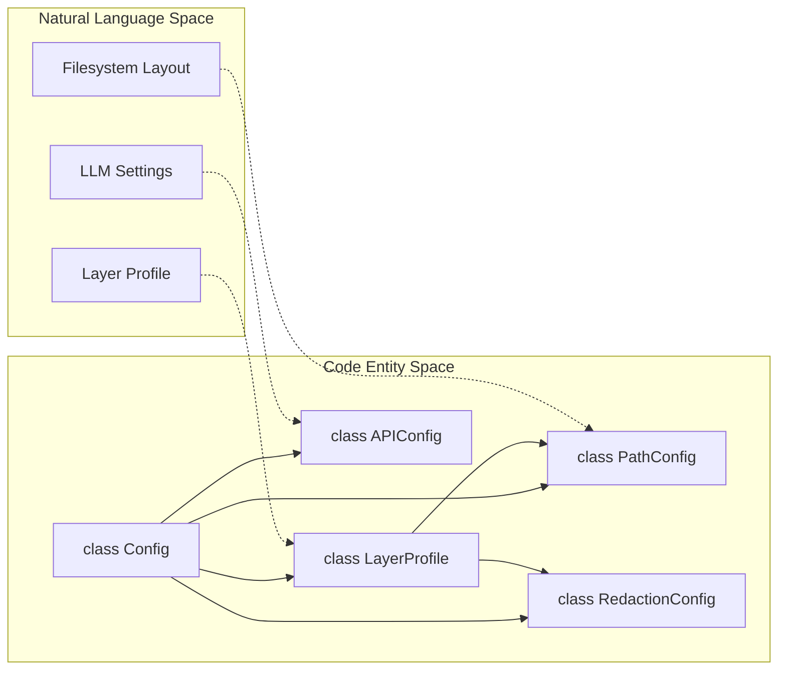
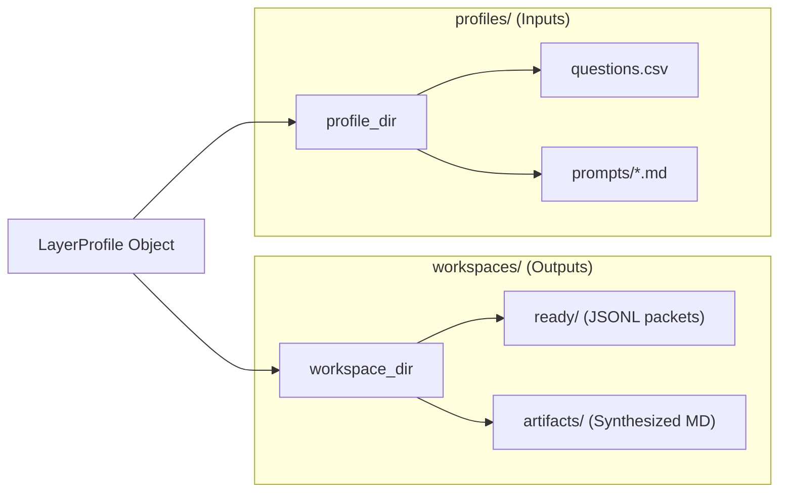

# Configuration System
Relevant source files
- [core/config.py](https://github.com/Cody-W-Tucker/Cognitive-Assistant/blob/a77ddaf6/core/config.py)
- [core/ingest_substrate.py](https://github.com/Cody-W-Tucker/Cognitive-Assistant/blob/a77ddaf6/core/ingest_substrate.py)
- [flake.lock](https://github.com/Cody-W-Tucker/Cognitive-Assistant/blob/a77ddaf6/flake.lock)
- [lib/config.py](https://github.com/Cody-W-Tucker/Cognitive-Assistant/blob/a77ddaf6/lib/config.py)
- [profiles/README.md](https://github.com/Cody-W-Tucker/Cognitive-Assistant/blob/a77ddaf6/profiles/README.md?plain=1)

The Cognitive Assistant utilizes a unified configuration system that parameterizes a shared pipeline across different conceptual layers (Existential and Operational). This architecture ensures that the logic for data ingestion, synthesis, and artifact generation remains consistent while the source material, prompt templates, and output goals vary by profile.

## The LayerProfile Dataclass

The `LayerProfile` class is the central declaration point for a pipeline layer. It defines identity, filesystem locations, and capability gates that determine how the core logic interacts with a specific profile's data.

| Attribute | Description |
| --- | --- |
| `name` | Internal slug (e.g., `existential`, `operational`). |
| `profile_dir` | The source directory containing committed inputs ([core/config.py66](https://github.com/Cody-W-Tucker/Cognitive-Assistant/blob/a77ddaf6/core/config.py#L66-L66)). |
| `workspace_dir` | The output directory for generated artifacts ([core/config.py67](https://github.com/Cody-W-Tucker/Cognitive-Assistant/blob/a77ddaf6/core/config.py#L67-L67)). |
| `prompt_files` | A mapping of logical prompt names to filenames within `prompts_dir` ([core/config.py75-76](https://github.com/Cody-W-Tucker/Cognitive-Assistant/blob/a77ddaf6/core/config.py#L75-L76)). |
| `has_corpus_ingest` | Boolean flag enabling batch artifact processing ([core/config.py82](https://github.com/Cody-W-Tucker/Cognitive-Assistant/blob/a77ddaf6/core/config.py#L82-L82)). |
| `skill_specs` | List of `SkillSpec` objects defining how to extract skills from synthesized profiles ([core/config.py97](https://github.com/Cody-W-Tucker/Cognitive-Assistant/blob/a77ddaf6/core/config.py#L97-L97)). |

### SkillSpec Implementation

A `SkillSpec`[core/config.py49-55](https://github.com/Cody-W-Tucker/Cognitive-Assistant/blob/a77ddaf6/core/config.py#L49-L55) defines a canonical skill by mapping a `slug` to specific `source_headings` within the synthesized `human_profile.md`. This allows the `SkillsCreator` to extract structured data from unstructured LLM output.

**Sources:**[core/config.py48-98](https://github.com/Cody-W-Tucker/Cognitive-Assistant/blob/a77ddaf6/core/config.py#L48-L98)[profiles/README.md30-38](https://github.com/Cody-W-Tucker/Cognitive-Assistant/blob/a77ddaf6/profiles/README.md?plain=1#L30-L38)

## Configuration Factory and Sub-Configs

The `Config` class (instantiated via `Config.from_profile(name)`) acts as a facade, aggregating specialized configuration objects that handle specific subsystems.

### Logical Entity Mapping: Configuration Space

This diagram bridges the high-level configuration concepts to the specific Python classes and factory methods used in the code.

**Sources:**[core/config.py10-12](https://github.com/Cody-W-Tucker/Cognitive-Assistant/blob/a77ddaf6/core/config.py#L10-L12)[lib/config.py18-20](https://github.com/Cody-W-Tucker/Cognitive-Assistant/blob/a77ddaf6/lib/config.py#L18-L20)[lib/config.py149-150](https://github.com/Cody-W-Tucker/Cognitive-Assistant/blob/a77ddaf6/lib/config.py#L149-L150)

### Sub-Config Roles

- **APIConfig**: Manages LLM provider selection (`LLM_PROVIDER`), model mapping (initial vs. refine), and context window limits [lib/config.py18-60](https://github.com/Cody-W-Tucker/Cognitive-Assistant/blob/a77ddaf6/lib/config.py#L18-L60) It includes the `create_client` factory for generating `OpenAI` or `Anthropic` clients [lib/config.py99-148](https://github.com/Cody-W-Tucker/Cognitive-Assistant/blob/a77ddaf6/lib/config.py#L99-L148)
- **PathConfig**: Derives absolute paths for the pipeline. It handles the `BASE_DIR` and ensures runtime directories (like `READY_DIR` or `ARTIFACTS_DIR`) exist [lib/config.py149-167](https://github.com/Cody-W-Tucker/Cognitive-Assistant/blob/a77ddaf6/lib/config.py#L149-L167)
- **RedactionConfig**: Stores regex patterns for PII removal. It provides a `get_redaction_function` used during the prompt synthesis stage to scrub sensitive data [lib/config.py169-193](https://github.com/Cody-W-Tucker/Cognitive-Assistant/blob/a77ddaf6/lib/config.py#L169-L193)

**Sources:**[lib/config.py17-194](https://github.com/Cody-W-Tucker/Cognitive-Assistant/blob/a77ddaf6/lib/config.py#L17-L194)

## Profile Registration and Discovery

Profiles are registered in a global `_PROFILES` dictionary [core/config.py105](https://github.com/Cody-W-Tucker/Cognitive-Assistant/blob/a77ddaf6/core/config.py#L105-L105) The system provides two built-in profiles: `EXISTENTIAL_PROFILE` and `OPERATIONAL_PROFILE`.

### Filesystem Layout Derivation

The system enforces a strict separation between **Inputs** (committed to Git) and **Outputs** (generated at runtime). The `LayerProfile` declaration dictates this layout:

### Registered Profile Comparison

| Feature | Existential Profile | Operational Profile |
| --- | --- | --- |
| **Input Source** | Substrate (Graph/Focus) [core/config.py136-139](https://github.com/Cody-W-Tucker/Cognitive-Assistant/blob/a77ddaf6/core/config.py#L136-L139) | Corpus (Files/Docs) [core/config.py194](https://github.com/Cody-W-Tucker/Cognitive-Assistant/blob/a77ddaf6/core/config.py#L194-L194) |
| **RLM Globs** | `ready/substrate/*.jsonl` | `ready/**/*.jsonl` |
| **Tool Specs** | Disabled (`has_tool_specs=False`) | Enabled (`has_tool_specs=True`) |
| **Synthesis Goal** | Identity & Frame | Workflow & Rules |

**Sources:**[core/config.py128-206](https://github.com/Cody-W-Tucker/Cognitive-Assistant/blob/a77ddaf6/core/config.py#L128-L206)[profiles/README.md5-10](https://github.com/Cody-W-Tucker/Cognitive-Assistant/blob/a77ddaf6/profiles/README.md?plain=1#L5-L10)

## Data Flow: From Profile to Pipeline

When a command is executed via `python -m core --profile <name>`, the following flow occurs:

1. **Resolution**: `get_profile(name)` retrieves the `LayerProfile`[core/config.py113-119](https://github.com/Cody-W-Tucker/Cognitive-Assistant/blob/a77ddaf6/core/config.py#L113-L119)
2. **Instantiation**: `Config.from_profile` builds the sub-configs (`PathConfig`, `APIConfig`, etc.) based on the profile's attributes.
3. **Path Resolution**: `PathConfig` maps relative logical paths to absolute paths on the local filesystem using `ROOT_DIR`[core/config.py23-25](https://github.com/Cody-W-Tucker/Cognitive-Assistant/blob/a77ddaf6/core/config.py#L23-L25)
4. **Execution**: The pipeline stage (e.g., `ingest_substrate.run`) receives the `Config` object and uses `config.paths.READY_DIR` to write its output [core/ingest_substrate.py208](https://github.com/Cody-W-Tucker/Cognitive-Assistant/blob/a77ddaf6/core/ingest_substrate.py#L208-L208)

**Sources:**[core/config.py1-12](https://github.com/Cody-W-Tucker/Cognitive-Assistant/blob/a77ddaf6/core/config.py#L1-L12)[core/ingest_substrate.py188-208](https://github.com/Cody-W-Tucker/Cognitive-Assistant/blob/a77ddaf6/core/ingest_substrate.py#L188-L208)