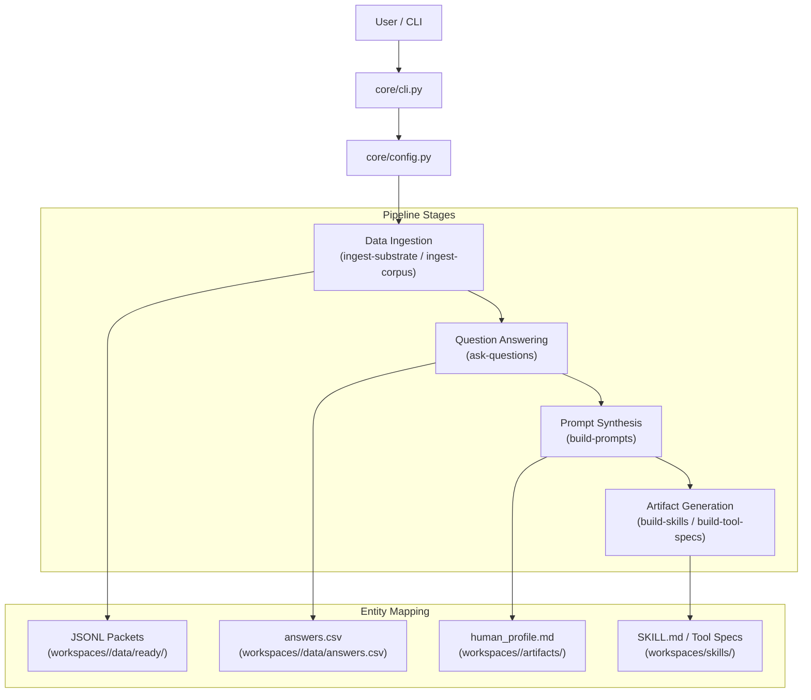
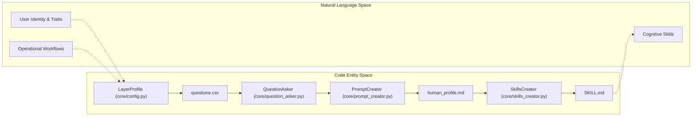

# Core Pipeline Architecture
Relevant source files
- [core/cli.py](https://github.com/Cody-W-Tucker/Cognitive-Assistant/blob/a77ddaf6/core/cli.py)
- [core/config.py](https://github.com/Cody-W-Tucker/Cognitive-Assistant/blob/a77ddaf6/core/config.py)

The **Core Pipeline Architecture** provides a unified execution model for processing raw human-centric data into structured cognitive artifacts. The system is designed around a single, parameterized pipeline defined in `core/` that adapts its behavior based on a `LayerProfile`. This architecture ensures that whether the system is processing existential identity data or operational workflow data, the underlying stages—ingestion, questioning, synthesis, and artifact generation—remain consistent and observable.

## System Flow Overview

The pipeline operates as a directed flow from raw inputs to refined cognitive models. Commands are issued via the unified CLI, which initializes a `Config` object derived from a specific `LayerProfile`. This configuration then drives the execution of various stages, ensuring that data is stored in the correct workspace and processed using the appropriate prompt sets.

### Command Execution Pipeline

The following diagram illustrates how a command flows from the user through the core logic to generate artifacts.

**Unified Command Flow**

**Sources:**[core/cli.py2-18](https://github.com/Cody-W-Tucker/Cognitive-Assistant/blob/a77ddaf6/core/cli.py#L2-L18)[core/cli.py178-210](https://github.com/Cody-W-Tucker/Cognitive-Assistant/blob/a77ddaf6/core/cli.py#L178-L210)[core/config.py4-12](https://github.com/Cody-W-Tucker/Cognitive-Assistant/blob/a77ddaf6/core/config.py#L4-L12)

---

## 2.1 CLI and Command Reference

The CLI acts as the primary entry point for all pipeline operations. It supports subcommands for individual stages (e.g., `ingest-substrate`, `ask-questions`) and compound commands like `update` which orchestrates multiple stages to refresh a profile's artifacts. The CLI is responsible for validating profile names and ensuring the execution environment is healthy.

For details, see [CLI and Command Reference](/Cody-W-Tucker/Cognitive-Assistant/2.1-cli-and-command-reference).

**Sources:**[core/cli.py30-166](https://github.com/Cody-W-Tucker/Cognitive-Assistant/blob/a77ddaf6/core/cli.py#L30-L166)[core/cli.py207-211](https://github.com/Cody-W-Tucker/Cognitive-Assistant/blob/a77ddaf6/core/cli.py#L207-L211)

---

## 2.2 Configuration System

The configuration system is centered around the `LayerProfile` dataclass and the `Config` factory. A `LayerProfile` statically declares the identity, filesystem paths, RLM (Retrieval-Augmented Language Model) parameters, and pipeline gates for a specific layer (e.g., `existential` or `operational`). The `Config` class wraps this profile to provide a unified interface for the rest of the `core/` logic.

For details, see [Configuration System](/Cody-W-Tucker/Cognitive-Assistant/2.2-configuration-system).

**Sources:**[core/config.py48-98](https://github.com/Cody-W-Tucker/Cognitive-Assistant/blob/a77ddaf6/core/config.py#L48-L98)[core/config.py108-119](https://github.com/Cody-W-Tucker/Cognitive-Assistant/blob/a77ddaf6/core/config.py#L108-L119)

---

## 2.3 Data Ingestion

Data ingestion transforms raw source material into a normalized format suitable for RLM queries.

- **Substrate Ingestion:** Projects schema graph and focus-bundle exports into JSONL packets, primarily used by the existential profile.
- **Corpus Ingestion:** Normalizes intake exports into ready-to-query JSONL files for operational profiles.

For details, see [Data Ingestion](/Cody-W-Tucker/Cognitive-Assistant/2.3-data-ingestion).

**Sources:**[core/cli.py43-68](https://github.com/Cody-W-Tucker/Cognitive-Assistant/blob/a77ddaf6/core/cli.py#L43-L68)[core/config.py136-139](https://github.com/Cody-W-Tucker/Cognitive-Assistant/blob/a77ddaf6/core/config.py#L136-L139)[core/config.py194](https://github.com/Cody-W-Tucker/Cognitive-Assistant/blob/a77ddaf6/core/config.py#L194-L194)

---

## 2.4 Question Answering and Prompt Creation

This stage represents the "reasoning" core of the pipeline. It uses the `RLM` (Retrieval Language Model) to query the ingested data against a set of questions defined in the profile's `questions.csv`.

1. **`ask-questions`**: Iterates through questions, applying a `rlm_query_template` to generate answers stored in `answers.csv`.
2. **`build-prompts`**: Takes the accumulated answers and uses an ensemble of LLMs to synthesize a comprehensive `human_profile.md`.

For details, see [Question Answering and Prompt Creation](/Cody-W-Tucker/Cognitive-Assistant/2.4-question-answering-and-prompt-creation).

**Sources:**[core/cli.py70-77](https://github.com/Cody-W-Tucker/Cognitive-Assistant/blob/a77ddaf6/core/cli.py#L70-L77)[core/config.py140-146](https://github.com/Cody-W-Tucker/Cognitive-Assistant/blob/a77ddaf6/core/config.py#L140-L146)[core/config.py195-202](https://github.com/Cody-W-Tucker/Cognitive-Assistant/blob/a77ddaf6/core/config.py#L195-L202)

---

## Architectural Mapping: Code Entities to Concepts

This diagram bridges the gap between the conceptual pipeline stages and the specific Python classes and filesystem entities that implement them.

**Code Entity to Pipeline Mapping**

**Sources:**[core/config.py48-98](https://github.com/Cody-W-Tucker/Cognitive-Assistant/blob/a77ddaf6/core/config.py#L48-L98)[core/config.py128-184](https://github.com/Cody-W-Tucker/Cognitive-Assistant/blob/a77ddaf6/core/config.py#L128-L184)[core/cli.py79-82](https://github.com/Cody-W-Tucker/Cognitive-Assistant/blob/a77ddaf6/core/cli.py#L79-L82)

### Pipeline Gates and Feature Support

The pipeline uses boolean gates within the `LayerProfile` to enable or disable specific generation logic based on the profile's purpose.

| Feature Gate | Code Symbol | Existential Profile | Operational Profile |
| --- | --- | --- | --- |
| Corpus Ingestion | `has_corpus_ingest` | `False` | `True` |
| Tool Spec Generation | `has_tool_specs` | `False` | `True` |
| Skill Generation | `skill_specs` | 3 Defined | 0 Defined (Global) |

**Sources:**[core/config.py82-83](https://github.com/Cody-W-Tucker/Cognitive-Assistant/blob/a77ddaf6/core/config.py#L82-L83)[core/config.py148-149](https://github.com/Cody-W-Tucker/Cognitive-Assistant/blob/a77ddaf6/core/config.py#L148-L149)[core/config.py205-206](https://github.com/Cody-W-Tucker/Cognitive-Assistant/blob/a77ddaf6/core/config.py#L205-L206)