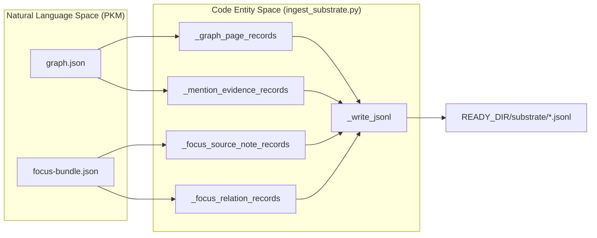
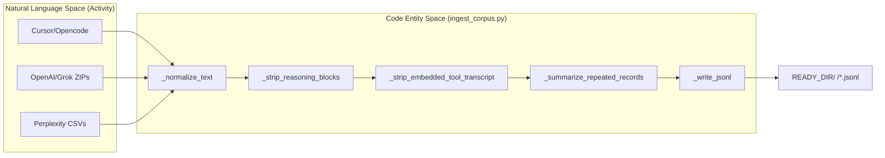

# Data Ingestion
Relevant source files
- [core/ingest_corpus.py](https://github.com/Cody-W-Tucker/Cognitive-Assistant/blob/a77ddaf6/core/ingest_corpus.py)
- [core/ingest_substrate.py](https://github.com/Cody-W-Tucker/Cognitive-Assistant/blob/a77ddaf6/core/ingest_substrate.py)
- [flake.lock](https://github.com/Cody-W-Tucker/Cognitive-Assistant/blob/a77ddaf6/flake.lock)
- [lib/config.py](https://github.com/Cody-W-Tucker/Cognitive-Assistant/blob/a77ddaf6/lib/config.py)
- [tests/test_ingest_substrate.py](https://github.com/Cody-W-Tucker/Cognitive-Assistant/blob/a77ddaf6/tests/test_ingest_substrate.py)

The Cognitive Assistant employs two distinct ingestion pathways to transform raw data into a structured format suitable for the existential and operational profiles. These pathways normalize disparate data sources—ranging from knowledge graphs and focus bundles to chat logs and search histories—into a unified JSONL packet format used by the Retrieval-Augmented Language Model (RLM) [core/ingest_substrate.py2-4](https://github.com/Cody-W-Tucker/Cognitive-Assistant/blob/a77ddaf6/core/ingest_substrate.py#L2-L4)

## Ingestion Pathways

### 1. Substrate Ingestion (`ingest-substrate`)

This pathway processes structured knowledge exports, typically originating from a user's personal knowledge management (PKM) system. It focuses on the **Existential Profile**, capturing identity, core frames, and cognitive patterns [core/ingest_substrate.py2-4](https://github.com/Cody-W-Tucker/Cognitive-Assistant/blob/a77ddaf6/core/ingest_substrate.py#L2-L4)

**Key Inputs:**

- `graph.json`: A complete export of the knowledge graph containing entities (people, organizations, etc.) and their relationships [core/ingest_substrate.py14-25](https://github.com/Cody-W-Tucker/Cognitive-Assistant/blob/a77ddaf6/core/ingest_substrate.py#L14-L25)
- `focus-bundle.json`: Specific bundles containing a focal entity, its body, and associated evidence from source notes [core/ingest_substrate.py91-94](https://github.com/Cody-W-Tucker/Cognitive-Assistant/blob/a77ddaf6/core/ingest_substrate.py#L91-L94)

### 2. Corpus Ingestion (`ingest-corpus`)

This pathway processes high-volume, unstructured activity data for the **Operational Profile**. It normalizes raw exports from AI tools and chat interfaces into high-signal artifacts [core/ingest_corpus.py2-14](https://github.com/Cody-W-Tucker/Cognitive-Assistant/blob/a77ddaf6/core/ingest_corpus.py#L2-L14)

**Supported Sources:**

- **Code Editors:** Cursor and Opencode JSONL exports [core/ingest_corpus.py8-9](https://github.com/Cody-W-Tucker/Cognitive-Assistant/blob/a77ddaf6/core/ingest_corpus.py#L8-L9)
- **Chat Interfaces:** Open-WebUI, OpenAI Chat, and Grok exports [core/ingest_corpus.py10-13](https://github.com/Cody-W-Tucker/Cognitive-Assistant/blob/a77ddaf6/core/ingest_corpus.py#L10-L13)
- **Search/Memory:** Perplexity history and memory CSVs [core/ingest_corpus.py11](https://github.com/Cody-W-Tucker/Cognitive-Assistant/blob/a77ddaf6/core/ingest_corpus.py#L11-L11)

---

## Data Flow: Substrate Ingestion

The `ingest-substrate` command maps complex graph structures into four primary record types.

### Substrate Record Types

| Record Type | Purpose | Key Fields |
| --- | --- | --- |
| `graph_page` | Represents a single entity or note in the graph. | `slug`, `title`, `body`, `frontmatter` |
| `mention_evidence` | Captures where one entity is mentioned by another, providing context. | `target_slug`, `source_slug`, `matched_lines` |
| `focus_source_note` | Links a specific focus bundle to the source notes that inform it. | `focus_slug`, `note_summary`, `matched_lines` |
| `focus_relation` | Describes relationships between a focus entity and other graph entities. | `focus_slug`, `related_slug`, `relation_group` |

Sources: [core/ingest_substrate.py44-144](https://github.com/Cody-W-Tucker/Cognitive-Assistant/blob/a77ddaf6/core/ingest_substrate.py#L44-L144)

### Implementation Logic

The `convert_substrate_exports` function acts as the orchestrator for this pathway [core/ingest_substrate.py147-152](https://github.com/Cody-W-Tucker/Cognitive-Assistant/blob/a77ddaf6/core/ingest_substrate.py#L147-L152) It iterates through graph groups (e.g., `people`, `projects`, `tasks`) and transforms them into JSONL packets [core/ingest_substrate.py14-25](https://github.com/Cody-W-Tucker/Cognitive-Assistant/blob/a77ddaf6/core/ingest_substrate.py#L14-L25)

**Substrate Transformation Flow**

Sources: [core/ingest_substrate.py44-185](https://github.com/Cody-W-Tucker/Cognitive-Assistant/blob/a77ddaf6/core/ingest_substrate.py#L44-L185)

---

## Data Flow: Corpus Ingestion

The `ingest-corpus` pathway focuses on normalization and signal extraction. It strips "noise" such as LLM reasoning blocks and tool execution transcripts to ensure the RLM processes only high-value user intent and assistant responses [core/ingest_corpus.py62-96](https://github.com/Cody-W-Tucker/Cognitive-Assistant/blob/a77ddaf6/core/ingest_corpus.py#L62-L96)

### Normalization Pipeline

1. **Reasoning Stripping:** Removes `
` and `
` blocks [core/ingest_corpus.py62-71](https://github.com/Cody-W-Tucker/Cognitive-Assistant/blob/a77ddaf6/core/ingest_corpus.py#L62-L71)
2. **Tool Transcript Removal:** Filters out verbose tool call logs (e.g., "Called the tool...", `<file>` blocks) [core/ingest_corpus.py73-96](https://github.com/Cody-W-Tucker/Cognitive-Assistant/blob/a77ddaf6/core/ingest_corpus.py#L73-L96)
3. **Text Truncation:** Limits user text to a maximum length (default 2000 chars) to prevent context window exhaustion during synthesis [core/ingest_corpus.py35](https://github.com/Cody-W-Tucker/Cognitive-Assistant/blob/a77ddaf6/core/ingest_corpus.py#L35-L35)[core/ingest_corpus.py118-121](https://github.com/Cody-W-Tucker/Cognitive-Assistant/blob/a77ddaf6/core/ingest_corpus.py#L118-L121)
4. **Deduplication:** The `_summarize_repeated_records` function groups identical user prompts and adds a `repeated` count to highlight frequent patterns [core/ingest_corpus.py124-144](https://github.com/Cody-W-Tucker/Cognitive-Assistant/blob/a77ddaf6/core/ingest_corpus.py#L124-L144)

**Corpus Transformation Flow**

Sources: [core/ingest_corpus.py62-158](https://github.com/Cody-W-Tucker/Cognitive-Assistant/blob/a77ddaf6/core/ingest_corpus.py#L62-L158)

---

## Technical Configuration

The ingestion process is governed by the `Config` and `PathConfig` classes, which ensure that output directories exist before writing [lib/config.py149-167](https://github.com/Cody-W-Tucker/Cognitive-Assistant/blob/a77ddaf6/lib/config.py#L149-L167)

### Directory Structure

Ingestion results are stored in the `READY_DIR`, which is typically defined as `data/ready/` within the profile's workspace [core/config.py157-160](https://github.com/Cody-W-Tucker/Cognitive-Assistant/blob/a77ddaf6/core/config.py#L157-L160)

- **Substrate Output:**`data/ready/substrate/`
- **Corpus Output:**`data/ready/<source_name>/` (e.g., `data/ready/openai/`)

### CLI Usage

The pathways are invoked via the following commands:

- `python -m core ingest-substrate --graph <path> --focus <path>`
- `python -m core ingest-corpus` (which automatically scans `data/intake/`)

Sources: [core/ingest_substrate.py188-216](https://github.com/Cody-W-Tucker/Cognitive-Assistant/blob/a77ddaf6/core/ingest_substrate.py#L188-L216)[core/ingest_corpus.py4-14](https://github.com/Cody-W-Tucker/Cognitive-Assistant/blob/a77ddaf6/core/ingest_corpus.py#L4-L14)