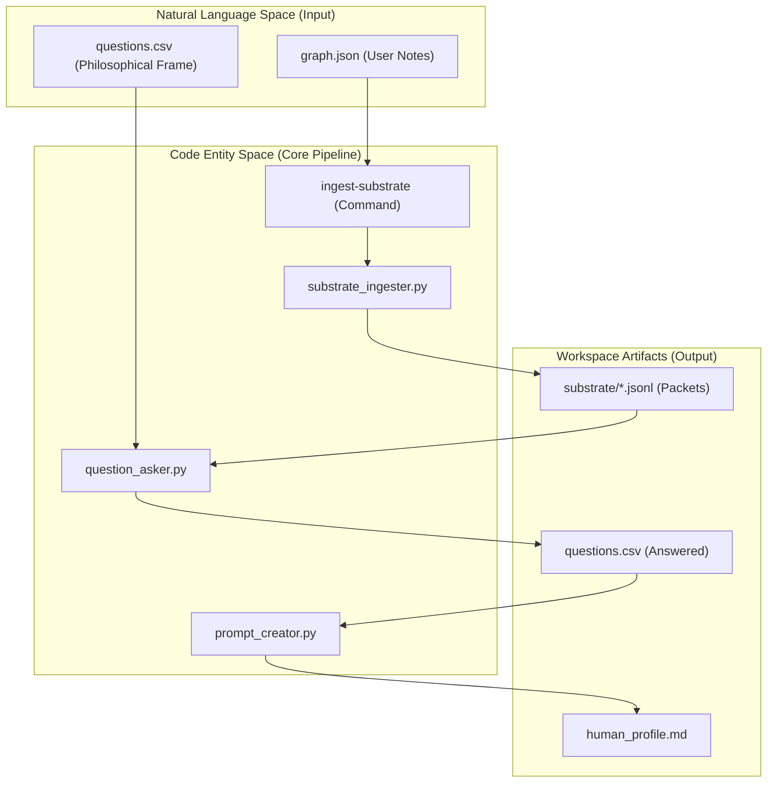
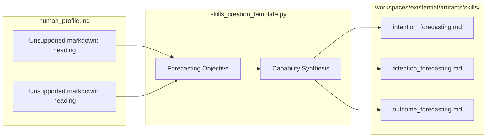

# Existential Profile
Relevant source files
- [profiles/existential/README.md](https://github.com/Cody-W-Tucker/Cognitive-Assistant/blob/a77ddaf6/profiles/existential/README.md?plain=1)
- [profiles/existential/prompts/README.md](https://github.com/Cody-W-Tucker/Cognitive-Assistant/blob/a77ddaf6/profiles/existential/prompts/README.md?plain=1)
- [profiles/existential/prompts/initial_template.md](https://github.com/Cody-W-Tucker/Cognitive-Assistant/blob/a77ddaf6/profiles/existential/prompts/initial_template.md?plain=1)
- [profiles/existential/prompts/skills_creation_template.md](https://github.com/Cody-W-Tucker/Cognitive-Assistant/blob/a77ddaf6/profiles/existential/prompts/skills_creation_template.md?plain=1)
- [profiles/existential/questions.csv](https://github.com/Cody-W-Tucker/Cognitive-Assistant/blob/a77ddaf6/profiles/existential/questions.csv)
- [profiles/operational/prompts/initial_template.md](https://github.com/Cody-W-Tucker/Cognitive-Assistant/blob/a77ddaf6/profiles/operational/prompts/initial_template.md?plain=1)
- [workspaces/alignment/artifacts/alignment_spec.md](https://github.com/Cody-W-Tucker/Cognitive-Assistant/blob/a77ddaf6/workspaces/alignment/artifacts/alignment_spec.md?plain=1)
- [workspaces/existential/artifacts/README.md](https://github.com/Cody-W-Tucker/Cognitive-Assistant/blob/a77ddaf6/workspaces/existential/artifacts/README.md?plain=1)
- [workspaces/existential/artifacts/human_profile.md](https://github.com/Cody-W-Tucker/Cognitive-Assistant/blob/a77ddaf6/workspaces/existential/artifacts/human_profile.md?plain=1)
- [workspaces/existential/artifacts/profile_candidate_anthropic.md](https://github.com/Cody-W-Tucker/Cognitive-Assistant/blob/a77ddaf6/workspaces/existential/artifacts/profile_candidate_anthropic.md?plain=1)
- [workspaces/existential/artifacts/profile_candidate_openai.md](https://github.com/Cody-W-Tucker/Cognitive-Assistant/blob/a77ddaf6/workspaces/existential/artifacts/profile_candidate_openai.md?plain=1)
- [workspaces/existential/artifacts/profile_candidate_xai.md](https://github.com/Cody-W-Tucker/Cognitive-Assistant/blob/a77ddaf6/workspaces/existential/artifacts/profile_candidate_xai.md?plain=1)

The **Existential Profile** is the foundational layer of the Cognitive Assistant's user modeling system. Its purpose is to reconstruct the user's "Core Frame"—their identity, value hierarchies, and deep cognitive patterns—to help downstream AI systems make better judgments in ambiguous, novel, or tradeoff-heavy conversations [profiles/existential/prompts/initial_template.md6-10](https://github.com/Cody-W-Tucker/Cognitive-Assistant/blob/a77ddaf6/profiles/existential/prompts/initial_template.md?plain=1#L6-L10)

Unlike a personality essay, the existential profile is an operational artifact designed for **capability transfer**, transforming raw user data into specific reasoning advantages for an assistant [profiles/existential/prompts/skills_creation_template.md6-10](https://github.com/Cody-W-Tucker/Cognitive-Assistant/blob/a77ddaf6/profiles/existential/prompts/skills_creation_template.md?plain=1#L6-L10)

## Substrate Ingestion Path

The existential profile is built upon a "substrate" of structured user data, typically exported from a personal knowledge graph (e.g., Obsidian or Logseq). This data is ingested via the `ingest-substrate` command, which processes a `graph.json` file into discrete JSONL packets [profiles/existential/README.md9-10](https://github.com/Cody-W-Tucker/Cognitive-Assistant/blob/a77ddaf6/profiles/existential/README.md?plain=1#L9-L10)

### Data Flow: Graph to Profile

The following diagram illustrates the transition from Natural Language substrate to the code-driven generation of the profile.

**Existential Data Pipeline**

**Sources:**[profiles/existential/README.md9-15](https://github.com/Cody-W-Tucker/Cognitive-Assistant/blob/a77ddaf6/profiles/existential/README.md?plain=1#L9-L15)[profiles/existential/questions.csv1-21](https://github.com/Cody-W-Tucker/Cognitive-Assistant/blob/a77ddaf6/profiles/existential/questions.csv#L1-L21)[workspaces/existential/artifacts/human_profile.md1-5](https://github.com/Cody-W-Tucker/Cognitive-Assistant/blob/a77ddaf6/workspaces/existential/artifacts/human_profile.md?plain=1#L1-L5)

## Five-Pillar Methodology

The profile is synthesized using the `initial_template.md`, which employs a five-pillar analysis methodology to ensure the resulting `human_profile.md` is operationally useful [profiles/existential/prompts/initial_template.md30-150](https://github.com/Cody-W-Tucker/Cognitive-Assistant/blob/a77ddaf6/profiles/existential/prompts/initial_template.md?plain=1#L30-L150)

| Pillar | Focus | Operational Goal |
| --- | --- | --- |
| **1. High-Leverage Signals** | Deviations & Values | Identify 6-10 signals that change the right AI response [profiles/existential/prompts/initial_template.md31-36](https://github.com/Cody-W-Tucker/Cognitive-Assistant/blob/a77ddaf6/profiles/existential/prompts/initial_template.md?plain=1#L31-L36) |
| **2. Interpretation Rules** | Ambiguity Mapping | Define how to read surface requests vs. underlying goals [profiles/existential/prompts/initial_template.md88-96](https://github.com/Cody-W-Tucker/Cognitive-Assistant/blob/a77ddaf6/profiles/existential/prompts/initial_template.md?plain=1#L88-L96) |
| **3. Context & Trajectory** | Lived History | Extract only history that materially affects downstream reasoning [profiles/existential/prompts/initial_template.md111-120](https://github.com/Cody-W-Tucker/Cognitive-Assistant/blob/a77ddaf6/profiles/existential/prompts/initial_template.md?plain=1#L111-L120) |
| **4. Constraints & Traps** | Failure Modes | Map recurring traps a generic model might accidentally reinforce [profiles/existential/prompts/initial_template.md139-144](https://github.com/Cody-W-Tucker/Cognitive-Assistant/blob/a77ddaf6/profiles/existential/prompts/initial_template.md?plain=1#L139-L144) |
| **5. Counterpart Qualities** | Collaborative Fit | Define the ideal "shape" of the assistant to match the user [profiles/existential/prompts/initial_template.md146-150](https://github.com/Cody-W-Tucker/Cognitive-Assistant/blob/a77ddaf6/profiles/existential/prompts/initial_template.md?plain=1#L146-L150) |

**Sources:**[profiles/existential/prompts/initial_template.md30-150](https://github.com/Cody-W-Tucker/Cognitive-Assistant/blob/a77ddaf6/profiles/existential/prompts/initial_template.md?plain=1#L30-L150)

## Synthesis and RLM Integration

The system uses **Reflective Language Modeling (RLM)** to synthesize answers. The `rlm_query_template` (referenced in `RLMConfig`) drives a first-person synthesis of the user's data [profiles/existential/README.md11-12](https://github.com/Cody-W-Tucker/Cognitive-Assistant/blob/a77ddaf6/profiles/existential/README.md?plain=1#L11-L12)

The `ask-questions` loop iterates through `questions.csv`, which contains inquiries based on developmental psychology and existential philosophy (e.g., Piaget, Nietzsche) to probe the user's "Will to Power," "Apollonian/Dionysian aspects," and "Stage Progression" [profiles/existential/README.md25-29](https://github.com/Cody-W-Tucker/Cognitive-Assistant/blob/a77ddaf6/profiles/existential/README.md?plain=1#L25-L29)[profiles/existential/questions.csv6-11](https://github.com/Cody-W-Tucker/Cognitive-Assistant/blob/a77ddaf6/profiles/existential/questions.csv#L6-L11)

### Artifact: human_profile.md

The primary output is `human_profile.md`. It is structured to be read by both humans (for verification) and LLMs (as a system prompt or context).

**Key Sections in `human_profile.md`:**

- **Core Frame:** The user's master operating logic (e.g., "systems-oriented builder") [workspaces/existential/artifacts/human_profile.md1-5](https://github.com/Cody-W-Tucker/Cognitive-Assistant/blob/a77ddaf6/workspaces/existential/artifacts/human_profile.md?plain=1#L1-L5)
- **High-Leverage Signals:** Specific traps like "Reflection-as-avoidance" [workspaces/existential/artifacts/human_profile.md7-17](https://github.com/Cody-W-Tucker/Cognitive-Assistant/blob/a77ddaf6/workspaces/existential/artifacts/human_profile.md?plain=1#L7-L17)
- **Interpretation Rules:** Cues for ambiguous requests (e.g., "When he asks for a framework... he often has enough clarity") [workspaces/existential/artifacts/human_profile.md19-30](https://github.com/Cody-W-Tucker/Cognitive-Assistant/blob/a77ddaf6/workspaces/existential/artifacts/human_profile.md?plain=1#L19-L30)
- **Cognitive Patterns:** Details on processing, attention, and decision styles [workspaces/existential/artifacts/human_profile.md31-40](https://github.com/Cody-W-Tucker/Cognitive-Assistant/blob/a77ddaf6/workspaces/existential/artifacts/human_profile.md?plain=1#L31-L40)

**Sources:**[workspaces/existential/artifacts/human_profile.md1-50](https://github.com/Cody-W-Tucker/Cognitive-Assistant/blob/a77ddaf6/workspaces/existential/artifacts/human_profile.md?plain=1#L1-L50)[profiles/existential/README.md31-32](https://github.com/Cody-W-Tucker/Cognitive-Assistant/blob/a77ddaf6/profiles/existential/README.md?plain=1#L31-L32)

## Skills Generation

Once the profile is generated, the `SkillsCreator` (via `build-skills`) transforms the profile's headings into OpenCode-compatible skills [profiles/existential/README.md31-32](https://github.com/Cody-W-Tucker/Cognitive-Assistant/blob/a77ddaf6/profiles/existential/README.md?plain=1#L31-L32)

**Skills Transformation Logic**

**Sources:**[profiles/existential/prompts/skills_creation_template.md1-27](https://github.com/Cody-W-Tucker/Cognitive-Assistant/blob/a77ddaf6/profiles/existential/prompts/skills_creation_template.md?plain=1#L1-L27)[workspaces/existential/artifacts/README.md1-7](https://github.com/Cody-W-Tucker/Cognitive-Assistant/blob/a77ddaf6/workspaces/existential/artifacts/README.md?plain=1#L1-L7)

Each generated skill must improve one of three forecasting tasks:

1. **Intention Forecasting:** Reconstructing the path to a request [profiles/existential/prompts/skills_creation_template.md29-33](https://github.com/Cody-W-Tucker/Cognitive-Assistant/blob/a77ddaf6/profiles/existential/prompts/skills_creation_template.md?plain=1#L29-L33)
2. **Attention Forecasting:** Noticing signals a generic model would miss [profiles/existential/prompts/skills_creation_template.md35-39](https://github.com/Cody-W-Tucker/Cognitive-Assistant/blob/a77ddaf6/profiles/existential/prompts/skills_creation_template.md?plain=1#L35-L39)
3. **Outcome Forecasting:** Predicting what the user counts as "good help" [profiles/existential/prompts/skills_creation_template.md40-44](https://github.com/Cody-W-Tucker/Cognitive-Assistant/blob/a77ddaf6/profiles/existential/prompts/skills_creation_template.md?plain=1#L40-L44)