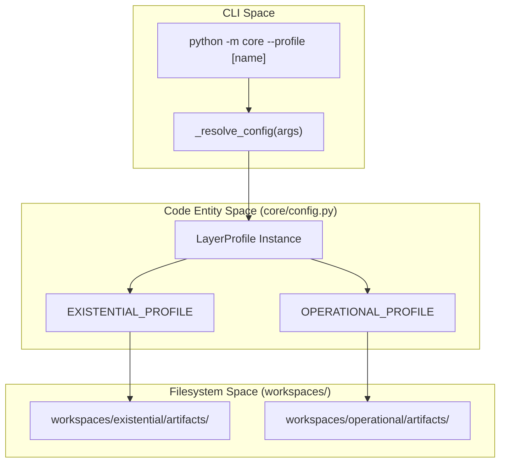
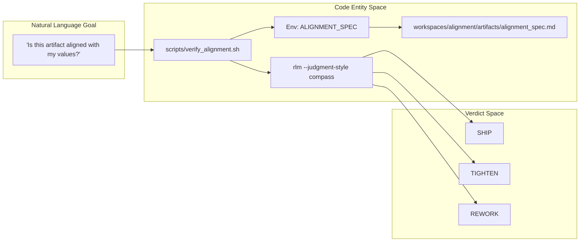

# Glossary
Relevant source files
- [AGENTS.md](https://github.com/Cody-W-Tucker/Cognitive-Assistant/blob/a77ddaf6/AGENTS.md?plain=1)
- [README.md](https://github.com/Cody-W-Tucker/Cognitive-Assistant/blob/a77ddaf6/README.md?plain=1)
- [core/alignment_spec.py](https://github.com/Cody-W-Tucker/Cognitive-Assistant/blob/a77ddaf6/core/alignment_spec.py)
- [core/cli.py](https://github.com/Cody-W-Tucker/Cognitive-Assistant/blob/a77ddaf6/core/cli.py)
- [core/config.py](https://github.com/Cody-W-Tucker/Cognitive-Assistant/blob/a77ddaf6/core/config.py)
- [core/skill_engine.py](https://github.com/Cody-W-Tucker/Cognitive-Assistant/blob/a77ddaf6/core/skill_engine.py)
- [core/skill_enhancer.py](https://github.com/Cody-W-Tucker/Cognitive-Assistant/blob/a77ddaf6/core/skill_enhancer.py)
- [flake.nix](https://github.com/Cody-W-Tucker/Cognitive-Assistant/blob/a77ddaf6/flake.nix)
- [profiles/alignment/prompts/soul_seed.md](https://github.com/Cody-W-Tucker/Cognitive-Assistant/blob/a77ddaf6/profiles/alignment/prompts/soul_seed.md?plain=1)
- [profiles/existential/prompts/initial_template.md](https://github.com/Cody-W-Tucker/Cognitive-Assistant/blob/a77ddaf6/profiles/existential/prompts/initial_template.md?plain=1)
- [profiles/existential/prompts/rlm_query_template.md](https://github.com/Cody-W-Tucker/Cognitive-Assistant/blob/a77ddaf6/profiles/existential/prompts/rlm_query_template.md?plain=1)
- [profiles/operational/prompts/initial_template.md](https://github.com/Cody-W-Tucker/Cognitive-Assistant/blob/a77ddaf6/profiles/operational/prompts/initial_template.md?plain=1)
- [profiles/operational/prompts/rlm_query_template.md](https://github.com/Cody-W-Tucker/Cognitive-Assistant/blob/a77ddaf6/profiles/operational/prompts/rlm_query_template.md?plain=1)
- [scripts/verify_alignment.sh](https://github.com/Cody-W-Tucker/Cognitive-Assistant/blob/a77ddaf6/scripts/verify_alignment.sh)
- [workspaces/alignment/artifacts/SOUL.md](https://github.com/Cody-W-Tucker/Cognitive-Assistant/blob/a77ddaf6/workspaces/alignment/artifacts/SOUL.md?plain=1)
- [workspaces/alignment/artifacts/alignment_spec.md](https://github.com/Cody-W-Tucker/Cognitive-Assistant/blob/a77ddaf6/workspaces/alignment/artifacts/alignment_spec.md?plain=1)
- [workspaces/alignment/artifacts/tool_specs/verify_alignment.md](https://github.com/Cody-W-Tucker/Cognitive-Assistant/blob/a77ddaf6/workspaces/alignment/artifacts/tool_specs/verify_alignment.md?plain=1)
- [workspaces/existential/artifacts/human_profile.md](https://github.com/Cody-W-Tucker/Cognitive-Assistant/blob/a77ddaf6/workspaces/existential/artifacts/human_profile.md?plain=1)
- [workspaces/operational/artifacts/human_profile.md](https://github.com/Cody-W-Tucker/Cognitive-Assistant/blob/a77ddaf6/workspaces/operational/artifacts/human_profile.md?plain=1)

This glossary defines the technical terms, domain-specific jargon, and codebase entities used within the Cognitive Assistant system. It serves as a reference for onboarding engineers to understand how conceptual layers (Existential vs. Operational) map to specific code structures and file paths.

## Core Concepts

### Layer Profile

A static declaration that defines the behavior, input paths, and artifact generation rules for a specific pipeline mode. The system currently supports three primary profiles: `existential`, `operational`, and `alignment`.

- **Implementation**: Defined as the `LayerProfile` dataclass in `core/config.py`.
- **Registration**: Profiles are instantiated and added to a global registry using `register_profile()`[core/config.py108-111](https://github.com/Cody-W-Tucker/Cognitive-Assistant/blob/a77ddaf6/core/config.py#L108-L111)
- **Code Pointer**: [core/config.py58-98](https://github.com/Cody-W-Tucker/Cognitive-Assistant/blob/a77ddaf6/core/config.py#L58-L98)

### Workspace

The runtime output directory where the pipeline persists generated artifacts, ingested data, and intermediate results. Each profile has a corresponding workspace (e.g., `workspaces/existential/`).

- **Structure**: Typically contains `data/ready/` for ingested JSONL packets and `artifacts/` for final LLM-generated documents.
- **Code Pointer**: [core/config.py67](https://github.com/Cody-W-Tucker/Cognitive-Assistant/blob/a77ddaf6/core/config.py#L67-L67)

### RLM (Reasoning Language Model)

An external CLI utility used by this codebase to perform high-context reasoning tasks. It bridges raw data (JSONL) with LLM prompts to generate synthesis.

- **Usage**: The system invokes `rlm` via a subprocess bridge in `lib.config.run_rlm_query`[core/config.py34](https://github.com/Cody-W-Tucker/Cognitive-Assistant/blob/a77ddaf6/core/config.py#L34-L34)
- **Integration**: Used primarily in the `ask-questions` command to process `questions.csv` against ingested evidence.

---

## Technical Terms & Jargon

### Alignment Spec

A personalized production-readiness checklist generated from the union of all system skills and profiles. It is used by the `verify-alignment` tool to score AI-generated content.

- **Artifact**: `workspaces/alignment/artifacts/alignment_spec.md`[flake.nix79](https://github.com/Cody-W-Tucker/Cognitive-Assistant/blob/a77ddaf6/flake.nix#L79-L79)
- **Logic**: Generated by `AlignmentSpecCreator` in `core/alignment_spec.py`[core/cli.py188-190](https://github.com/Cody-W-Tucker/Cognitive-Assistant/blob/a77ddaf6/core/cli.py#L188-L190)

### Compass Map

A four-quadrant methodology used during alignment verification to categorize observations about an artifact:

- **North**: Origin and framing.
- **West**: Supporting structure/coherence.
- **East**: Contradictions/omissions.
- **South**: Downstream implications.
- **Code Pointer**: [scripts/verify_alignment.sh152-157](https://github.com/Cody-W-Tucker/Cognitive-Assistant/blob/a77ddaf6/scripts/verify_alignment.sh#L152-L157)

### Hermes

A legacy or external source format for skills. The `enhance-skill` command uses Hermes-formatted material to refine existing skills in the workspace.

- **Code Pointer**: [core/cli.py91-105](https://github.com/Cody-W-Tucker/Cognitive-Assistant/blob/a77ddaf6/core/cli.py#L91-L105)

### SOUL

The "Durable Persona" artifact representing the agent's identity, boundaries, and voice. It is synthesized from both existential and operational human profiles.

- **Artifact**: `workspaces/alignment/artifacts/SOUL.md`[workspaces/alignment/artifacts/SOUL.md1-60](https://github.com/Cody-W-Tucker/Cognitive-Assistant/blob/a77ddaf6/workspaces/alignment/artifacts/SOUL.md?plain=1#L1-L60)
- **Generator**: `soul_creator.py`[core/cli.py155-164](https://github.com/Cody-W-Tucker/Cognitive-Assistant/blob/a77ddaf6/core/cli.py#L155-L164)

### Substrate

Specifically refers to the input data for the **Existential Profile**, consisting of graph-based knowledge (e.g., `graph.json`).

- **Ingestion**: Handled by `ingest-substrate`[core/cli.py48-69](https://github.com/Cody-W-Tucker/Cognitive-Assistant/blob/a77ddaf6/core/cli.py#L48-L69)

---

## System Mapping: Natural Language to Code Entity

The following diagrams illustrate how conceptual requirements are translated into specific code structures and filesystem locations.

### Profile Execution Flow

This diagram shows how a CLI command targeting a specific "Layer" resolves to internal configuration and workspace outputs.

**Sources**: [core/cli.py170-175](https://github.com/Cody-W-Tucker/Cognitive-Assistant/blob/a77ddaf6/core/cli.py#L170-L175)[core/config.py128-205](https://github.com/Cody-W-Tucker/Cognitive-Assistant/blob/a77ddaf6/core/config.py#L128-L205)

### Alignment Verification Pipeline

This diagram bridges the conceptual "Alignment" goal with the specific scripts and environment variables that execute it.

**Sources**: [scripts/verify_alignment.sh117-140](https://github.com/Cody-W-Tucker/Cognitive-Assistant/blob/a77ddaf6/scripts/verify_alignment.sh#L117-L140)[workspaces/alignment/artifacts/tool_specs/verify_alignment.md43-55](https://github.com/Cody-W-Tucker/Cognitive-Assistant/blob/a77ddaf6/workspaces/alignment/artifacts/tool_specs/verify_alignment.md?plain=1#L43-L55)

---

## Component Reference Table

| Term | Code Symbol / File Path | Role |
| --- | --- | --- |
| **Skill Spec** | `core.config.SkillSpec` | Defines how a skill is extracted from a profile [core/config.py49-55](https://github.com/Cody-W-Tucker/Cognitive-Assistant/blob/a77ddaf6/core/config.py#L49-L55) |
| **Ingest Corpus** | `core.ingest_corpus` | Processes batch artifacts for the operational profile [core/cli.py212-213](https://github.com/Cody-W-Tucker/Cognitive-Assistant/blob/a77ddaf6/core/cli.py#L212-L213) |
| **Soul Seed** | `profiles/alignment/prompts/soul_seed.md` | The master prompt for generating the agent SOUL [profiles/alignment/prompts/soul_seed.md1-22](https://github.com/Cody-W-Tucker/Cognitive-Assistant/blob/a77ddaf6/profiles/alignment/prompts/soul_seed.md?plain=1#L1-L22) |
| **Verify Tool** | `packages.<system>.verify-alignment` | Nix-packaged wrapper for the verification script [flake.nix97-105](https://github.com/Cody-W-Tucker/Cognitive-Assistant/blob/a77ddaf6/flake.nix#L97-L105) |
| **Human Profile** | `human_profile.md` | The primary synthesis artifact for a layer [workspaces/existential/artifacts/human_profile.md1-5](https://github.com/Cody-W-Tucker/Cognitive-Assistant/blob/a77ddaf6/workspaces/existential/artifacts/human_profile.md?plain=1#L1-L5) |
| **Redaction** | `RedactionConfig` | Regex patterns used to scrub PII during synthesis [core/config.py86-89](https://github.com/Cody-W-Tucker/Cognitive-Assistant/blob/a77ddaf6/core/config.py#L86-L89) |

**Sources**: [core/config.py49-89](https://github.com/Cody-W-Tucker/Cognitive-Assistant/blob/a77ddaf6/core/config.py#L49-L89)[flake.nix97-105](https://github.com/Cody-W-Tucker/Cognitive-Assistant/blob/a77ddaf6/flake.nix#L97-L105)[core/cli.py212-213](https://github.com/Cody-W-Tucker/Cognitive-Assistant/blob/a77ddaf6/core/cli.py#L212-L213)