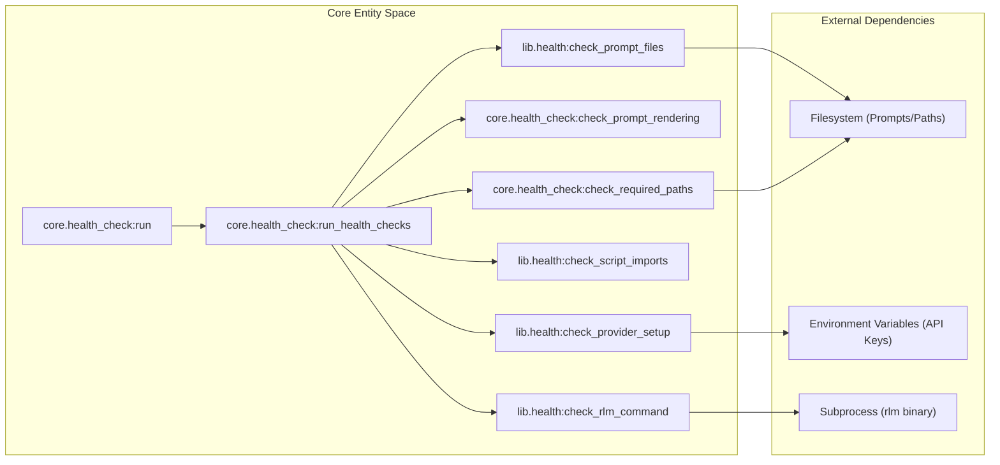
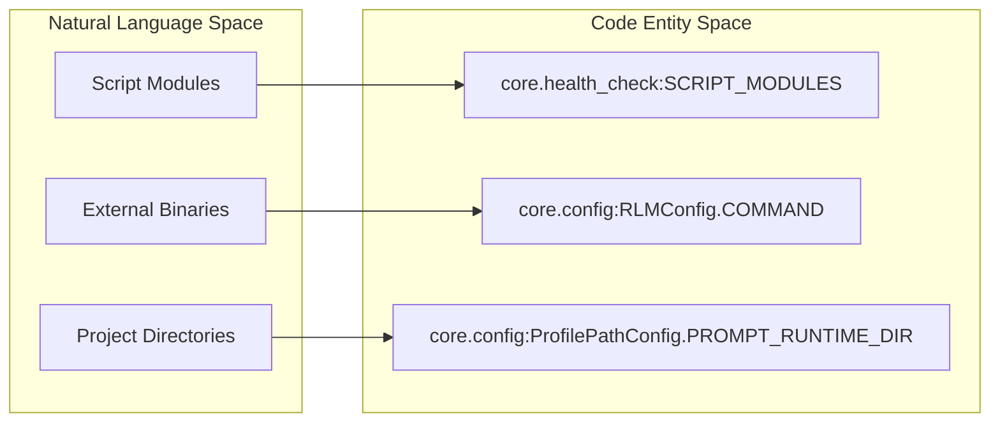

# Health Check System
Relevant source files
- [core/health_check.py](https://github.com/Cody-W-Tucker/Cognitive-Assistant/blob/a77ddaf6/core/health_check.py)
- [lib/__init__.py](https://github.com/Cody-W-Tucker/Cognitive-Assistant/blob/a77ddaf6/lib/__init__.py)
- [lib/health.py](https://github.com/Cody-W-Tucker/Cognitive-Assistant/blob/a77ddaf6/lib/health.py)
- [lib/prompts.py](https://github.com/Cody-W-Tucker/Cognitive-Assistant/blob/a77ddaf6/lib/prompts.py)
- [tests/test_health.py](https://github.com/Cody-W-Tucker/Cognitive-Assistant/blob/a77ddaf6/tests/test_health.py)

The Health Check System is a diagnostic framework designed to verify the integrity of the Cognitive Assistant's configuration, environment, and template rendering before executing resource-intensive pipeline operations. It ensures that required files exist, LLM providers are correctly configured, and that prompt templates are syntactically valid for string interpolation.

## System Architecture

The health check logic is split between a profile-aware core layer and a reusable library of validation primitives.

### Component Relationship

The `core.health_check` module acts as the orchestrator, utilizing `Config` objects to parameterize checks defined in `lib.health`.

"Health Check Data Flow"

**Sources:**[core/health_check.py92-115](https://github.com/Cody-W-Tucker/Cognitive-Assistant/blob/a77ddaf6/core/health_check.py#L92-L115)[lib/health.py11-83](https://github.com/Cody-W-Tucker/Cognitive-Assistant/blob/a77ddaf6/lib/health.py#L11-L83)

## Core Validation Logic

### 1. Issue Aggregation Pattern

Every health check function follows a standard pattern: it accepts configuration parameters and returns a `List[str]` containing descriptions of any issues found. An empty list signifies a "healthy" state. This allows `run_health_checks` to accumulate all errors across different subsystems before reporting back to the user [core/health_check.py94-115](https://github.com/Cody-W-Tucker/Cognitive-Assistant/blob/a77ddaf6/core/health_check.py#L94-L115)

### 2. Prompt Rendering Verification

The system verifies that all prompt templates declared in a profile can be successfully rendered using a set of standard fixtures. This prevents runtime `KeyError` or `ValueError` during LLM generation.

- **Placeholder Fixtures**: A dictionary of sample values (`_PLACEHOLDER_FIXTURES`) used to simulate real data [core/health_check.py32-44](https://github.com/Cody-W-Tucker/Cognitive-Assistant/blob/a77ddaf6/core/health_check.py#L32-L44)
- **Render Specs**: A mapping of template names to the specific placeholders they are expected to contain [core/health_check.py58-68](https://github.com/Cody-W-Tucker/Cognitive-Assistant/blob/a77ddaf6/core/health_check.py#L58-L68)

| Template Name | Required Placeholders |
| --- | --- |
| `initial_template` | `context` |
| `ensemble_synthesis_template` | `candidate_profiles` |
| `skills_creation_template` | `grouped_bio_content` |
| `rlm_query_template` | (Derived from `profile.rlm_prompt_placeholders`) |
| `tool_specs_creation_template` | `bio_content`, `supported_tools`, `seed_documents` |

**Sources:**[core/health_check.py32-79](https://github.com/Cody-W-Tucker/Cognitive-Assistant/blob/a77ddaf6/core/health_check.py#L32-L79)

### 3. Provider and Environment Checks

The `check_provider_setup` function validates the LLM integration layer without making actual network calls. It checks for:

- **Environment Variables**: Ensures `{PROVIDER}_API_KEY` is present in the shell environment [lib/health.py57-60](https://github.com/Cody-W-Tucker/Cognitive-Assistant/blob/a77ddaf6/lib/health.py#L57-L60)
- **Python Dependencies**: Verifies that the required SDK (`anthropic` or `openai`) is installed in the current Python environment [lib/health.py61-66](https://github.com/Cody-W-Tucker/Cognitive-Assistant/blob/a77ddaf6/lib/health.py#L61-L66)
- **Client Factory**: Attempts to instantiate the client via `create_client` to catch configuration mismatches [lib/health.py68-72](https://github.com/Cody-W-Tucker/Cognitive-Assistant/blob/a77ddaf6/lib/health.py#L68-L72)

**Sources:**[lib/health.py43-74](https://github.com/Cody-W-Tucker/Cognitive-Assistant/blob/a77ddaf6/lib/health.py#L43-L74)

## Dependency and Path Validation

The system ensures the environment is prepared for the specific profile being checked.

"Path and Import Validation"

**Sources:**[core/health_check.py20-28](https://github.com/Cody-W-Tucker/Cognitive-Assistant/blob/a77ddaf6/core/health_check.py#L20-L28)[lib/health.py32-40](https://github.com/Cody-W-Tucker/Cognitive-Assistant/blob/a77ddaf6/lib/health.py#L32-L40)[lib/health.py77-82](https://github.com/Cody-W-Tucker/Cognitive-Assistant/blob/a77ddaf6/lib/health.py#L77-L82)

### Import Checks

The `SCRIPT_MODULES` list defines the critical path for the application. The `check_script_imports` function uses `importlib` to ensure all core components can be loaded without syntax errors or missing dependencies [core/health_check.py20-28](https://github.com/Cody-W-Tucker/Cognitive-Assistant/blob/a77ddaf6/core/health_check.py#L20-L28)[lib/health.py32-40](https://github.com/Cody-W-Tucker/Cognitive-Assistant/blob/a77ddaf6/lib/health.py#L32-L40)

### RLM Command Availability

The system relies on the `rlm` binary for evidence retrieval. `check_rlm_command` uses `shutil.which` to verify the command (defaulting to "rlm") is available in the system `PATH`[lib/health.py77-82](https://github.com/Cody-W-Tucker/Cognitive-Assistant/blob/a77ddaf6/lib/health.py#L77-L82)

## Automated Testing

Health checks are integrated into the test suite via `tests/test_health.py`. This ensures that any changes to profile definitions or prompt templates are validated during CI.

- **`test_each_profile_static_health`**: Iterates through every profile returned by `list_profiles()` and runs static health checks (file existence and rendering) [tests/test_health.py42-61](https://github.com/Cody-W-Tucker/Cognitive-Assistant/blob/a77ddaf6/tests/test_health.py#L42-L61)
- **`test_workspace_skill_slugs_are_globally_unique`**: A specialized health check that scans `workspaces/skills` to ensure no two skills share the same slug, preventing collision in the unified skill store [tests/test_health.py65-76](https://github.com/Cody-W-Tucker/Cognitive-Assistant/blob/a77ddaf6/tests/test_health.py#L65-L76)

**Sources:**[tests/test_health.py42-76](https://github.com/Cody-W-Tucker/Cognitive-Assistant/blob/a77ddaf6/tests/test_health.py#L42-L76)