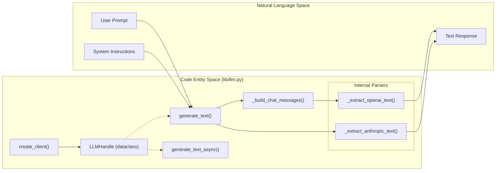
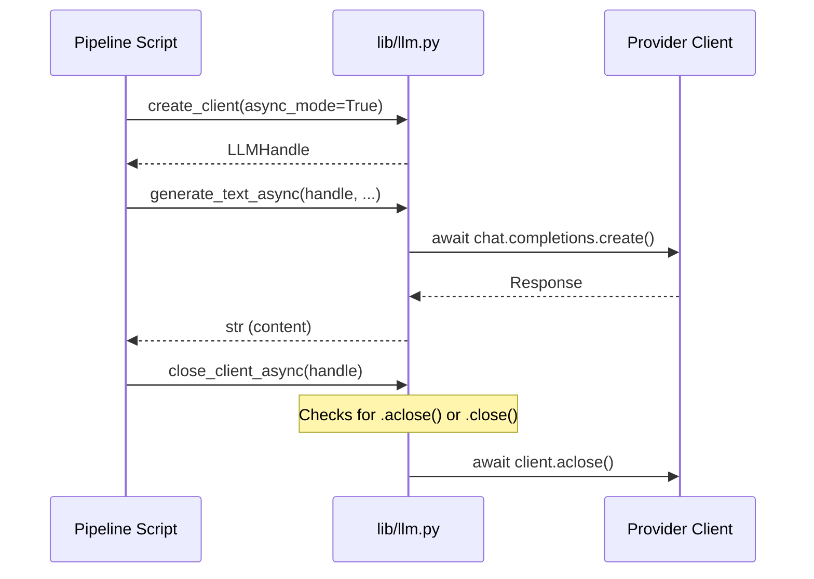

# LLM Abstraction (lib/llm.py)
Relevant source files
- [lib/llm.py](https://github.com/Cody-W-Tucker/Cognitive-Assistant/blob/a77ddaf6/lib/llm.py)
- [tests/test_llm.py](https://github.com/Cody-W-Tucker/Cognitive-Assistant/blob/a77ddaf6/tests/test_llm.py)

The `lib/llm.py` module provides a unified interface for interacting with various Large Language Model (LLM) providers. It abstracts the differences between provider SDKs (specifically Anthropic and OpenAI-compatible APIs like xAI) into a consistent set of synchronous and asynchronous functions. This layer ensures that the core pipeline remains agnostic to the specific transport or message format required by the underlying service.

### Implementation Overview

The abstraction relies on the `LLMHandle` dataclass to carry both the active client instance and the metadata necessary to route requests correctly. The library handles the structural differences between Anthropic's top-level system parameter and OpenAI's system role message, as well as the differences in response parsing.

#### LLM Entity Space Mapping

The following diagram maps the conceptual LLM interactions to the specific code entities in `lib/llm.py`.

**Diagram: LLM Interface Mapping**

**Sources:**[lib/llm.py9-17](https://github.com/Cody-W-Tucker/Cognitive-Assistant/blob/a77ddaf6/lib/llm.py#L9-L17)[lib/llm.py19-37](https://github.com/Cody-W-Tucker/Cognitive-Assistant/blob/a77ddaf6/lib/llm.py#L19-L37)[lib/llm.py54-61](https://github.com/Cody-W-Tucker/Cognitive-Assistant/blob/a77ddaf6/lib/llm.py#L54-L61)[lib/llm.py89-96](https://github.com/Cody-W-Tucker/Cognitive-Assistant/blob/a77ddaf6/lib/llm.py#L89-L96)

---

### Key Data Structures and Factory

#### LLMHandle

A frozen dataclass that stores the resolved state for a session.

- `client`: The underlying provider client (e.g., `Anthropic()` or `OpenAI()`).
- `model`: The specific model string (e.g., `claude-3-5-sonnet-20241022`).
- `provider`: A string identifier used for branching logic (`anthropic` vs others).
- `async_mode`: A boolean indicating if the client is configured for asynchronous I/O.

**Sources:**[lib/llm.py9-17](https://github.com/Cody-W-Tucker/Cognitive-Assistant/blob/a77ddaf6/lib/llm.py#L9-L17)

#### create_client

A factory function that invokes `api_config.create_client` to instantiate the appropriate SDK client. It resolves the provider and model based on the provided `APIConfig` or specific overrides.

**Sources:**[lib/llm.py19-37](https://github.com/Cody-W-Tucker/Cognitive-Assistant/blob/a77ddaf6/lib/llm.py#L19-L37)

---

### Text Generation Interfaces

The library provides two primary interfaces for text generation, branching internally based on the `provider` attribute of the `LLMHandle`.

| Function | Mode | Provider Logic |
| --- | --- | --- |
| `generate_text` | Synchronous | Uses `handle.client.messages.create` for Anthropic; `handle.client.chat.completions.create` for OpenAI-compatible. |
| `generate_text_async` | Asynchronous | Uses streaming for Anthropic (`stream.text_stream`); uses `await` for OpenAI-compatible completions. |

#### Provider Branching Logic

1. **Anthropic**: The system prompt is passed as a top-level `system` keyword argument [lib/llm.py73-74](https://github.com/Cody-W-Tucker/Cognitive-Assistant/blob/a77ddaf6/lib/llm.py#L73-L74) Responses are parsed by iterating through `content` blocks [lib/llm.py148-159](https://github.com/Cody-W-Tucker/Cognitive-Assistant/blob/a77ddaf6/lib/llm.py#L148-L159)
2. **OpenAI-compatible**: The system prompt is prepended to the message list as a `{"role": "system"}` object via `_build_chat_messages`[lib/llm.py130-138](https://github.com/Cody-W-Tucker/Cognitive-Assistant/blob/a77ddaf6/lib/llm.py#L130-L138) Responses are extracted from `choices[0].message.content`[lib/llm.py141-145](https://github.com/Cody-W-Tucker/Cognitive-Assistant/blob/a77ddaf6/lib/llm.py#L141-L145)

**Sources:**[lib/llm.py54-86](https://github.com/Cody-W-Tucker/Cognitive-Assistant/blob/a77ddaf6/lib/llm.py#L54-L86)[lib/llm.py89-127](https://github.com/Cody-W-Tucker/Cognitive-Assistant/blob/a77ddaf6/lib/llm.py#L89-L127)

---

### Client Lifecycle Management

For asynchronous workflows, it is critical to close the underlying network connections. `close_client_async` provides a safe way to shut down clients by checking for common teardown methods.

**Diagram: Async Lifecycle**

**Sources:**[lib/llm.py40-52](https://github.com/Cody-W-Tucker/Cognitive-Assistant/blob/a77ddaf6/lib/llm.py#L40-L52)[tests/test_llm.py87-101](https://github.com/Cody-W-Tucker/Cognitive-Assistant/blob/a77ddaf6/tests/test_llm.py#L87-L101)

---

### Internal Helpers

The module uses several private helpers to normalize data formats across providers:

- **`_build_chat_messages(user_prompt, system_prompt)`**: Constructs the standard list of dictionaries for OpenAI-compatible endpoints [lib/llm.py130-138](https://github.com/Cody-W-Tucker/Cognitive-Assistant/blob/a77ddaf6/lib/llm.py#L130-L138)
- **`_extract_openai_text(response)`**: Navigates the OpenAI response object, handling potential empty responses with a `ValueError`[lib/llm.py141-145](https://github.com/Cody-W-Tucker/Cognitive-Assistant/blob/a77ddaf6/lib/llm.py#L141-L145)
- **`_extract_anthropic_text(response)`**: Aggregates text from Anthropic's `content` block list [lib/llm.py148-159](https://github.com/Cody-W-Tucker/Cognitive-Assistant/blob/a77ddaf6/lib/llm.py#L148-L159)

**Sources:**[lib/llm.py130-160](https://github.com/Cody-W-Tucker/Cognitive-Assistant/blob/a77ddaf6/lib/llm.py#L130-L160)