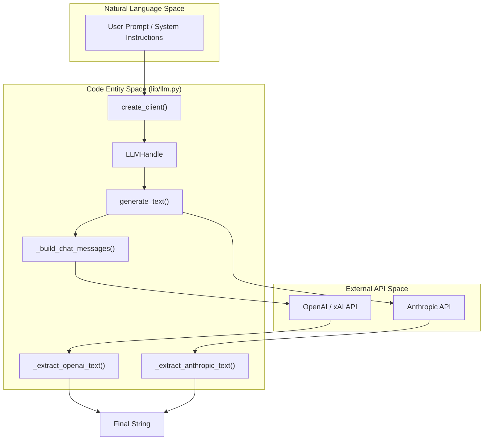
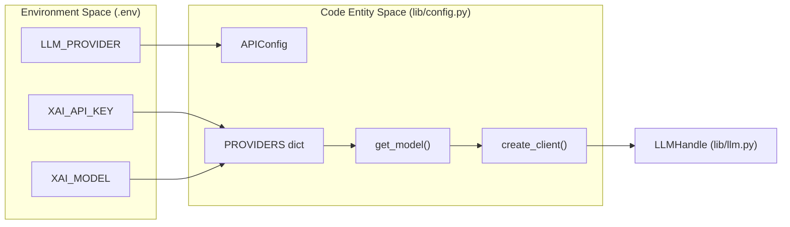

# LLM Integration Layer
Relevant source files
- [core/ingest_substrate.py](https://github.com/Cody-W-Tucker/Cognitive-Assistant/blob/a77ddaf6/core/ingest_substrate.py)
- [flake.lock](https://github.com/Cody-W-Tucker/Cognitive-Assistant/blob/a77ddaf6/flake.lock)
- [lib/config.py](https://github.com/Cody-W-Tucker/Cognitive-Assistant/blob/a77ddaf6/lib/config.py)
- [lib/llm.py](https://github.com/Cody-W-Tucker/Cognitive-Assistant/blob/a77ddaf6/lib/llm.py)
- [tests/test_llm.py](https://github.com/Cody-W-Tucker/Cognitive-Assistant/blob/a77ddaf6/tests/test_llm.py)

The **LLM Integration Layer** provides a unified interface for interacting with multiple Large Language Model (LLM) providers. It abstracts the complexities of different API structures (such as Anthropic's `system` parameter vs. OpenAI's `system` role) and manages both synchronous and asynchronous communication patterns. This layer ensures that the core pipeline remains agnostic to the specific backend being used, whether it is **xAI**, **OpenAI**, or **Anthropic**.

### Architecture Overview

The integration is split between a high-level abstraction library that handles the execution of requests and a configuration system that manages provider-specific settings and model selection.

#### LLM Provider Abstraction

The system uses a unified `LLMHandle` to track client state, model identifiers, and provider types. This allows the pipeline to pass a single object to generation functions without needing to know the underlying implementation details.

**Key Components:**

- **`LLMHandle`**: A frozen dataclass that stores the resolved client, model name, provider string, and a boolean indicating if it is in `async_mode`[lib/llm.py9-16](https://github.com/Cody-W-Tucker/Cognitive-Assistant/blob/a77ddaf6/lib/llm.py#L9-L16)
- **Generation Interface**: Standardized functions `generate_text` and `generate_text_async` that branch logic based on the provider [lib/llm.py54-127](https://github.com/Cody-W-Tucker/Cognitive-Assistant/blob/a77ddaf6/lib/llm.py#L54-L127)
- **Lifecycle Management**: Helpers for closing asynchronous clients safely [lib/llm.py40-52](https://github.com/Cody-W-Tucker/Cognitive-Assistant/blob/a77ddaf6/lib/llm.py#L40-L52)

For details, see [LLM Abstraction (lib/llm.py)](/Cody-W-Tucker/Cognitive-Assistant/5.1-llm-abstraction-(libllm.py)).

#### Provider Configuration and RLM

The `APIConfig` class serves as the central registry for provider metadata, including API keys, context window limits, and model mappings for different "purposes" (e.g., `initial` drafting vs. `refine` synthesis) [lib/config.py18-60](https://github.com/Cody-W-Tucker/Cognitive-Assistant/blob/a77ddaf6/lib/config.py#L18-L60)

The system also integrates with the **RLM (Retrieval Language Model)** CLI tool via subprocess calls. This bridge allows the assistant to perform complex queries against ingested data packets before synthesizing them into final artifacts [lib/config.py202-225](https://github.com/Cody-W-Tucker/Cognitive-Assistant/blob/a77ddaf6/lib/config.py#L202-L225)

For details, see [Provider Configuration and RLM Integration](/Cody-W-Tucker/Cognitive-Assistant/5.2-provider-configuration-and-rlm-integration).

### Logic Flow: Natural Language to Code Entity

The following diagram illustrates how a natural language request from the pipeline (e.g., "Synthesize this profile") is transformed into a provider-specific API call through the integration layer.

**LLM Request Flow**

**Sources:**[lib/llm.py19-37](https://github.com/Cody-W-Tucker/Cognitive-Assistant/blob/a77ddaf6/lib/llm.py#L19-L37)[lib/llm.py54-86](https://github.com/Cody-W-Tucker/Cognitive-Assistant/blob/a77ddaf6/lib/llm.py#L54-L86)[lib/llm.py130-146](https://github.com/Cody-W-Tucker/Cognitive-Assistant/blob/a77ddaf6/lib/llm.py#L130-L146)

### Configuration Mapping

The system bridges environment variables and internal configuration through `APIConfig`. This mapping ensures that the "Code Entity Space" correctly reflects the "Natural Language Space" requirements for context and output length.

**Configuration Entity Mapping**

**Sources:**[lib/config.py18-60](https://github.com/Cody-W-Tucker/Cognitive-Assistant/blob/a77ddaf6/lib/config.py#L18-L60)[lib/config.py62-81](https://github.com/Cody-W-Tucker/Cognitive-Assistant/blob/a77ddaf6/lib/config.py#L62-L81)[lib/config.py99-134](https://github.com/Cody-W-Tucker/Cognitive-Assistant/blob/a77ddaf6/lib/config.py#L99-L134)

### Supported Providers

The integration layer supports the following providers out of the box, managed via `APIConfig.PROVIDERS`[lib/config.py24-60](https://github.com/Cody-W-Tucker/Cognitive-Assistant/blob/a77ddaf6/lib/config.py#L24-L60):

| Provider | Client Class | Default Model | Purpose-Specific Models |
| --- | --- | --- | --- |
| **xAI** | `OpenAI` (Compatible) | `grok-4.3` | `initial_model`, `refine_model` |
| **OpenAI** | `OpenAI` | `gpt-5.5` | `initial_model`, `refine_model` |
| **Anthropic** | `Anthropic` | `claude-opus-4-8` | `initial_model`, `refine_model` |

**Sources:**[lib/config.py24-60](https://github.com/Cody-W-Tucker/Cognitive-Assistant/blob/a77ddaf6/lib/config.py#L24-L60)[lib/config.py118-132](https://github.com/Cody-W-Tucker/Cognitive-Assistant/blob/a77ddaf6/lib/config.py#L118-L132)