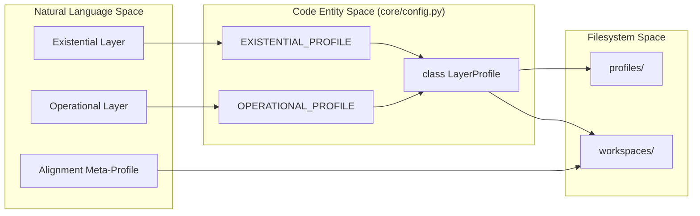
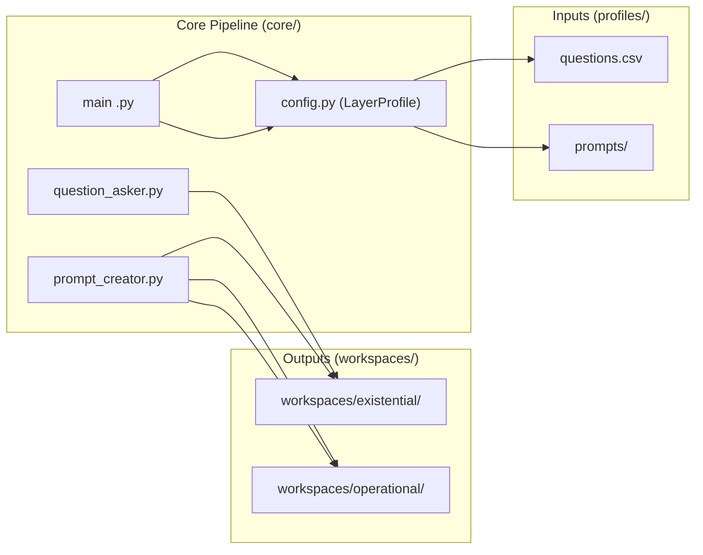

# Layer Profiles
Relevant source files
- [core/config.py](https://github.com/Cody-W-Tucker/Cognitive-Assistant/blob/a77ddaf6/core/config.py)
- [profiles/README.md](https://github.com/Cody-W-Tucker/Cognitive-Assistant/blob/a77ddaf6/profiles/README.md?plain=1)

The Cognitive Assistant system is built on a unified pipeline in `core/` that is parameterized by **Layer Profiles**. A `LayerProfile` is a static declaration that defines how the pipeline behaves for a specific domain of knowledge—specifically what questions it asks, which prompts it uses for synthesis, and which artifacts it is capable of producing.

The repository strictly separates **inputs** (located in `profiles/`) from **generated outputs** (located in `workspaces/`). By switching the `--profile` flag in the CLI, the same core logic can perform introspective identity modeling (Existential) or workflow pattern extraction (Operational).

### Profile Parameterization

The `LayerProfile` dataclass in [core/config.py58-98](https://github.com/Cody-W-Tucker/Cognitive-Assistant/blob/a77ddaf6/core/config.py#L58-L98) acts as the central registry for these behaviors. It defines:

- **Identity**: The name and display name of the layer.
- **Paths**: The source directories for prompts and questions, and the target directories for artifacts.
- **Capabilities**: Boolean gates like `has_corpus_ingest` or `has_tool_specs` that enable or disable specific pipeline stages.
- **RLM Configuration**: The specific JSONL evidence files (e.g., `graph_pages.jsonl`) that the RLM (Retrieval Language Model) engine should query.

### System Entity Mapping: Profile to Code

The following diagram illustrates how the abstract concept of a "Profile" maps to specific code entities and filesystem locations.

**Profile Configuration Bridge**

Sources: [core/config.py58-98](https://github.com/Cody-W-Tucker/Cognitive-Assistant/blob/a77ddaf6/core/config.py#L58-L98)[core/config.py128-184](https://github.com/Cody-W-Tucker/Cognitive-Assistant/blob/a77ddaf6/core/config.py#L128-L184)[core/config.py186-235](https://github.com/Cody-W-Tucker/Cognitive-Assistant/blob/a77ddaf6/core/config.py#L186-L235)[profiles/README.md1-24](https://github.com/Cody-W-Tucker/Cognitive-Assistant/blob/a77ddaf6/profiles/README.md?plain=1#L1-L24)

---

## Existential Profile

The **Existential Profile** is designed for first-person introspective modeling. It focuses on the "Soul" of the assistant—its identity, core frame, and cognitive patterns.

- **Purpose**: To synthesize a durable identity based on a "substrate" of personal notes and relational graphs.
- **Ingestion**: It primarily consumes `graph.json` and focus bundles, which are transformed into `graph_pages.jsonl` and `mention_evidence.jsonl`.
- **Key Artifact**: The `human_profile.md` generated here represents the assistant's internal self-conception.

For details on the five-pillar methodology and reflective synthesis, see **[Existential Profile (#3.1)](https://github.com/Cody-W-Tucker/Cognitive-Assistant/blob/a77ddaf6/Existential Profile (#3.1))**.

Sources: [core/config.py128-149](https://github.com/Cody-W-Tucker/Cognitive-Assistant/blob/a77ddaf6/core/config.py#L128-L149)[profiles/README.md41-42](https://github.com/Cody-W-Tucker/Cognitive-Assistant/blob/a77ddaf6/profiles/README.md?plain=1#L41-L42)

---

## Operational Profile

The **Operational Profile** is designed for third-person workflow modeling. It focuses on the "Body" of the assistant—its tasks, tools, and tacit rules of operation.

- **Purpose**: To extract workflow patterns, success criteria, and tool specifications from a corpus of activity logs or documentation.
- **Ingestion**: Enables the `ingest-corpus` pathway to process batch artifacts into evidence packets.
- **Key Artifacts**: In addition to a `human_profile.md` focused on behavior, it generates `memory.md` and `tasks.md` tool specs.

For details on evidence weighting and tool spec generation, see **[Operational Profile (#3.2)](https://github.com/Cody-W-Tucker/Cognitive-Assistant/blob/a77ddaf6/Operational Profile (#3.2))**.

Sources: [core/config.py186-215](https://github.com/Cody-W-Tucker/Cognitive-Assistant/blob/a77ddaf6/core/config.py#L186-L215)[profiles/README.md43](https://github.com/Cody-W-Tucker/Cognitive-Assistant/blob/a77ddaf6/profiles/README.md?plain=1#L43-L43)

---

## Alignment Profile

The **Alignment Profile** is a meta-profile that sits above the Existential and Operational layers. It does not have its own ingestion pipeline; instead, it consumes the artifacts produced by the other two profiles to ensure systemic coherence.

- **Purpose**: To bridge the gap between "who the agent is" (Existential) and "what the agent does" (Operational).
- **Key Artifacts**:

- `SOUL.md`: The definitive persona.
- `SOUL_ARCHETYPE.md`: The high-level pattern.
- `alignment_spec.md`: A verification checklist used to score all other artifacts.

For details on the `soul_seed.md` and the verification lifecycle, see **[Alignment Profile (#3.3)](https://github.com/Cody-W-Tucker/Cognitive-Assistant/blob/a77ddaf6/Alignment Profile (#3.3))**.

Sources: [profiles/README.md18-19](https://github.com/Cody-W-Tucker/Cognitive-Assistant/blob/a77ddaf6/profiles/README.md?plain=1#L18-L19)[profiles/README.md44-45](https://github.com/Cody-W-Tucker/Cognitive-Assistant/blob/a77ddaf6/profiles/README.md?plain=1#L44-L45)

---

## Pipeline Execution Flow

The profile selected via the `--profile` flag determines which commands in `python -m core` are valid and how they access data.

**Data Flow by Profile Type**

Sources: [core/config.py10-12](https://github.com/Cody-W-Tucker/Cognitive-Assistant/blob/a77ddaf6/core/config.py#L10-L12)[profiles/README.md30-38](https://github.com/Cody-W-Tucker/Cognitive-Assistant/blob/a77ddaf6/profiles/README.md?plain=1#L30-L38)[profiles/README.md50-59](https://github.com/Cody-W-Tucker/Cognitive-Assistant/blob/a77ddaf6/profiles/README.md?plain=1#L50-L59)