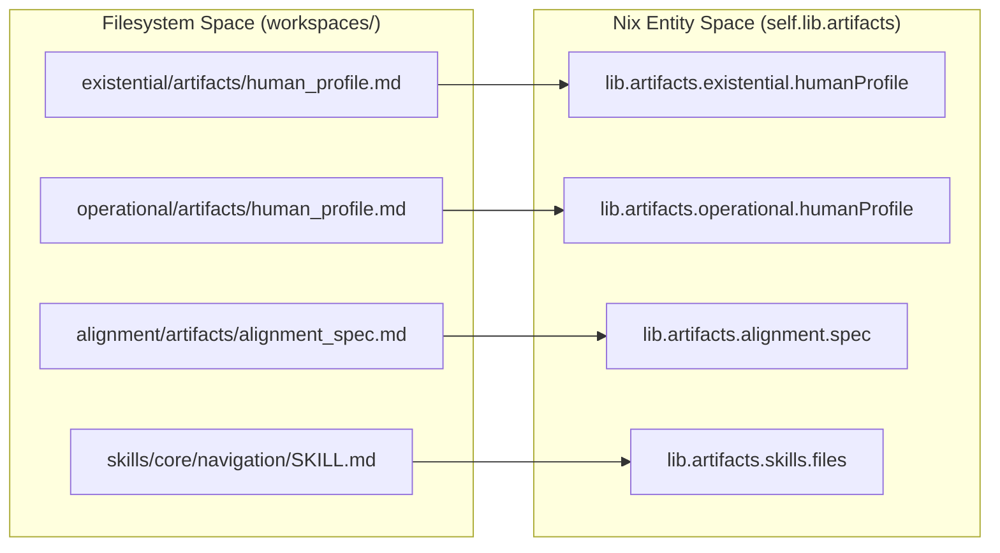
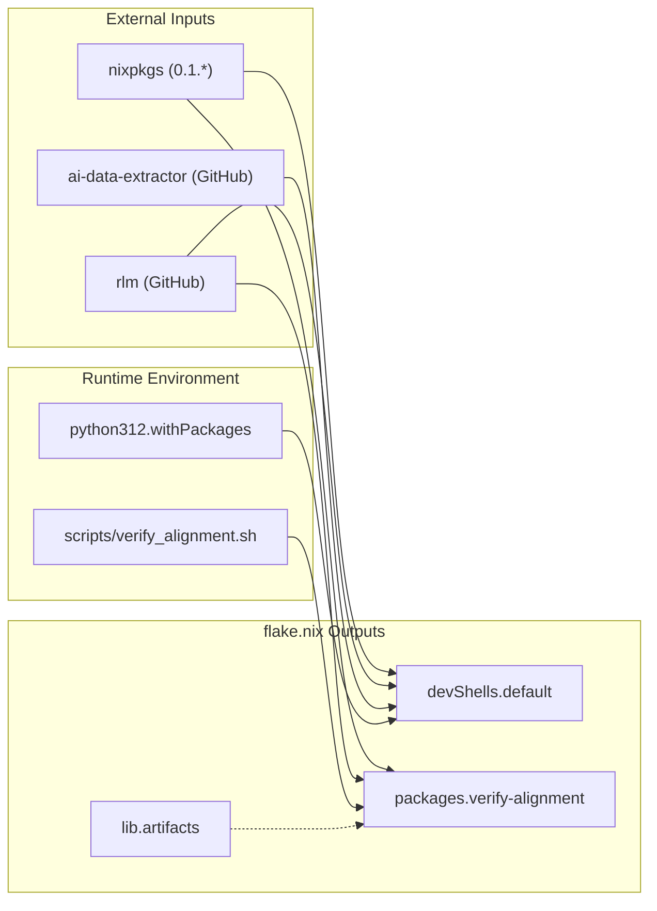

# Nix Packaging and Distribution
Relevant source files
- [LICENSE](https://github.com/Cody-W-Tucker/Cognitive-Assistant/blob/a77ddaf6/LICENSE)
- [core/ingest_substrate.py](https://github.com/Cody-W-Tucker/Cognitive-Assistant/blob/a77ddaf6/core/ingest_substrate.py)
- [flake.lock](https://github.com/Cody-W-Tucker/Cognitive-Assistant/blob/a77ddaf6/flake.lock)
- [flake.nix](https://github.com/Cody-W-Tucker/Cognitive-Assistant/blob/a77ddaf6/flake.nix)
- [lib/config.py](https://github.com/Cody-W-Tucker/Cognitive-Assistant/blob/a77ddaf6/lib/config.py)

This page details the Nix-based infrastructure used for environment reproducibility, artifact distribution, and package management. The system leverages Nix Flakes to provide a unified entry point for both developers and downstream consumers, ensuring that the Python 3.12 stack, external CLI dependencies (like `rlm`), and generated cognitive artifacts are consistently accessible across supported systems.

### Flake Architecture and Inputs

The `flake.nix` file serves as the declarative configuration for the entire repository. It manages external dependencies and defines how the internal workspace artifacts are exposed to the Nix ecosystem.

**Key Inputs:**

- **nixpkgs**: Pinned to the `0.1.*` release branch for stability [flake.nix5](https://github.com/Cody-W-Tucker/Cognitive-Assistant/blob/a77ddaf6/flake.nix#L5-L5)
- **rlm**: The Retrieval Logic Module, used for querying the ingested packets [flake.nix6](https://github.com/Cody-W-Tucker/Cognitive-Assistant/blob/a77ddaf6/flake.nix#L6-L6)
- **ai-data-extractor**: External tool for structured data extraction [flake.nix7](https://github.com/Cody-W-Tucker/Cognitive-Assistant/blob/a77ddaf6/flake.nix#L7-L7)

**Supported Systems:**
The flake supports `x86_64-linux`, `aarch64-linux`, `x86_64-darwin`, and `aarch64-darwin`[flake.nix18-23](https://github.com/Cody-W-Tucker/Cognitive-Assistant/blob/a77ddaf6/flake.nix#L18-L23)

### Artifact Export Logic

The flake implements a discovery mechanism to turn filesystem artifacts (generated by the pipeline) into Nix-addressable outputs. This allows downstream consumers to import the "soul" or "skills" of the assistant without needing to run the generation pipeline themselves.

#### mkLayerExports Helper

The `mkLayerExports` function standardizes the export of profile-specific artifacts. It takes a profile name and a workspace directory, returning a set containing the `human_profile.md` path [flake.nix32-39](https://github.com/Cody-W-Tucker/Cognitive-Assistant/blob/a77ddaf6/flake.nix#L32-L39)

#### Skill Discovery Logic

The flake dynamically crawls the `workspaces/skills` directory to build a map of all available skills:

1. **Category Discovery**: Identifies subdirectories in `workspaces/skills` (e.g., `core`, `workflow`) [flake.nix41-43](https://github.com/Cody-W-Tucker/Cognitive-Assistant/blob/a77ddaf6/flake.nix#L41-L43)
2. **Skill Mapping**: For each category, it finds individual skill directories containing a `SKILL.md` file [flake.nix44-51](https://github.com/Cody-W-Tucker/Cognitive-Assistant/blob/a77ddaf6/flake.nix#L44-L51)
3. **Attribute Generation**: It creates a `skillsByName` attribute set where keys are skill names and values are the contents of the `SKILL.md` files [flake.nix61-66](https://github.com/Cody-W-Tucker/Cognitive-Assistant/blob/a77ddaf6/flake.nix#L61-L66)

### Nix Flake Data Flow

The following diagram illustrates how raw workspace files are transformed into exported Nix attributes.

**Workspace to Nix Output Mapping**



**Sources:**[flake.nix32-66](https://github.com/Cody-W-Tucker/Cognitive-Assistant/blob/a77ddaf6/flake.nix#L32-L66)[flake.nix76-92](https://github.com/Cody-W-Tucker/Cognitive-Assistant/blob/a77ddaf6/flake.nix#L76-L92)

### Packages and Development Shells

#### verify-alignment Package

The flake exports a `verify-alignment` package, which is a shell application that wraps the `scripts/verify_alignment.sh` script [flake.nix97-105](https://github.com/Cody-W-Tucker/Cognitive-Assistant/blob/a77ddaf6/flake.nix#L97-L105)

- **Runtime Inputs**: Includes the `rlm` package [flake.nix99](https://github.com/Cody-W-Tucker/Cognitive-Assistant/blob/a77ddaf6/flake.nix#L99-L99)
- **Environment Injection**: It automatically sets the `ALIGNMENT_SPEC` environment variable to point to the flake's internal `alignment_spec.md` if not already provided [flake.nix101-102](https://github.com/Cody-W-Tucker/Cognitive-Assistant/blob/a77ddaf6/flake.nix#L101-L102)

#### devShells.default

The development environment is strictly managed to ensure all contributors use the same toolchain. It includes:

- **Python 3.12 Stack**: Configured with `python-dotenv`, `anthropic`, `pandas`, and `openai`[flake.nix114-121](https://github.com/Cody-W-Tucker/Cognitive-Assistant/blob/a77ddaf6/flake.nix#L114-L121)
- **Binary Dependencies**: Direct inclusion of `rlm` and `ai-data-extractor` binaries [flake.nix122-123](https://github.com/Cody-W-Tucker/Cognitive-Assistant/blob/a77ddaf6/flake.nix#L122-L123)

### Exported Artifact Structure

Downstream NixOS configurations or other flakes can access the system's outputs via `self.lib.artifacts`.

| Attribute Path | Description | Source File Reference |
| --- | --- | --- |
| `lib.artifacts.alignment.spec` | The personalized verification checklist. | `workspaces/alignment/artifacts/alignment_spec.md` |
| `lib.artifacts.alignment.soulFile` | The durable persona (SOUL.md). | `workspaces/alignment/artifacts/SOUL.md` |
| `lib.artifacts.existential.humanProfile` | Synthesis of identity and core frames. | `workspaces/existential/artifacts/human_profile.md` |
| `lib.artifacts.operational.toolSpecs.memory` | Generated memory tool specification. | `workspaces/operational/artifacts/tool_specs/memory.md` |
| `lib.artifacts.skills.names` | List of all discovered skill slugs. | `flake.nix:87` |
| `lib.artifacts.skills.files` | Map of skill names to full `SKILL.md` content. | `flake.nix:88` |

**Sources:**[flake.nix76-92](https://github.com/Cody-W-Tucker/Cognitive-Assistant/blob/a77ddaf6/flake.nix#L76-L92)[flake.nix67-73](https://github.com/Cody-W-Tucker/Cognitive-Assistant/blob/a77ddaf6/flake.nix#L67-L73)

### Technical Implementation: Dependency Graph

This diagram shows how the Nix flake orchestrates external inputs and internal scripts to provide the runtime environment.

**Flake Dependency and Execution Graph**



**Sources:**[flake.nix1-128](https://github.com/Cody-W-Tucker/Cognitive-Assistant/blob/a77ddaf6/flake.nix#L1-L128)[flake.lock1-91](https://github.com/Cody-W-Tucker/Cognitive-Assistant/blob/a77ddaf6/flake.lock#L1-L91)

### Downstream Usage

To use these artifacts in a downstream Nix project, add this repository as an input to your `flake.nix`:

```
inputs.cog-assistant.url = "github:Cody-W-Tucker/Cognitive-Assistant";
 
# Accessing a skill in your configuration:
# cog-assistant.lib.artifacts.skills.files.navigation
```

**Sources:**[flake.nix76-92](https://github.com/Cody-W-Tucker/Cognitive-Assistant/blob/a77ddaf6/flake.nix#L76-L92)