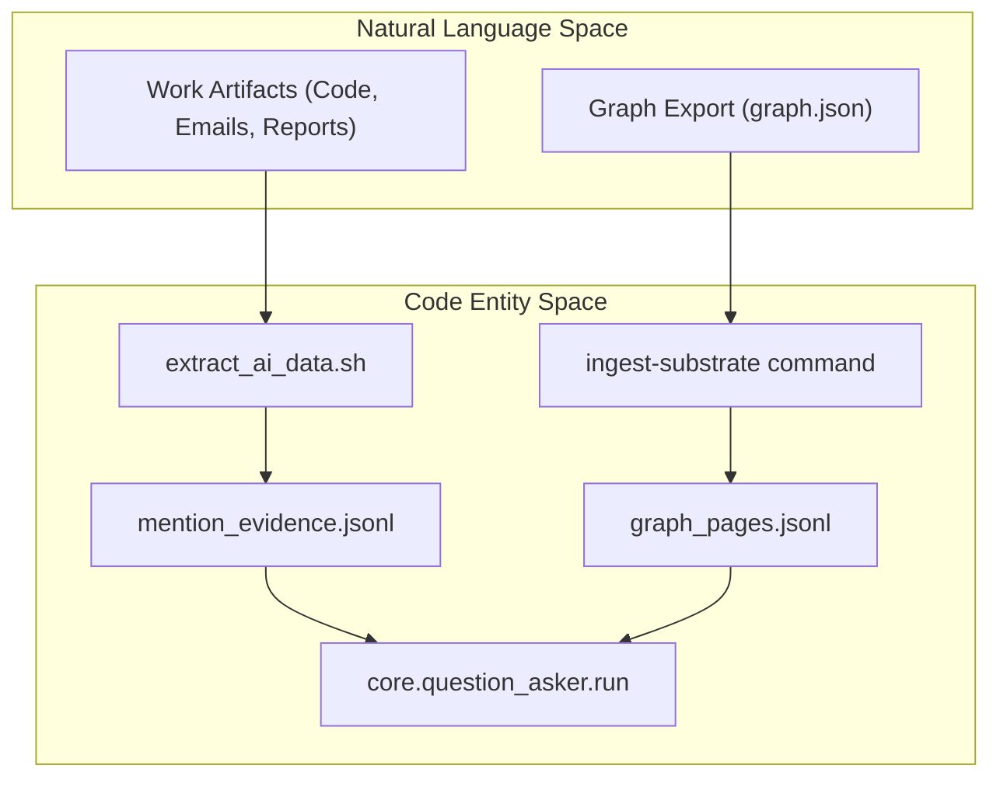
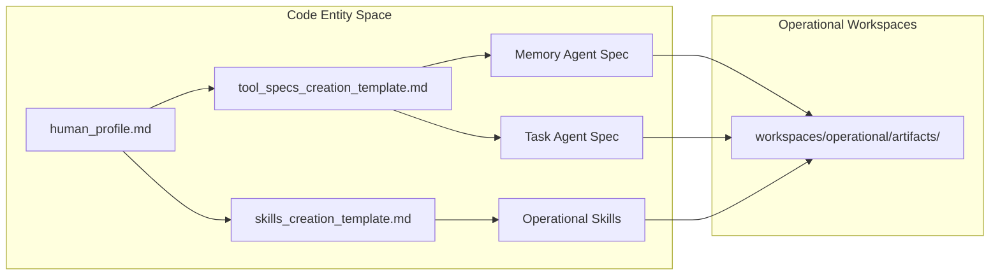

# Operational Profile
Relevant source files
- [core/question_asker.py](https://github.com/Cody-W-Tucker/Cognitive-Assistant/blob/a77ddaf6/core/question_asker.py)
- [profiles/operational/README.md](https://github.com/Cody-W-Tucker/Cognitive-Assistant/blob/a77ddaf6/profiles/operational/README.md?plain=1)
- [profiles/operational/prompts/README.md](https://github.com/Cody-W-Tucker/Cognitive-Assistant/blob/a77ddaf6/profiles/operational/prompts/README.md?plain=1)
- [profiles/operational/prompts/memory.md](https://github.com/Cody-W-Tucker/Cognitive-Assistant/blob/a77ddaf6/profiles/operational/prompts/memory.md?plain=1)
- [profiles/operational/prompts/skills_creation_template.md](https://github.com/Cody-W-Tucker/Cognitive-Assistant/blob/a77ddaf6/profiles/operational/prompts/skills_creation_template.md?plain=1)
- [profiles/operational/prompts/tasks.md](https://github.com/Cody-W-Tucker/Cognitive-Assistant/blob/a77ddaf6/profiles/operational/prompts/tasks.md?plain=1)
- [profiles/operational/prompts/tool_specs_creation_template.md](https://github.com/Cody-W-Tucker/Cognitive-Assistant/blob/a77ddaf6/profiles/operational/prompts/tool_specs_creation_template.md?plain=1)
- [profiles/operational/questions.csv](https://github.com/Cody-W-Tucker/Cognitive-Assistant/blob/a77ddaf6/profiles/operational/questions.csv)
- [profiles/operational/scripts/extract_ai_data.sh](https://github.com/Cody-W-Tucker/Cognitive-Assistant/blob/a77ddaf6/profiles/operational/scripts/extract_ai_data.sh)
- [workspaces/operational/artifacts/README.md](https://github.com/Cody-W-Tucker/Cognitive-Assistant/blob/a77ddaf6/workspaces/operational/artifacts/README.md?plain=1)
- [workspaces/operational/artifacts/tool_specs/memory.md](https://github.com/Cody-W-Tucker/Cognitive-Assistant/blob/a77ddaf6/workspaces/operational/artifacts/tool_specs/memory.md?plain=1)
- [workspaces/operational/artifacts/tool_specs/tasks.md](https://github.com/Cody-W-Tucker/Cognitive-Assistant/blob/a77ddaf6/workspaces/operational/artifacts/tool_specs/tasks.md?plain=1)

The **Operational Profile** is a specialized configuration of the `Cognitive Assistant` designed to extract and codify a user's "tacit rules"—the implicit habits, workflow patterns, and technical standards embedded in their work artifacts [profiles/operational/README.md1-6](https://github.com/Cody-W-Tucker/Cognitive-Assistant/blob/a77ddaf6/profiles/operational/README.md?plain=1#L1-L6) Unlike the Existential Profile, which focuses on identity and motivation, the Operational Profile provides the technical depth and efficiency required to translate ideas into grounded execution [profiles/operational/README.md5-7](https://github.com/Cody-W-Tucker/Cognitive-Assistant/blob/a77ddaf6/profiles/operational/README.md?plain=1#L5-L7)

## Purpose and Scope

The operational layer bridges the gap between high-level intent and low-level execution by analyzing real-world outputs such as code, emails, and reports [profiles/operational/README.md55-62](https://github.com/Cody-W-Tucker/Cognitive-Assistant/blob/a77ddaf6/profiles/operational/README.md?plain=1#L55-L62) It serves three primary functions:

1. **Workflow Extraction**: Uncovering implicit habits like prioritization logic (e.g., "ROI-first") or technical constraints (e.g., "Check mobile first") [profiles/operational/README.md9-10](https://github.com/Cody-W-Tucker/Cognitive-Assistant/blob/a77ddaf6/profiles/operational/README.md?plain=1#L9-L10)
2. **Tool Specification**: Generating personalized system prompts for specialized agents (e.g., Memory and Task agents) [workspaces/operational/artifacts/README.md6](https://github.com/Cody-W-Tucker/Cognitive-Assistant/blob/a77ddaf6/workspaces/operational/artifacts/README.md?plain=1#L6-L6)
3. **Skill Synthesis**: Creating "OpenCode-compatible" skills that encode heuristics for work-stance, salience, and outcome forecasting [profiles/operational/prompts/skills_creation_template.md1-30](https://github.com/Cody-W-Tucker/Cognitive-Assistant/blob/a77ddaf6/profiles/operational/prompts/skills_creation_template.md?plain=1#L1-L30)

---

## Data Ingestion and Corpus Processing

The Operational Profile utilizes a specific ingestion pathway to transform raw artifacts into a structured evidence layer.

### Ingestion Sources

- **Corpus Ingestion**: The `extract_ai_data.sh` script leverages the `ai-data-extraction` tool to pull data from sources like Claude Code, Cursor, and OpenCode, producing `.jsonl` packets in the operational data directory [profiles/operational/scripts/extract_ai_data.sh9-45](https://github.com/Cody-W-Tucker/Cognitive-Assistant/blob/a77ddaf6/profiles/operational/scripts/extract_ai_data.sh#L9-L45)
- **Substrate Ingestion**: Users can ingest a structured schema graph using `python -m core --profile operational ingest-substrate --graph /path/to/graph.json`[profiles/operational/README.md11-12](https://github.com/Cody-W-Tucker/Cognitive-Assistant/blob/a77ddaf6/profiles/operational/README.md?plain=1#L11-L12)

### Evidence Weighting Logic

When synthesizing the profile, the system applies specific weighting rules to handle conflicts between data types:

- **High Weight**: `mention_evidence.jsonl` is prioritized for concrete technical claims because it preserves original source lines [profiles/operational/README.md19-20](https://github.com/Cody-W-Tucker/Cognitive-Assistant/blob/a77ddaf6/profiles/operational/README.md?plain=1#L19-L20)
- **Medium Weight**: Direct work traces (emails/code) override graph summaries for workflow, sequencing, and quality-threshold questions [profiles/operational/README.md21-22](https://github.com/Cody-W-Tucker/Cognitive-Assistant/blob/a77ddaf6/profiles/operational/README.md?plain=1#L21-L22)
- **Low Weight**: `graph_pages.jsonl` is used primarily for entity continuity and long-running theme disambiguation [profiles/operational/README.md20-23](https://github.com/Cody-W-Tucker/Cognitive-Assistant/blob/a77ddaf6/profiles/operational/README.md?plain=1#L20-L23)

### Operational Data Flow

The following diagram illustrates how raw work artifacts are transformed into the evidence layer used by the `question_asker.py`[core/question_asker.py1-167](https://github.com/Cody-W-Tucker/Cognitive-Assistant/blob/a77ddaf6/core/question_asker.py#L1-L167)

**Diagram: Artifact to Evidence Transformation**

**Sources:**[profiles/operational/scripts/extract_ai_data.sh1-45](https://github.com/Cody-W-Tucker/Cognitive-Assistant/blob/a77ddaf6/profiles/operational/scripts/extract_ai_data.sh#L1-L45)[profiles/operational/README.md9-23](https://github.com/Cody-W-Tucker/Cognitive-Assistant/blob/a77ddaf6/profiles/operational/README.md?plain=1#L9-L23)[core/question_asker.py74-90](https://github.com/Cody-W-Tucker/Cognitive-Assistant/blob/a77ddaf6/core/question_asker.py#L74-L90)

---

## Question Answering and Synthesis

The operational pipeline uses `core/question_asker.py` to iterate through a specialized `questions.csv` containing 20 categories of operational inquiry, such as "Decision Architecture" and "Failure Modes" [profiles/operational/questions.csv1-20](https://github.com/Cody-W-Tucker/Cognitive-Assistant/blob/a77ddaf6/profiles/operational/questions.csv#L1-L20)

### RLM Query Construction

For each question, the system constructs a prompt using the `rlm_query_template.md`[profiles/operational/prompts/README.md5](https://github.com/Cody-W-Tucker/Cognitive-Assistant/blob/a77ddaf6/profiles/operational/prompts/README.md?plain=1#L5-L5) Unlike the first-person existential synthesis, the operational RLM query asks the model to evaluate the corpus against a third-person operational taxonomy [profiles/operational/prompts/README.md5-8](https://github.com/Cody-W-Tucker/Cognitive-Assistant/blob/a77ddaf6/profiles/operational/prompts/README.md?plain=1#L5-L8)

Key components of the RLM prompt:

- **Category/Goal/Element**: Contextual metadata from `questions.csv`[core/question_asker.py124-126](https://github.com/Cody-W-Tucker/Cognitive-Assistant/blob/a77ddaf6/core/question_asker.py#L124-L126)
- **Synthesis Prompt**: A shared evaluation posture that enforces "truth-contact" and avoids generic uplift [profiles/operational/prompts/skills_creation_template.md57-62](https://github.com/Cody-W-Tucker/Cognitive-Assistant/blob/a77ddaf6/profiles/operational/prompts/skills_creation_template.md?plain=1#L57-L62)

**Sources:**[core/question_asker.py21-35](https://github.com/Cody-W-Tucker/Cognitive-Assistant/blob/a77ddaf6/core/question_asker.py#L21-L35)[profiles/operational/questions.csv1-20](https://github.com/Cody-W-Tucker/Cognitive-Assistant/blob/a77ddaf6/profiles/operational/questions.csv#L1-L20)[profiles/operational/prompts/README.md1-9](https://github.com/Cody-W-Tucker/Cognitive-Assistant/blob/a77ddaf6/profiles/operational/prompts/README.md?plain=1#L1-L9)

---

## Artifact Generation

The final stage of the operational pipeline produces three primary artifacts in `workspaces/operational/artifacts/`[workspaces/operational/artifacts/README.md1-8](https://github.com/Cody-W-Tucker/Cognitive-Assistant/blob/a77ddaf6/workspaces/operational/artifacts/README.md?plain=1#L1-L8)

### 1. Human Profile (`human_profile.md`)

A human-readable synthesis of the user's operational style, generated using `initial_template.md`[profiles/operational/prompts/README.md6](https://github.com/Cody-W-Tucker/Cognitive-Assistant/blob/a77ddaf6/profiles/operational/prompts/README.md?plain=1#L6-L6) It documents recurring decision rules, tradeoff logic, and craft identity [profiles/operational/questions.csv8-14](https://github.com/Cody-W-Tucker/Cognitive-Assistant/blob/a77ddaf6/profiles/operational/questions.csv#L8-L14)

### 2. Tool Specifications (`tool_specs/`)

The `tool_specs_creation_template.md` generates personalized system prompts for single-tool agents [profiles/operational/prompts/tool_specs_creation_template.md1-7](https://github.com/Cody-W-Tucker/Cognitive-Assistant/blob/a77ddaf6/profiles/operational/prompts/tool_specs_creation_template.md?plain=1#L1-L7)

- **Memory Agent (`memory.md`)**: Instructs the agent on which durable facts (repos, operators, decisions) are worth storing versus transient chatter [workspaces/operational/artifacts/tool_specs/memory.md1-51](https://github.com/Cody-W-Tucker/Cognitive-Assistant/blob/a77ddaf6/workspaces/operational/artifacts/tool_specs/memory.md?plain=1#L1-L51)
- **Task Agent (`tasks.md`)**: Defines rules for capturing "real commitments" and shaping them into actionable next steps with clear "done conditions" [workspaces/operational/artifacts/tool_specs/tasks.md1-42](https://github.com/Cody-W-Tucker/Cognitive-Assistant/blob/a77ddaf6/workspaces/operational/artifacts/tool_specs/tasks.md?plain=1#L1-L42)

### 3. Operational Skills (`skills/`)

The `skills_creation_template.md` transforms the profile into OpenCode-style skills [profiles/operational/prompts/skills_creation_template.md1-5](https://github.com/Cody-W-Tucker/Cognitive-Assistant/blob/a77ddaf6/profiles/operational/prompts/skills_creation_template.md?plain=1#L1-L5) These skills are designed to improve three specific forecasting abilities:

1. **Work Stance Forecasting**: Inferring if the user is in orientation, execution, or diagnosis mode [profiles/operational/prompts/skills_creation_template.md29-35](https://github.com/Cody-W-Tucker/Cognitive-Assistant/blob/a77ddaf6/profiles/operational/prompts/skills_creation_template.md?plain=1#L29-L35)
2. **Salience Forecasting**: Identifying risks or friction points that a generic model would underweight [profiles/operational/prompts/skills_creation_template.md36-41](https://github.com/Cody-W-Tucker/Cognitive-Assistant/blob/a77ddaf6/profiles/operational/prompts/skills_creation_template.md?plain=1#L36-L41)
3. **Outcome Forecasting**: Predicting what would make a response feel "grounded" vs "overprocessed" [profiles/operational/prompts/skills_creation_template.md42-47](https://github.com/Cody-W-Tucker/Cognitive-Assistant/blob/a77ddaf6/profiles/operational/prompts/skills_creation_template.md?plain=1#L42-L47)

**Diagram: Operational Artifact Generation Flow**

**Sources:**[workspaces/operational/artifacts/README.md1-8](https://github.com/Cody-W-Tucker/Cognitive-Assistant/blob/a77ddaf6/workspaces/operational/artifacts/README.md?plain=1#L1-L8)[profiles/operational/prompts/tool_specs_creation_template.md1-92](https://github.com/Cody-W-Tucker/Cognitive-Assistant/blob/a77ddaf6/profiles/operational/prompts/tool_specs_creation_template.md?plain=1#L1-L92)[profiles/operational/prompts/skills_creation_template.md1-115](https://github.com/Cody-W-Tucker/Cognitive-Assistant/blob/a77ddaf6/profiles/operational/prompts/skills_creation_template.md?plain=1#L1-L115)

---

## Summary of Operational Logic

| Component | Implementation / File | Purpose |
| --- | --- | --- |
| **Ingestion** | `extract_ai_data.sh` | Extracts raw work traces into JSONL [profiles/operational/scripts/extract_ai_data.sh1-45](https://github.com/Cody-W-Tucker/Cognitive-Assistant/blob/a77ddaf6/profiles/operational/scripts/extract_ai_data.sh#L1-L45) |
| **Query Logic** | `rlm_query_template.md` | Evaluates corpus against operational taxonomy [profiles/operational/prompts/README.md5](https://github.com/Cody-W-Tucker/Cognitive-Assistant/blob/a77ddaf6/profiles/operational/prompts/README.md?plain=1#L5-L5) |
| **Memory Rules** | `memory.md` | Personalized `insert/update/delete` logic for facts [profiles/operational/prompts/memory.md14-44](https://github.com/Cody-W-Tucker/Cognitive-Assistant/blob/a77ddaf6/profiles/operational/prompts/memory.md?plain=1#L14-L44) |
| **Task Rules** | `tasks.md` | Distinguishes "real commitments" from "passing thoughts" [profiles/operational/prompts/tasks.md17-40](https://github.com/Cody-W-Tucker/Cognitive-Assistant/blob/a77ddaf6/profiles/operational/prompts/tasks.md?plain=1#L17-L40) |
| **Skill Synthesis** | `skills_creation_template.md` | Encodes heuristics for stance and salience [profiles/operational/prompts/skills_creation_template.md26-47](https://github.com/Cody-W-Tucker/Cognitive-Assistant/blob/a77ddaf6/profiles/operational/prompts/skills_creation_template.md?plain=1#L26-L47) |

**Sources:**[profiles/operational/prompts/README.md1-9](https://github.com/Cody-W-Tucker/Cognitive-Assistant/blob/a77ddaf6/profiles/operational/prompts/README.md?plain=1#L1-L9)[profiles/operational/prompts/memory.md1-94](https://github.com/Cody-W-Tucker/Cognitive-Assistant/blob/a77ddaf6/profiles/operational/prompts/memory.md?plain=1#L1-L94)[profiles/operational/prompts/tasks.md1-66](https://github.com/Cody-W-Tucker/Cognitive-Assistant/blob/a77ddaf6/profiles/operational/prompts/tasks.md?plain=1#L1-L66)