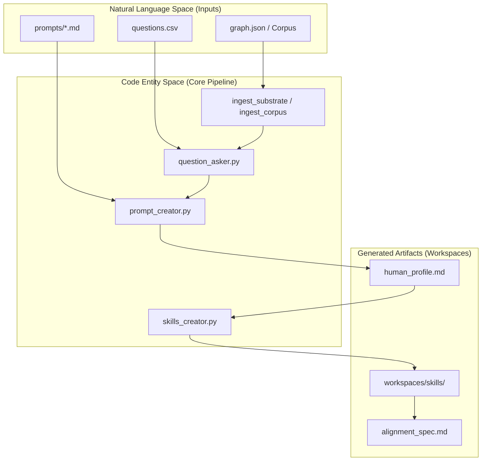
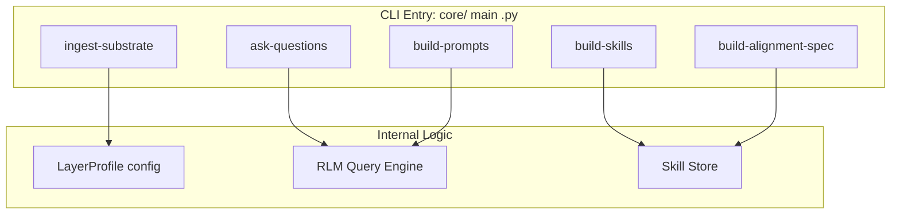

# Overview
Relevant source files
- [AGENTS.md](https://github.com/Cody-W-Tucker/Cognitive-Assistant/blob/a77ddaf6/AGENTS.md?plain=1)
- [README.md](https://github.com/Cody-W-Tucker/Cognitive-Assistant/blob/a77ddaf6/README.md?plain=1)
- [flake.nix](https://github.com/Cody-W-Tucker/Cognitive-Assistant/blob/a77ddaf6/flake.nix)
- [profiles/existential/prompts/rlm_query_template.md](https://github.com/Cody-W-Tucker/Cognitive-Assistant/blob/a77ddaf6/profiles/existential/prompts/rlm_query_template.md?plain=1)
- [profiles/operational/prompts/rlm_query_template.md](https://github.com/Cody-W-Tucker/Cognitive-Assistant/blob/a77ddaf6/profiles/operational/prompts/rlm_query_template.md?plain=1)

The Cognitive Assistant is a technical framework designed to synthesize a durable digital identity and operational profile for a user by analyzing their introspective and professional data. The system operates by processing two distinct layers of information—Existential and Operational—to generate datasets that inform AI agent behavior, ensuring that automated actions are scaffolded by the user's actual reasoning traces, aspirations, and tacit workflow rules [README.md1-12](https://github.com/Cody-W-Tucker/Cognitive-Assistant/blob/a77ddaf6/README.md?plain=1#L1-L12)

The system is built as a unified pipeline parameterized by a `LayerProfile`[README.md72-73](https://github.com/Cody-W-Tucker/Cognitive-Assistant/blob/a77ddaf6/README.md?plain=1#L72-L73) This architecture allows a single set of core scripts to handle diverse data sources, from personal journals to professional codebases, producing a unified "SOUL" and a set of verifiable "Skills" that can be consumed by downstream NixOS systems or AI agents [README.md14-27](https://github.com/Cody-W-Tucker/Cognitive-Assistant/blob/a77ddaf6/README.md?plain=1#L14-L27)

## System Architecture

The repository is organized into four primary domains that separate core logic from user-specific data and generated outputs [AGENTS.md7-14](https://github.com/Cody-W-Tucker/Cognitive-Assistant/blob/a77ddaf6/AGENTS.md?plain=1#L7-L14)

| Directory | Role | Content |
| --- | --- | --- |
| `core/` | **Logic** | The unified pipeline scripts and CLI entry points. |
| `profiles/` | **Inputs** | Profile-specific configurations, `questions.csv`, and prompt templates. |
| `workspaces/` | **Outputs** | Runtime data, ingested packets, and generated Markdown artifacts. |
| `lib/` | **Infrastructure** | Shared libraries for LLM integration, configuration, and health checks. |

### Data Flow: From Substrate to Alignment

The following diagram illustrates how raw user data (Substrate/Corpus) moves through the `core` pipeline to become a verified Alignment Spec.

**Pipeline Entity Mapping**

Sources: [AGENTS.md7-14](https://github.com/Cody-W-Tucker/Cognitive-Assistant/blob/a77ddaf6/AGENTS.md?plain=1#L7-L14)[README.md72-93](https://github.com/Cody-W-Tucker/Cognitive-Assistant/blob/a77ddaf6/README.md?plain=1#L72-L93)[flake.nix76-91](https://github.com/Cody-W-Tucker/Cognitive-Assistant/blob/a77ddaf6/flake.nix#L76-L91)

## Key Subsystems

### 1. Layer Profiles

The system is driven by two primary profiles defined in `core/config.py`[AGENTS.md80-82](https://github.com/Cody-W-Tucker/Cognitive-Assistant/blob/a77ddaf6/AGENTS.md?plain=1#L80-L82):

- **Existential Layer**: Focuses on identity, core drivers, and aspirations by questioning introspective content like journals [README.md5](https://github.com/Cody-W-Tucker/Cognitive-Assistant/blob/a77ddaf6/README.md?plain=1#L5-L5)
- **Operational Layer**: Processes work output, emails, and social posts to identify tacit rules and workflow patterns [README.md6](https://github.com/Cody-W-Tucker/Cognitive-Assistant/blob/a77ddaf6/README.md?plain=1#L6-L6)

For details on how these profiles are configured, see [Repository Layout](/Cody-W-Tucker/Cognitive-Assistant/1.2-repository-layout).

### 2. The Unified Pipeline

Commands are executed via `python -m core` and are generally profile-aware. The pipeline follows a sequence of ingestion, questioning, synthesis, and artifact generation [README.md75-93](https://github.com/Cody-W-Tucker/Cognitive-Assistant/blob/a77ddaf6/README.md?plain=1#L75-L93)

**Command Execution Map**

Sources: [README.md75-93](https://github.com/Cody-W-Tucker/Cognitive-Assistant/blob/a77ddaf6/README.md?plain=1#L75-L93)[AGENTS.md18-51](https://github.com/Cody-W-Tucker/Cognitive-Assistant/blob/a77ddaf6/AGENTS.md?plain=1#L18-L51)

### 3. Alignment and Skills

The output of the pipeline is a set of "Skills" (stored in `workspaces/skills/`) and an "Alignment Spec" [README.md95-104](https://github.com/Cody-W-Tucker/Cognitive-Assistant/blob/a77ddaf6/README.md?plain=1#L95-L104) The Alignment Spec acts as a personalized production-readiness checklist [README.md111-114](https://github.com/Cody-W-Tucker/Cognitive-Assistant/blob/a77ddaf6/README.md?plain=1#L111-L114)

- **Skills**: Unified under `workspaces/skills/` and categorized for downstream consumption (e.g., Hermes-style skill trees) [README.md16-23](https://github.com/Cody-W-Tucker/Cognitive-Assistant/blob/a77ddaf6/README.md?plain=1#L16-L23)
- **Verification**: The `verify-alignment` tool (a Nix-packaged shell script) scores AI-generated artifacts against the generated spec [README.md120-129](https://github.com/Cody-W-Tucker/Cognitive-Assistant/blob/a77ddaf6/README.md?plain=1#L120-L129)

## Getting Started

To begin using the Cognitive Assistant, you must set up a Nix-based development environment and configure your layer profiles.

For setup instructions and environment configuration, see **[Getting Started](/Cody-W-Tucker/Cognitive-Assistant/1.1-getting-started)**.
For a deep dive into the directory structure and profile parameters, see **[Repository Layout](/Cody-W-Tucker/Cognitive-Assistant/1.2-repository-layout)**.

Sources: [README.md31-60](https://github.com/Cody-W-Tucker/Cognitive-Assistant/blob/a77ddaf6/README.md?plain=1#L31-L60)[flake.nix109-127](https://github.com/Cody-W-Tucker/Cognitive-Assistant/blob/a77ddaf6/flake.nix#L109-L127)