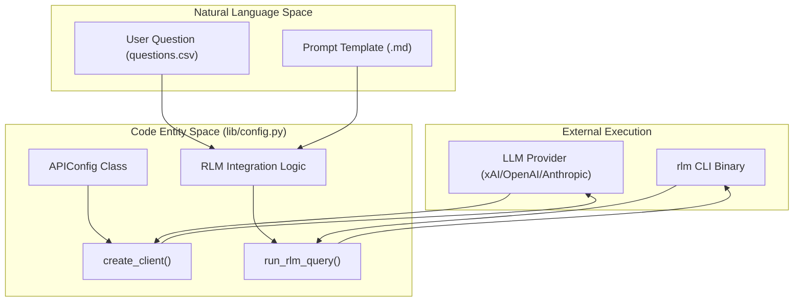
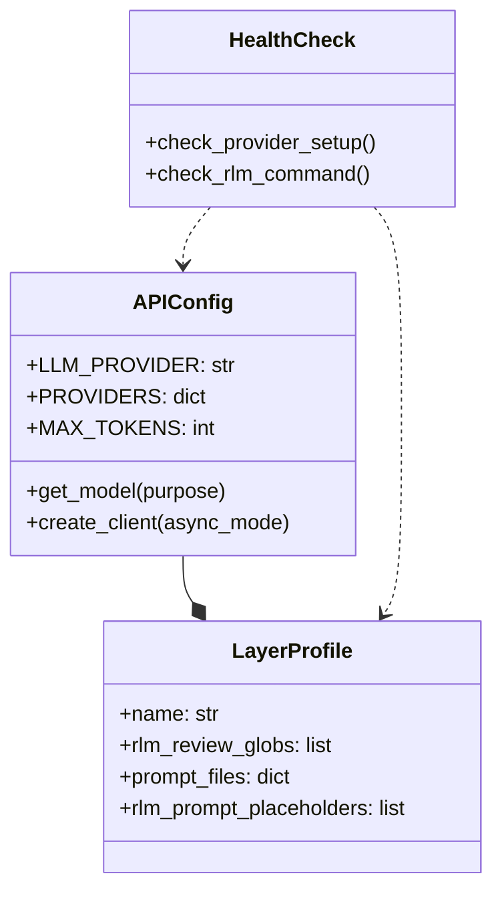

# Provider Configuration and RLM Integration
Relevant source files
- [core/config.py](https://github.com/Cody-W-Tucker/Cognitive-Assistant/blob/a77ddaf6/core/config.py)
- [core/ingest_substrate.py](https://github.com/Cody-W-Tucker/Cognitive-Assistant/blob/a77ddaf6/core/ingest_substrate.py)
- [flake.lock](https://github.com/Cody-W-Tucker/Cognitive-Assistant/blob/a77ddaf6/flake.lock)
- [lib/__init__.py](https://github.com/Cody-W-Tucker/Cognitive-Assistant/blob/a77ddaf6/lib/__init__.py)
- [lib/config.py](https://github.com/Cody-W-Tucker/Cognitive-Assistant/blob/a77ddaf6/lib/config.py)
- [lib/health.py](https://github.com/Cody-W-Tucker/Cognitive-Assistant/blob/a77ddaf6/lib/health.py)
- [lib/prompts.py](https://github.com/Cody-W-Tucker/Cognitive-Assistant/blob/a77ddaf6/lib/prompts.py)

The LLM integration layer provides a unified abstraction for multi-provider access and specialized data retrieval via the **RLM (Retrieval Language Model)** bridge. This system decouples the high-level pipeline logic from specific API implementations and manages the complex subprocess orchestration required to query ingested substrate and corpus data.

## Provider Configuration (APIConfig)

The `APIConfig` class serves as the central authority for LLM settings, model selection, and client instantiation. It supports a provider map that defines context windows, output limits, and specific model versions for different stages of the pipeline.

### Model Selection by Purpose

The system distinguishes between different task "purposes" to allow for cost and performance optimization:

- **Initial**: Used for drafting or broad synthesis (e.g., `XAI_INITIAL_MODEL`).
- **Refine**: Used for iterative improvements or synthesis of multiple drafts (e.g., `XAI_REFINE_MODEL`).
- **Default**: The fallback model for general tasks.

### Supported Providers

The configuration maps environment variables to internal settings for three primary providers:

| Provider | Client Library | Base URL | Default Context (`MAX_TOKENS`) |
| --- | --- | --- | --- |
| **xAI** | `openai` | `https://api.x.ai/v1` | 2,000,000 |
| **OpenAI** | `openai` | Official API | 1,050,000 |
| **Anthropic** | `anthropic` | Official API | 1,000,000 |

### Client Factory

The `create_client` method acts as a factory that returns a configured client instance (either synchronous or asynchronous) and the resolved model name. It handles the specific requirements of the `openai` and `anthropic` Python packages, including authentication via API keys stored in environment variables.

**Sources:**[lib/config.py18-148](https://github.com/Cody-W-Tucker/Cognitive-Assistant/blob/a77ddaf6/lib/config.py#L18-L148)[lib/config.py195-212](https://github.com/Cody-W-Tucker/Cognitive-Assistant/blob/a77ddaf6/lib/config.py#L195-L212)

---

## RLM Integration

The **RLM (Retrieval Language Model)** integration allows the pipeline to query local data indices using a dedicated CLI binary. This bridge is critical for the "Evidence-Based Synthesis" phase of the Cognitive Assistant.

### Subprocess Bridge (`run_rlm_query`)

The system communicates with the external `rlm` binary via a subprocess. This function takes a structured query (often rendered from `rlm_query_template.md`) and returns the retrieved evidence or synthesized response from the local corpus.

### RLM Execution Flow

1. **Template Rendering**: The pipeline renders a prompt containing the user question and instructions.
2. **Subprocess Invocation**: `run_rlm_query` executes the `rlm` command with the rendered prompt as input.
3. **Result Capture**: The output is captured from `stdout` and returned to the caller (e.g., `question_asker.py`).

**Sources:**[lib/config.py215-240](https://github.com/Cody-W-Tucker/Cognitive-Assistant/blob/a77ddaf6/lib/config.py#L215-L240)[core/config.py34-36](https://github.com/Cody-W-Tucker/Cognitive-Assistant/blob/a77ddaf6/core/config.py#L34-L36)

---

## Data Flow: From Configuration to Query

The following diagram illustrates how the configuration entities in the "Code Entity Space" facilitate the flow of data from the "Natural Language Space" (User Questions) to the "RLM Space" (Data Retrieval).

### Logic and Entity Mapping

Title: "Natural Language to Code Entity Mapping: LLM & RLM Flow"

**Sources:**[lib/config.py18-148](https://github.com/Cody-W-Tucker/Cognitive-Assistant/blob/a77ddaf6/lib/config.py#L18-L148)[lib/config.py215-240](https://github.com/Cody-W-Tucker/Cognitive-Assistant/blob/a77ddaf6/lib/config.py#L215-L240)[core/config.py128-202](https://github.com/Cody-W-Tucker/Cognitive-Assistant/blob/a77ddaf6/core/config.py#L128-L202)

---

## Provider Validation and Health Checks

To ensure the system is correctly configured before starting long-running pipeline jobs, the integration layer includes validation and health check primitives.

### Validation Logic

`validate_provider_config` checks for:

1. The presence of the required API key for the selected `LLM_PROVIDER`.
2. The availability of the necessary Python packages (`openai` or `anthropic`).

### Health Check Integration

The `lib/health.py` module provides functions that the `core/health_check.py` system uses to verify the environment:

- `check_provider_setup`: Iterates through configured providers to ensure keys and clients are valid.
- `check_rlm_command`: Uses `shutil.which` to verify the `rlm` binary is available on the system `PATH`.

**Sources:**[lib/health.py43-82](https://github.com/Cody-W-Tucker/Cognitive-Assistant/blob/a77ddaf6/lib/health.py#L43-L82)[lib/config.py195-212](https://github.com/Cody-W-Tucker/Cognitive-Assistant/blob/a77ddaf6/lib/config.py#L195-L212)

### System Entity Relationship

Title: "Provider and RLM Configuration Relationships"

**Sources:**[core/config.py48-99](https://github.com/Cody-W-Tucker/Cognitive-Assistant/blob/a77ddaf6/core/config.py#L48-L99)[lib/config.py18-98](https://github.com/Cody-W-Tucker/Cognitive-Assistant/blob/a77ddaf6/lib/config.py#L18-L98)[lib/health.py43-82](https://github.com/Cody-W-Tucker/Cognitive-Assistant/blob/a77ddaf6/lib/health.py#L43-L82)

## Implementation Details

### API Configuration Structure

The `PROVIDERS` dictionary in `APIConfig` contains the following schema for each provider:

- `api_key`: Fetched from environment variables (e.g., `XAI_API_KEY`).
- `initial_model` / `refine_model`: Specific model identifiers.
- `MAX_TOKENS`: The context window limit used for truncation logic.
- `MAX_COMPLETION_TOKENS`: The limit for the generated response.
- `base_url`: (Optional) Custom endpoint for OpenAI-compatible APIs like xAI.

**Sources:**[lib/config.py24-60](https://github.com/Cody-W-Tucker/Cognitive-Assistant/blob/a77ddaf6/lib/config.py#L24-L60)

### RLM Subprocess Bridge

The `run_rlm_query` function is a thin wrapper around `subprocess.run`. It uses `capture_output=True` and `text=True` to handle the I/O stream between the Python pipeline and the Rust-based RLM binary. If the binary returns a non-zero exit code, the bridge captures the `stderr` to assist in debugging.

**Sources:**[lib/config.py215-240](https://github.com/Cody-W-Tucker/Cognitive-Assistant/blob/a77ddaf6/lib/config.py#L215-L240)