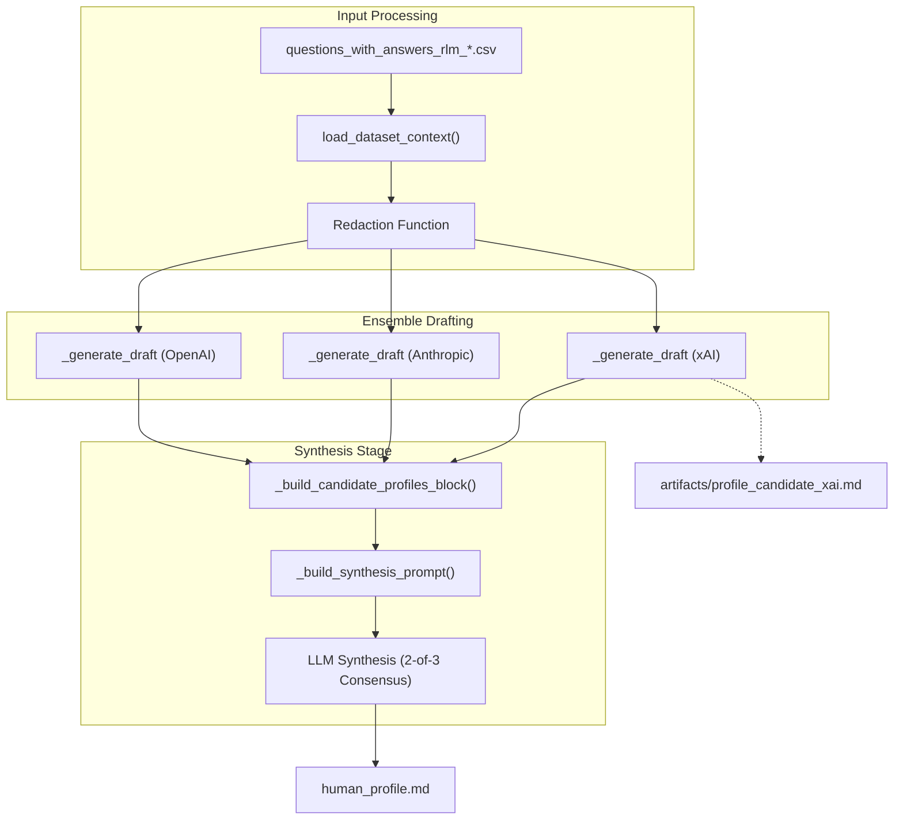

# Question Answering and Prompt Creation
Relevant source files
- [core/prompt_creator.py](https://github.com/Cody-W-Tucker/Cognitive-Assistant/blob/a77ddaf6/core/prompt_creator.py)
- [core/question_asker.py](https://github.com/Cody-W-Tucker/Cognitive-Assistant/blob/a77ddaf6/core/question_asker.py)
- [profiles/existential/prompts/ensemble_synthesis_template.md](https://github.com/Cody-W-Tucker/Cognitive-Assistant/blob/a77ddaf6/profiles/existential/prompts/ensemble_synthesis_template.md?plain=1)
- [profiles/existential/prompts/synthesis_prompt.md](https://github.com/Cody-W-Tucker/Cognitive-Assistant/blob/a77ddaf6/profiles/existential/prompts/synthesis_prompt.md?plain=1)
- [profiles/operational/README.md](https://github.com/Cody-W-Tucker/Cognitive-Assistant/blob/a77ddaf6/profiles/operational/README.md?plain=1)
- [profiles/operational/prompts/ensemble_synthesis_template.md](https://github.com/Cody-W-Tucker/Cognitive-Assistant/blob/a77ddaf6/profiles/operational/prompts/ensemble_synthesis_template.md?plain=1)
- [profiles/operational/prompts/synthesis_prompt.md](https://github.com/Cody-W-Tucker/Cognitive-Assistant/blob/a77ddaf6/profiles/operational/prompts/synthesis_prompt.md?plain=1)
- [tests/test_prompt_creator.py](https://github.com/Cody-W-Tucker/Cognitive-Assistant/blob/a77ddaf6/tests/test_prompt_creator.py)

This section details the two-stage process of transforming raw ingested data into a coherent, high-fidelity `human_profile.md`. The first stage, **Question Answering**, utilizes Retrieval-Augmented Generation (RAG) via the `rlm` tool to answer targeted probes about the user's identity or workflow. The second stage, **Prompt Creation**, employs an ensemble of Large Language Models (LLMs) to synthesize those answers into a final narrative profile, applying consensus-based filtering and redaction.

## Question Answering Loop (`question_asker.py`)

The `ask-questions` command executes a loop over a profile-specific `questions.csv` file. For every row, the system constructs a query that is passed to the `rlm` binary, which retrieves relevant context from the ingested packets and generates a response.

### Implementation and Data Flow

1. **Input Loading**: The system reads `questions.csv` from the profile's path [core/question_asker.py95-97](https://github.com/Cody-W-Tucker/Cognitive-Assistant/blob/a77ddaf6/core/question_asker.py#L95-L97)
2. **Column Initialization**: It identifies `QUESTION_COLUMNS` and `ANSWER_COLUMNS` from the configuration [core/question_asker.py109-115](https://github.com/Cody-W-Tucker/Cognitive-Assistant/blob/a77ddaf6/core/question_asker.py#L109-L115)
3. **RLM Query Construction**: For each missing answer, it builds a prompt using the `rlm_query_template` defined in the profile's configuration [core/question_asker.py21-35](https://github.com/Cody-W-Tucker/Cognitive-Assistant/blob/a77ddaf6/core/question_asker.py#L21-L35)
4. **Retry Logic**: Queries are sent to `rlm` via `_ask_with_retry`, which implements exponential backoff (defaulting to 3 retries) to handle transient failures [core/question_asker.py38-61](https://github.com/Cody-W-Tucker/Cognitive-Assistant/blob/a77ddaf6/core/question_asker.py#L38-L61)
5. **Incremental Persistence**: To prevent data loss during long-running batch operations, the system writes the updated DataFrame to a timestamped CSV file after *every* successful question-answer pair [core/question_asker.py154-156](https://github.com/Cody-W-Tucker/Cognitive-Assistant/blob/a77ddaf6/core/question_asker.py#L154-L156)

### RLM Integration

The `run_rlm_query` function acts as a bridge to the external `rlm` CLI. It leverages the profile's `rlm_review_paths` (or `ready/` directory) to provide the grounding context for the LLM [core/question_asker.py83-91](https://github.com/Cody-W-Tucker/Cognitive-Assistant/blob/a77ddaf6/core/question_asker.py#L83-L91)

**Natural Language to Code Entity Space: Question Answering**

| System Concept | Code Entity | File Reference |
| --- | --- | --- |
| **Question Loop** | `run(config)` | [core/question_asker.py74-163](https://github.com/Cody-W-Tucker/Cognitive-Assistant/blob/a77ddaf6/core/question_asker.py#L74-L163) |
| **Prompt Builder** | `_build_prompt` | [core/question_asker.py21-35](https://github.com/Cody-W-Tucker/Cognitive-Assistant/blob/a77ddaf6/core/question_asker.py#L21-L35) |
| **Resilience Logic** | `_ask_with_retry` | [core/question_asker.py38-61](https://github.com/Cody-W-Tucker/Cognitive-Assistant/blob/a77ddaf6/core/question_asker.py#L38-L61) |
| **Persistence** | `_write_dataframe` | [core/question_asker.py64-71](https://github.com/Cody-W-Tucker/Cognitive-Assistant/blob/a77ddaf6/core/question_asker.py#L64-L71) |
| **Template Source** | `config.prompts.rlm_query_template` | [core/question_asker.py29](https://github.com/Cody-W-Tucker/Cognitive-Assistant/blob/a77ddaf6/core/question_asker.py#L29-L29) |

**Sources:**[core/question_asker.py1-167](https://github.com/Cody-W-Tucker/Cognitive-Assistant/blob/a77ddaf6/core/question_asker.py#L1-L167)[profiles/operational/README.md1-70](https://github.com/Cody-W-Tucker/Cognitive-Assistant/blob/a77ddaf6/profiles/operational/README.md?plain=1#L1-L70)

---

## Prompt Creation and Synthesis (`prompt_creator.py`)

The `build-prompts` command takes the output of the question-answering stage and generates the final `human_profile.md`. This process uses an **Ensemble Drafting** strategy to ensure high-fidelity results.

### Ensemble Workflow

The system does not rely on a single model for the final profile. Instead, it follows a three-step synthesis:

1. **Drafting**: The system concurrently calls three distinct providers—**xAI**, **Anthropic**, and **OpenAI**—to generate three independent versions of the profile [core/prompt_creator.py23](https://github.com/Cody-W-Tucker/Cognitive-Assistant/blob/a77ddaf6/core/prompt_creator.py#L23-L23)[core/prompt_creator.py208-216](https://github.com/Cody-W-Tucker/Cognitive-Assistant/blob/a77ddaf6/core/prompt_creator.py#L208-L216)
2. **Synthesis**: An "Ensemble Synthesis" prompt is sent to a primary model (defaulting to Anthropic). This prompt contains the three drafts wrapped in `<candidate>` tags [core/prompt_creator.py179-193](https://github.com/Cody-W-Tucker/Cognitive-Assistant/blob/a77ddaf6/core/prompt_creator.py#L179-L193)
3. **Consensus Filtering**: The synthesis model is instructed via the `ensemble_synthesis_template.md` to only retain claims supported by at least **two out of three** drafts [profiles/existential/prompts/ensemble_synthesis_template.md1-16](https://github.com/Cody-W-Tucker/Cognitive-Assistant/blob/a77ddaf6/profiles/existential/prompts/ensemble_synthesis_template.md?plain=1#L1-L16)

### Redaction and Persistence

Before the context is sent to the ensemble, the `load_dataset_context` function applies the profile's redaction logic [core/prompt_creator.py56-60](https://github.com/Cody-W-Tucker/Cognitive-Assistant/blob/a77ddaf6/core/prompt_creator.py#L56-L60) If a regex match is found in an answer, it is replaced (e.g., masking PII or sensitive project names) before the LLM sees the data [core/prompt_creator.py82-84](https://github.com/Cody-W-Tucker/Cognitive-Assistant/blob/a77ddaf6/core/prompt_creator.py#L82-L84)

The final artifact is written to `human_profile.md` in the workspace's root, while individual model drafts are saved to the `artifacts/` directory for debugging [core/prompt_creator.py196-202](https://github.com/Cody-W-Tucker/Cognitive-Assistant/blob/a77ddaf6/core/prompt_creator.py#L196-L202)

### Data Flow Diagram: Ensemble Synthesis

**Sources:**[core/prompt_creator.py1-248](https://github.com/Cody-W-Tucker/Cognitive-Assistant/blob/a77ddaf6/core/prompt_creator.py#L1-L248)[profiles/existential/prompts/ensemble_synthesis_template.md1-16](https://github.com/Cody-W-Tucker/Cognitive-Assistant/blob/a77ddaf6/profiles/existential/prompts/ensemble_synthesis_template.md?plain=1#L1-L16)[tests/test_prompt_creator.py1-49](https://github.com/Cody-W-Tucker/Cognitive-Assistant/blob/a77ddaf6/tests/test_prompt_creator.py#L1-L49)

---

## Profile-Specific Synthesis Strategies

The content of the final profile depends heavily on the `synthesis_prompt.md` provided by the active profile.

### Existential Synthesis

The existential profile focuses on first-person psychological depth. It instructs the LLM to speak as the user's "deepest thoughts," weaving together cognitive shifts, aspirational drives, and relational patterns [profiles/existential/prompts/synthesis_prompt.md1-14](https://github.com/Cody-W-Tucker/Cognitive-Assistant/blob/a77ddaf6/profiles/existential/prompts/synthesis_prompt.md?plain=1#L1-L14)

### Operational Synthesis

The operational profile focuses on third-person "tacit rules." It prioritizes high-salience composite artifacts and hidden workflow standards earned from work traces (e.g., code, emails). It explicitly forbids psychological speculation, focusing instead on observable behavior and quality filters [profiles/operational/prompts/synthesis_prompt.md1-44](https://github.com/Cody-W-Tucker/Cognitive-Assistant/blob/a77ddaf6/profiles/operational/prompts/synthesis_prompt.md?plain=1#L1-L44)

**Natural Language to Code Entity Space: Synthesis Prompts**

| Concept | Implementation Entity | File Reference |
| --- | --- | --- |
| **Consensus Logic** | `ensemble_synthesis_template.md` | [profiles/existential/prompts/ensemble_synthesis_template.md6-11](https://github.com/Cody-W-Tucker/Cognitive-Assistant/blob/a77ddaf6/profiles/existential/prompts/ensemble_synthesis_template.md?plain=1#L6-L11) |
| **Existential Tone** | `synthesis_prompt.md` (Existential) | [profiles/existential/prompts/synthesis_prompt.md1-3](https://github.com/Cody-W-Tucker/Cognitive-Assistant/blob/a77ddaf6/profiles/existential/prompts/synthesis_prompt.md?plain=1#L1-L3) |
| **Operational Tone** | `synthesis_prompt.md` (Operational) | [profiles/operational/prompts/synthesis_prompt.md7-12](https://github.com/Cody-W-Tucker/Cognitive-Assistant/blob/a77ddaf6/profiles/operational/prompts/synthesis_prompt.md?plain=1#L7-L12) |
| **Model Selection** | `ENSEMBLE_DRAFT_PROVIDERS` | [core/prompt_creator.py23](https://github.com/Cody-W-Tucker/Cognitive-Assistant/blob/a77ddaf6/core/prompt_creator.py#L23-L23) |

**Sources:**[profiles/existential/prompts/synthesis_prompt.md1-14](https://github.com/Cody-W-Tucker/Cognitive-Assistant/blob/a77ddaf6/profiles/existential/prompts/synthesis_prompt.md?plain=1#L1-L14)[profiles/operational/prompts/synthesis_prompt.md1-44](https://github.com/Cody-W-Tucker/Cognitive-Assistant/blob/a77ddaf6/profiles/operational/prompts/synthesis_prompt.md?plain=1#L1-L44)[core/prompt_creator.py23-24](https://github.com/Cody-W-Tucker/Cognitive-Assistant/blob/a77ddaf6/core/prompt_creator.py#L23-L24)