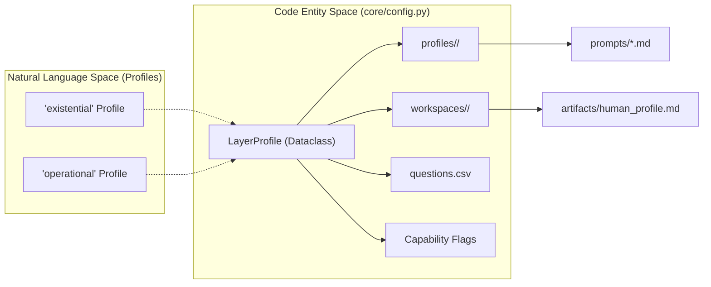
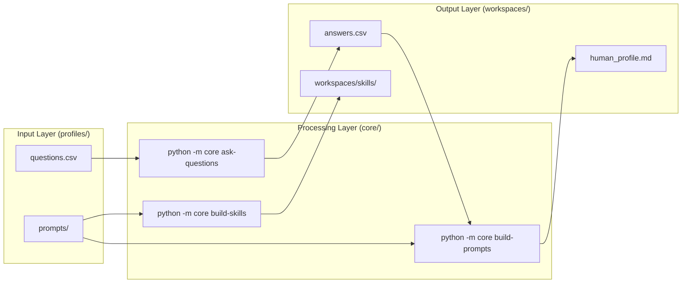

# Repository Layout
Relevant source files
- [AGENTS.md](https://github.com/Cody-W-Tucker/Cognitive-Assistant/blob/a77ddaf6/AGENTS.md?plain=1)
- [core/__init__.py](https://github.com/Cody-W-Tucker/Cognitive-Assistant/blob/a77ddaf6/core/__init__.py)
- [profiles/README.md](https://github.com/Cody-W-Tucker/Cognitive-Assistant/blob/a77ddaf6/profiles/README.md?plain=1)
- [profiles/existential/prompts/rlm_query_template.md](https://github.com/Cody-W-Tucker/Cognitive-Assistant/blob/a77ddaf6/profiles/existential/prompts/rlm_query_template.md?plain=1)
- [profiles/operational/prompts/rlm_query_template.md](https://github.com/Cody-W-Tucker/Cognitive-Assistant/blob/a77ddaf6/profiles/operational/prompts/rlm_query_template.md?plain=1)
- [workspaces/README.md](https://github.com/Cody-W-Tucker/Cognitive-Assistant/blob/a77ddaf6/workspaces/README.md?plain=1)

The Cognitive Assistant repository is designed as a unified pipeline that is parameterized by a **Layer Profile**. This architecture ensures that while different layers of the assistant (e.g., the introspective "existential" layer and the work-pattern "operational" layer) have different inputs and goals, they share a common codebase for ingestion, question answering, and artifact generation [AGENTS.md5-14](https://github.com/Cody-W-Tucker/Cognitive-Assistant/blob/a77ddaf6/AGENTS.md?plain=1#L5-L14)

## Directory Structure

The repository is organized into four primary top-level directories, enforcing a strict separation between shared logic, profile-specific configuration, and generated runtime data [AGENTS.md7-14](https://github.com/Cody-W-Tucker/Cognitive-Assistant/blob/a77ddaf6/AGENTS.md?plain=1#L7-L14)

| Directory | Role | Description |
| --- | --- | --- |
| `core/` | **Logic** | The unified pipeline scripts and command-line interface [AGENTS.md8](https://github.com/Cody-W-Tucker/Cognitive-Assistant/blob/a77ddaf6/AGENTS.md?plain=1#L8-L8) |
| `profiles/` | **Inputs** | Committed source material (prompts, questions) that define profile behavior [profiles/README.md7](https://github.com/Cody-W-Tucker/Cognitive-Assistant/blob/a77ddaf6/profiles/README.md?plain=1#L7-L7) |
| `workspaces/` | **Outputs** | Generated runtime data, cached answers, and final markdown artifacts [profiles/README.md8](https://github.com/Cody-W-Tucker/Cognitive-Assistant/blob/a77ddaf6/profiles/README.md?plain=1#L8-L8) |
| `lib/` | **Infrastructure** | Shared libraries for LLM integration, configuration, and health checks [AGENTS.md11](https://github.com/Cody-W-Tucker/Cognitive-Assistant/blob/a77ddaf6/AGENTS.md?plain=1#L11-L11) |

### Logical Flow and Data Separation

The system maintains a strict boundary between "Profile-owned inputs" and "Workspace-generated outputs."

- **Profiles** are the durable source of truth. If you want to change what the system asks or how it synthesizes information, you edit files in `profiles/`[profiles/README.md63-71](https://github.com/Cody-W-Tucker/Cognitive-Assistant/blob/a77ddaf6/profiles/README.md?plain=1#L63-L71)
- **Workspaces** are volatile and derived. Running the pipeline transforms profile inputs into workspace artifacts [profiles/README.md48-61](https://github.com/Cody-W-Tucker/Cognitive-Assistant/blob/a77ddaf6/profiles/README.md?plain=1#L48-L61)

## The Unified Pipeline

The system does not use separate scripts for different profiles. Instead, the `core` package provides a single set of commands that adapt their behavior based on the `--profile` flag [AGENTS.md18-21](https://github.com/Cody-W-Tucker/Cognitive-Assistant/blob/a77ddaf6/AGENTS.md?plain=1#L18-L21)

### Pipeline Parameterization (LayerProfile)

The behavior of the pipeline is governed by the `LayerProfile` dataclass defined in `core/config.py`. This configuration maps a profile name to its filesystem locations and functional capabilities [profiles/README.md30-38](https://github.com/Cody-W-Tucker/Cognitive-Assistant/blob/a77ddaf6/profiles/README.md?plain=1#L30-L38)

**Entity Mapping: Pipeline Configuration to Filesystem**
The following diagram illustrates how the `LayerProfile` object in `core/config.py` bridges the abstract "Profile" concept to concrete code entities and directories.

Sources: [core/config.py](https://github.com/Cody-W-Tucker/Cognitive-Assistant/blob/a77ddaf6/core/config.py)[profiles/README.md10](https://github.com/Cody-W-Tucker/Cognitive-Assistant/blob/a77ddaf6/profiles/README.md?plain=1#L10-L10)[profiles/README.md30-38](https://github.com/Cody-W-Tucker/Cognitive-Assistant/blob/a77ddaf6/profiles/README.md?plain=1#L30-L38)

## Data Flow: From Input to Artifact

The pipeline follows a standard progression: Ingestion → Question Answering → Synthesis. While the commands are shared, the internal logic (like the LLM templates used) is swapped based on the active profile [profiles/README.md50-59](https://github.com/Cody-W-Tucker/Cognitive-Assistant/blob/a77ddaf6/profiles/README.md?plain=1#L50-L59)

### Profile-Specific Synthesis Logic

The `rlm_query_template.md` file within each profile's `prompts/` directory defines the "voice" and "logic" of that layer.

- **Existential Profile**: Uses a first-person reflective voice. It focuses on continuity, alignment, and psychological synthesis from a graph-based substrate [profiles/existential/prompts/rlm_query_template.md10-15](https://github.com/Cody-W-Tucker/Cognitive-Assistant/blob/a77ddaf6/profiles/existential/prompts/rlm_query_template.md?plain=1#L10-L15)
- **Operational Profile**: Uses a third-person analytical voice. It focuses on extracting "Tacit Rules" and "Operational Functions" from a corpus of work artifacts (conversations, bug reports, etc.) [profiles/operational/prompts/rlm_query_template.md41-59](https://github.com/Cody-W-Tucker/Cognitive-Assistant/blob/a77ddaf6/profiles/operational/prompts/rlm_query_template.md?plain=1#L41-L59)

### System Data Flow Diagram

This diagram traces how data moves from the source inputs in `profiles/` through the `core` pipeline into the `workspaces/`.

Sources: [profiles/README.md48-61](https://github.com/Cody-W-Tucker/Cognitive-Assistant/blob/a77ddaf6/profiles/README.md?plain=1#L48-L61)[AGENTS.md29-41](https://github.com/Cody-W-Tucker/Cognitive-Assistant/blob/a77ddaf6/AGENTS.md?plain=1#L29-L41)[workspaces/README.md1-6](https://github.com/Cody-W-Tucker/Cognitive-Assistant/blob/a77ddaf6/workspaces/README.md?plain=1#L1-L6)

## Registered Profiles

The system currently registers two primary profiles and one meta-profile [AGENTS.md16](https://github.com/Cody-W-Tucker/Cognitive-Assistant/blob/a77ddaf6/AGENTS.md?plain=1#L16-L16):

1. **Existential (`profiles/existential/`)**:

- **Purpose**: Identity, core frame, and cognitive patterns.
- **Input**: `graph.json` (substrate).
- **Key Artifact**: `workspaces/existential/artifacts/human_profile.md`[profiles/README.md16](https://github.com/Cody-W-Tucker/Cognitive-Assistant/blob/a77ddaf6/profiles/README.md?plain=1#L16-L16)[profiles/README.md42](https://github.com/Cody-W-Tucker/Cognitive-Assistant/blob/a77ddaf6/profiles/README.md?plain=1#L42-L42)
2. **Operational (`profiles/operational/`)**:

- **Purpose**: Workflow patterns, tacit rules, and tool specifications.
- **Input**: Artifact corpus (conversations, logs).
- **Key Artifacts**: `workspaces/operational/artifacts/human_profile.md`, tool specs, and skills [profiles/README.md17](https://github.com/Cody-W-Tucker/Cognitive-Assistant/blob/a77ddaf6/profiles/README.md?plain=1#L17-L17)[profiles/README.md43](https://github.com/Cody-W-Tucker/Cognitive-Assistant/blob/a77ddaf6/profiles/README.md?plain=1#L43-L43)
3. **Alignment (`profiles/alignment/`)**:

- **Purpose**: Cross-profile verification and "SOUL" generation.
- **Input**: Outputs from both Existential and Operational profiles.
- **Key Artifact**: `workspaces/alignment/artifacts/alignment_spec.md`[profiles/README.md18](https://github.com/Cody-W-Tucker/Cognitive-Assistant/blob/a77ddaf6/profiles/README.md?plain=1#L18-L18)[profiles/README.md44](https://github.com/Cody-W-Tucker/Cognitive-Assistant/blob/a77ddaf6/profiles/README.md?plain=1#L44-L44)

Sources: [AGENTS.md1-87](https://github.com/Cody-W-Tucker/Cognitive-Assistant/blob/a77ddaf6/AGENTS.md?plain=1#L1-L87)[profiles/README.md1-72](https://github.com/Cody-W-Tucker/Cognitive-Assistant/blob/a77ddaf6/profiles/README.md?plain=1#L1-L72)[workspaces/README.md1-6](https://github.com/Cody-W-Tucker/Cognitive-Assistant/blob/a77ddaf6/workspaces/README.md?plain=1#L1-L6)[profiles/existential/prompts/rlm_query_template.md1-18](https://github.com/Cody-W-Tucker/Cognitive-Assistant/blob/a77ddaf6/profiles/existential/prompts/rlm_query_template.md?plain=1#L1-L18)[profiles/operational/prompts/rlm_query_template.md1-64](https://github.com/Cody-W-Tucker/Cognitive-Assistant/blob/a77ddaf6/profiles/operational/prompts/rlm_query_template.md?plain=1#L1-L64)