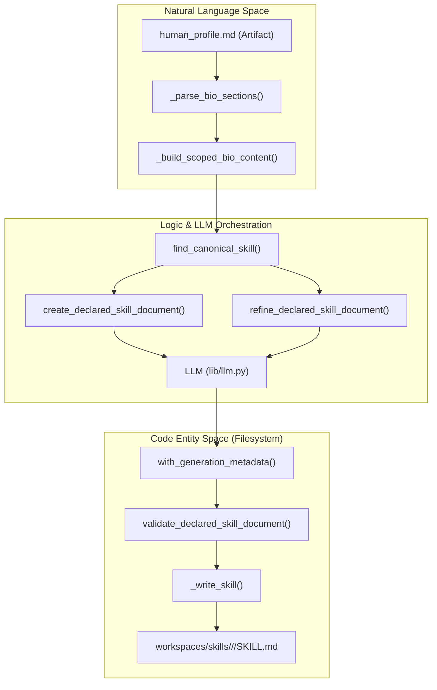
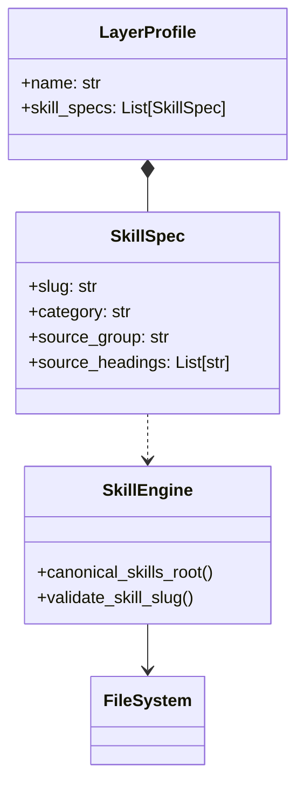

# Skills System
Relevant source files
- [core/alignment_spec.py](https://github.com/Cody-W-Tucker/Cognitive-Assistant/blob/a77ddaf6/core/alignment_spec.py)
- [core/skill_engine.py](https://github.com/Cody-W-Tucker/Cognitive-Assistant/blob/a77ddaf6/core/skill_engine.py)
- [core/skill_enhancer.py](https://github.com/Cody-W-Tucker/Cognitive-Assistant/blob/a77ddaf6/core/skill_enhancer.py)
- [core/skills_creator.py](https://github.com/Cody-W-Tucker/Cognitive-Assistant/blob/a77ddaf6/core/skills_creator.py)
- [workspaces/skills/README.md](https://github.com/Cody-W-Tucker/Cognitive-Assistant/blob/a77ddaf6/workspaces/skills/README.md?plain=1)
- [workspaces/skills/communication/earned-candor-and-the-commitment-handoff/SKILL.md](https://github.com/Cody-W-Tucker/Cognitive-Assistant/blob/a77ddaf6/workspaces/skills/communication/earned-candor-and-the-commitment-handoff/SKILL.md?plain=1)
- [workspaces/skills/communication/separate-fear-from-clarity-and-ownership/SKILL.md](https://github.com/Cody-W-Tucker/Cognitive-Assistant/blob/a77ddaf6/workspaces/skills/communication/separate-fear-from-clarity-and-ownership/SKILL.md?plain=1)
- [workspaces/skills/core/additive-thinking-partner/SKILL.md](https://github.com/Cody-W-Tucker/Cognitive-Assistant/blob/a77ddaf6/workspaces/skills/core/additive-thinking-partner/SKILL.md?plain=1)
- [workspaces/skills/core/bound-before-solving/SKILL.md](https://github.com/Cody-W-Tucker/Cognitive-Assistant/blob/a77ddaf6/workspaces/skills/core/bound-before-solving/SKILL.md?plain=1)
- [workspaces/skills/core/diagnose-before-patching/SKILL.md](https://github.com/Cody-W-Tucker/Cognitive-Assistant/blob/a77ddaf6/workspaces/skills/core/diagnose-before-patching/SKILL.md?plain=1)
- [workspaces/skills/core/skip-the-default-scripts/SKILL.md](https://github.com/Cody-W-Tucker/Cognitive-Assistant/blob/a77ddaf6/workspaces/skills/core/skip-the-default-scripts/SKILL.md?plain=1)
- [workspaces/skills/core/verify-before-trust/SKILL.md](https://github.com/Cody-W-Tucker/Cognitive-Assistant/blob/a77ddaf6/workspaces/skills/core/verify-before-trust/SKILL.md?plain=1)
- [workspaces/skills/domain/system-building-as-meaning-making/SKILL.md](https://github.com/Cody-W-Tucker/Cognitive-Assistant/blob/a77ddaf6/workspaces/skills/domain/system-building-as-meaning-making/SKILL.md?plain=1)
- [workspaces/skills/existential/decision-calibration/SKILL.md](https://github.com/Cody-W-Tucker/Cognitive-Assistant/blob/a77ddaf6/workspaces/skills/existential/decision-calibration/SKILL.md?plain=1)
- [workspaces/skills/existential/mode-detection/SKILL.md](https://github.com/Cody-W-Tucker/Cognitive-Assistant/blob/a77ddaf6/workspaces/skills/existential/mode-detection/SKILL.md?plain=1)
- [workspaces/skills/existential/relational-orientation/SKILL.md](https://github.com/Cody-W-Tucker/Cognitive-Assistant/blob/a77ddaf6/workspaces/skills/existential/relational-orientation/SKILL.md?plain=1)
- [workspaces/skills/operational/boundary-handoff/SKILL.md](https://github.com/Cody-W-Tucker/Cognitive-Assistant/blob/a77ddaf6/workspaces/skills/operational/boundary-handoff/SKILL.md?plain=1)
- [workspaces/skills/operational/complexity-reduction/SKILL.md](https://github.com/Cody-W-Tucker/Cognitive-Assistant/blob/a77ddaf6/workspaces/skills/operational/complexity-reduction/SKILL.md?plain=1)
- [workspaces/skills/operational/failure-recovery/SKILL.md](https://github.com/Cody-W-Tucker/Cognitive-Assistant/blob/a77ddaf6/workspaces/skills/operational/failure-recovery/SKILL.md?plain=1)
- [workspaces/skills/operational/scope-framing/SKILL.md](https://github.com/Cody-W-Tucker/Cognitive-Assistant/blob/a77ddaf6/workspaces/skills/operational/scope-framing/SKILL.md?plain=1)
- [workspaces/skills/operator/bind-to-operator/SKILL.md](https://github.com/Cody-W-Tucker/Cognitive-Assistant/blob/a77ddaf6/workspaces/skills/operator/bind-to-operator/SKILL.md?plain=1)
- [workspaces/skills/operator/read-the-active-mode/SKILL.md](https://github.com/Cody-W-Tucker/Cognitive-Assistant/blob/a77ddaf6/workspaces/skills/operator/read-the-active-mode/SKILL.md?plain=1)
- [workspaces/skills/workflow/avoidance-vs-misalignment-discriminator/SKILL.md](https://github.com/Cody-W-Tucker/Cognitive-Assistant/blob/a77ddaf6/workspaces/skills/workflow/avoidance-vs-misalignment-discriminator/SKILL.md?plain=1)
- [workspaces/skills/workflow/collapse-unearned-complexity/SKILL.md](https://github.com/Cody-W-Tucker/Cognitive-Assistant/blob/a77ddaf6/workspaces/skills/workflow/collapse-unearned-complexity/SKILL.md?plain=1)
- [workspaces/skills/workflow/decision-ready-not-impressive/SKILL.md](https://github.com/Cody-W-Tucker/Cognitive-Assistant/blob/a77ddaf6/workspaces/skills/workflow/decision-ready-not-impressive/SKILL.md?plain=1)
- [workspaces/skills/workflow/redirect-from-analysis-to-action/SKILL.md](https://github.com/Cody-W-Tucker/Cognitive-Assistant/blob/a77ddaf6/workspaces/skills/workflow/redirect-from-analysis-to-action/SKILL.md?plain=1)

The **Skills System** is the mechanism by which the Cognitive Assistant transforms synthesized profile data into modular, reusable, and verifiable units of capability called "Skills." These skills are stored in a unified store at `workspaces/skills/` and serve as the behavioral building blocks for the agent's persona and operational logic.

## 1. Unified Skill Store

All skills are stored in a hierarchical directory structure under `workspaces/skills/`. While different profiles (Existential, Operational) own the *source bios* and *prompts* that generate skills, the skills themselves reside in a shared workspace to allow for cross-profile discovery and alignment verification.

### Directory Structure

The store is organized by **Category Taxonomy**, with each skill residing in its own slug-named directory containing a `SKILL.md` file.

```
workspaces/skills/
├── core/           # Fundamental cognitive/operational patterns
├── workflow/       # Process-oriented skills
├── operator/       # Skills for adapting to specific users/roles
├── communication/  # Tone, candor, and relational skills
├── domain/         # Subject-matter specific expertise
├── existential/    # Identity-driven patterns (from Existential Profile)
└── operational/    # Task-driven patterns (from Operational Profile)
```

Sources: [core/skill_engine.py22-24](https://github.com/Cody-W-Tucker/Cognitive-Assistant/blob/a77ddaf6/core/skill_engine.py#L22-L24)[workspaces/skills/README.md1-10](https://github.com/Cody-W-Tucker/Cognitive-Assistant/blob/a77ddaf6/workspaces/skills/README.md?plain=1#L1-L10)

### SKILL.md Frontmatter

Every skill must contain a YAML frontmatter block. This metadata is used for skill discovery, categorization, and validation during the build process.

| Field | Description |
| --- | --- |
| `name` | The unique slug for the skill. |
| `description` | A concise summary of the skill's purpose. |
| `category` | One of the taxonomy categories (e.g., `core`, `workflow`). |
| `source_group` | The profile group that generated it (e.g., `hermes-existential`). |
| `compatibility` | Usually `opencode`, indicating the skill format version. |

Sources: [workspaces/skills/communication/separate-fear-from-clarity-and-ownership/SKILL.md1-7](https://github.com/Cody-W-Tucker/Cognitive-Assistant/blob/a77ddaf6/workspaces/skills/communication/separate-fear-from-clarity-and-ownership/SKILL.md?plain=1#L1-L7)[core/skill_engine.py25-26](https://github.com/Cody-W-Tucker/Cognitive-Assistant/blob/a77ddaf6/core/skill_engine.py#L25-L26)

---

## 2. Skill Generation and Refinement

The lifecycle of a skill involves initial generation from profile "bios," incremental refinement when source material changes, and manual or automated enhancement.

### SkillsCreator

The `SkillsCreator` class [core/skills_creator.py36-37](https://github.com/Cody-W-Tucker/Cognitive-Assistant/blob/a77ddaf6/core/skills_creator.py#L36-L37) is responsible for the automated generation of skills. It follows a specific data flow:

1. **Bio Resolution**: Locates the latest `human_profile*.md` artifact for the active profile [core/skills_creator.py82-95](https://github.com/Cody-W-Tucker/Cognitive-Assistant/blob/a77ddaf6/core/skills_creator.py#L82-L95)
2. **Scoping**: Parses the bio into sections and extracts content relevant to specific `SkillSpec` declarations in the profile configuration [core/skills_creator.py155-173](https://github.com/Cody-W-Tucker/Cognitive-Assistant/blob/a77ddaf6/core/skills_creator.py#L155-L173)
3. **LLM Generation**:

- If the skill is new, it calls `create_declared_skill_document`[core/skills_creator.py128-137](https://github.com/Cody-W-Tucker/Cognitive-Assistant/blob/a77ddaf6/core/skills_creator.py#L128-L137)
- If the skill exists, it calls `refine_declared_skill_document` to merge new bio insights into the existing `SKILL.md`[core/skills_creator.py139-153](https://github.com/Cody-W-Tucker/Cognitive-Assistant/blob/a77ddaf6/core/skills_creator.py#L139-L153)
4. **Validation**: Ensures the generated Markdown meets structural requirements [core/skills_creator.py124](https://github.com/Cody-W-Tucker/Cognitive-Assistant/blob/a77ddaf6/core/skills_creator.py#L124-L124)

### SkillEnhancer

The `SkillEnhancer` (invoked via `python -m core enhance-skill`) allows for targeted refinement of a single skill. This is often used when a specific behavioral edge case is identified that requires a more precise LLM prompt than the general generation loop provides.

### Hermes Bootstrap Imports

The system supports "Hermes" imports—pre-defined skill templates or "seeds" that provide a starting point for common cognitive patterns (e.g., `additive-thinking-partner`). These are merged with local profile context during generation [core/skills_creator.py61-80](https://github.com/Cody-W-Tucker/Cognitive-Assistant/blob/a77ddaf6/core/skills_creator.py#L61-L80)

### Stale Skill Cleanup

To maintain the integrity of the skill store, `SkillsCreator` performs a cleanup phase. If a skill directory exists in the workspace but is no longer declared in the profile's `skill_specs`, it is removed [core/skills_creator.py58](https://github.com/Cody-W-Tucker/Cognitive-Assistant/blob/a77ddaf6/core/skills_creator.py#L58-L58)

---

## 3. Implementation Diagrams

### Skill Generation Data Flow

This diagram illustrates the transition from Natural Language (Profile Bios) to Code-ready Artifacts (`SKILL.md`).



Sources: [core/skills_creator.py47-59](https://github.com/Cody-W-Tucker/Cognitive-Assistant/blob/a77ddaf6/core/skills_creator.py#L47-L59)[core/skills_creator.py97-126](https://github.com/Cody-W-Tucker/Cognitive-Assistant/blob/a77ddaf6/core/skills_creator.py#L97-L126)[core/skill_engine.py22-32](https://github.com/Cody-W-Tucker/Cognitive-Assistant/blob/a77ddaf6/core/skill_engine.py#L22-L32)

### Skill Taxonomy and Configuration

How the `LayerProfile` configuration in `core/config.py` maps to the physical skill structure.



Sources: [core/config.py21-32](https://github.com/Cody-W-Tucker/Cognitive-Assistant/blob/a77ddaf6/core/config.py#L21-L32)[core/skill_engine.py22-30](https://github.com/Cody-W-Tucker/Cognitive-Assistant/blob/a77ddaf6/core/skill_engine.py#L22-L30)

---

## 4. Category Taxonomy Detail

Skills are categorized to help the agent select the appropriate "tool" for a given cognitive state.

| Category | Role | Example Skill |
| --- | --- | --- |
| **Core** | Fundamental constraints (don't guess, verify first). | `bound-before-solving`[workspaces/skills/core/bound-before-solving/SKILL.md](https://github.com/Cody-W-Tucker/Cognitive-Assistant/blob/a77ddaf6/workspaces/skills/core/bound-before-solving/SKILL.md?plain=1) |
| **Workflow** | Managing the transition between thinking and doing. | `decision-ready-not-impressive`[workspaces/skills/workflow/decision-ready-not-impressive/SKILL.md](https://github.com/Cody-W-Tucker/Cognitive-Assistant/blob/a77ddaf6/workspaces/skills/workflow/decision-ready-not-impressive/SKILL.md?plain=1) |
| **Operator** | Adapting output for the person receiving it. | `bind-to-operator`[workspaces/skills/operator/bind-to-operator/SKILL.md](https://github.com/Cody-W-Tucker/Cognitive-Assistant/blob/a77ddaf6/workspaces/skills/operator/bind-to-operator/SKILL.md?plain=1) |
| **Communication** | Handling tone, directness, and relational stakes. | `earned-candor-and-the-commitment-handoff`[workspaces/skills/communication/earned-candor-and-the-commitment-handoff/SKILL.md](https://github.com/Cody-W-Tucker/Cognitive-Assistant/blob/a77ddaf6/workspaces/skills/communication/earned-candor-and-the-commitment-handoff/SKILL.md?plain=1) |
| **Domain** | Specialized knowledge or meaning-making frameworks. | `system-building-as-meaning-making`[workspaces/skills/domain/system-building-as-meaning-making/SKILL.md](https://github.com/Cody-W-Tucker/Cognitive-Assistant/blob/a77ddaf6/workspaces/skills/domain/system-building-as-meaning-making/SKILL.md?plain=1) |
| **Existential** | High-level identity and mode-detection patterns. | `mode-detection`[workspaces/skills/existential/mode-detection/SKILL.md](https://github.com/Cody-W-Tucker/Cognitive-Assistant/blob/a77ddaf6/workspaces/skills/existential/mode-detection/SKILL.md?plain=1) |
| **Operational** | Specific task-recovery and boundary-handling logic. | `failure-recovery`[workspaces/skills/operational/failure-recovery/SKILL.md](https://github.com/Cody-W-Tucker/Cognitive-Assistant/blob/a77ddaf6/workspaces/skills/operational/failure-recovery/SKILL.md?plain=1) |

Sources: [workspaces/skills/README.md5-15](https://github.com/Cody-W-Tucker/Cognitive-Assistant/blob/a77ddaf6/workspaces/skills/README.md?plain=1#L5-L15)[core/skills_creator.py109-112](https://github.com/Cody-W-Tucker/Cognitive-Assistant/blob/a77ddaf6/core/skills_creator.py#L109-L112)

## 5. Stale Skill Cleanup Logic

The cleanup process ensures that the `workspaces/skills/` directory does not accumulate "ghost" skills that are no longer supported by the profile configuration.

```
# Conceptual logic from core/skills_creator.py
def _cleanup_stale_generated_skills(self, output_dir, declared_slugs):
    # 1. Identify all skill directories currently in the workspace
    # 2. Filter for those owned by the current profile (via frontmatter)
    # 3. If a directory's slug is NOT in declared_slugs, delete it
```

Sources: [core/skills_creator.py58](https://github.com/Cody-W-Tucker/Cognitive-Assistant/blob/a77ddaf6/core/skills_creator.py#L58-L58)[core/skills_creator.py108-111](https://github.com/Cody-W-Tucker/Cognitive-Assistant/blob/a77ddaf6/core/skills_creator.py#L108-L111)