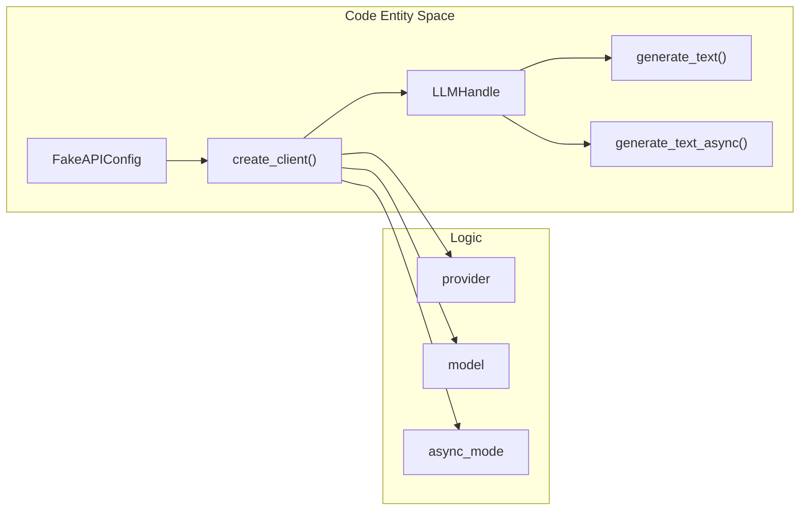
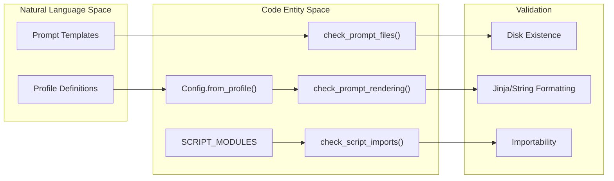

# Test Suite
Relevant source files
- [lib/llm.py](https://github.com/Cody-W-Tucker/Cognitive-Assistant/blob/a77ddaf6/lib/llm.py)
- [profiles/existential/prompts/ensemble_synthesis_template.md](https://github.com/Cody-W-Tucker/Cognitive-Assistant/blob/a77ddaf6/profiles/existential/prompts/ensemble_synthesis_template.md?plain=1)
- [profiles/operational/prompts/ensemble_synthesis_template.md](https://github.com/Cody-W-Tucker/Cognitive-Assistant/blob/a77ddaf6/profiles/operational/prompts/ensemble_synthesis_template.md?plain=1)
- [tests/test_health.py](https://github.com/Cody-W-Tucker/Cognitive-Assistant/blob/a77ddaf6/tests/test_health.py)
- [tests/test_ingest_substrate.py](https://github.com/Cody-W-Tucker/Cognitive-Assistant/blob/a77ddaf6/tests/test_ingest_substrate.py)
- [tests/test_llm.py](https://github.com/Cody-W-Tucker/Cognitive-Assistant/blob/a77ddaf6/tests/test_llm.py)
- [tests/test_prompt_creator.py](https://github.com/Cody-W-Tucker/Cognitive-Assistant/blob/a77ddaf6/tests/test_prompt_creator.py)
- [tests/test_skill_engine.py](https://github.com/Cody-W-Tucker/Cognitive-Assistant/blob/a77ddaf6/tests/test_skill_engine.py)
- [tests/test_skills_creator.py](https://github.com/Cody-W-Tucker/Cognitive-Assistant/blob/a77ddaf6/tests/test_skills_creator.py)

The Cognitive Assistant test suite provides automated validation for the system's LLM integration, data ingestion pipelines, skill generation logic, and profile health. It is designed to run in CI environments by mocking external dependencies like LLM APIs and the `rlm` binary.

## Execution and Environment

Tests are executed within the project's development environment, which provides all necessary Python dependencies and the `rlm` tool.

| Command | Description |
| --- | --- |
| `nix develop` | Enter the development shell with all dependencies. |
| `python3 -m unittest discover tests` | Run the full test suite. |
| `python3 tests/test_health.py` | Run profile-aware health checks. |

Sources: [tests/test_health.py1-79](https://github.com/Cody-W-Tucker/Cognitive-Assistant/blob/a77ddaf6/tests/test_health.py#L1-L79)[tests/test_llm.py103-104](https://github.com/Cody-W-Tucker/Cognitive-Assistant/blob/a77ddaf6/tests/test_llm.py#L103-L104)

---

## LLM Mocking and Integration (test_llm.py)

The LLM test suite ensures that the abstraction layer in `lib/llm.py` correctly handles different provider protocols (OpenAI vs. Anthropic) and manages client lifecycles.

### Key Mocking Classes

- **`FakeMessages`**: Simulates the Anthropic `messages` client. It captures `kwargs` to verify that system prompts are correctly injected or omitted [tests/test_llm.py13-20](https://github.com/Cody-W-Tucker/Cognitive-Assistant/blob/a77ddaf6/tests/test_llm.py#L13-L20)
- **`FakeAsyncClient`**: Simulates an asynchronous client with an `aclose` method to verify that `close_client_async` properly shuts down resources [tests/test_llm.py22-28](https://github.com/Cody-W-Tucker/Cognitive-Assistant/blob/a77ddaf6/tests/test_llm.py#L22-L28)

### Data Flow: LLM Handle Creation

The following diagram illustrates how the `create_client` factory produces a unified `LLMHandle` regardless of the underlying provider.

**LLM Handle Initialization**

Sources: [lib/llm.py9-37](https://github.com/Cody-W-Tucker/Cognitive-Assistant/blob/a77ddaf6/lib/llm.py#L9-L37)[tests/test_llm.py31-46](https://github.com/Cody-W-Tucker/Cognitive-Assistant/blob/a77ddaf6/tests/test_llm.py#L31-L46)

---

## Data Ingestion (test_ingest_substrate.py)

Tests for the ingestion engine verify the conversion of complex graph structures into the JSONL packet format required by the pipeline.

### Validation Logic

- **Graph-only Conversion**: Verifies that `convert_substrate_exports` produces `graph_pages.jsonl` and `mention_evidence.jsonl` while correctly omitting focus-related files when no focus bundles are provided [tests/test_ingest_substrate.py15-79](https://github.com/Cody-W-Tucker/Cognitive-Assistant/blob/a77ddaf6/tests/test_ingest_substrate.py#L15-L79)
- **Focus Bundle Integration**: Ensures that focus notes and relations are correctly mapped to their respective JSONL output files [tests/test_ingest_substrate.py80-149](https://github.com/Cody-W-Tucker/Cognitive-Assistant/blob/a77ddaf6/tests/test_ingest_substrate.py#L80-L149)

Sources: [tests/test_ingest_substrate.py11-149](https://github.com/Cody-W-Tucker/Cognitive-Assistant/blob/a77ddaf6/tests/test_ingest_substrate.py#L11-L149)

---

## Skill Engine and Creator (test_skill_engine.py, test_skills_creator.py)

The skills system is tested for both its low-level markdown manipulation and its high-level lifecycle management (creation and cleanup).

### Skill Artifact Mechanics

`test_skill_engine.py` validates the structural integrity of `SKILL.md` files:

- **Frontmatter Extraction**: Uses `extract_frontmatter` and `body_without_frontmatter` to isolate metadata from content [tests/test_skill_engine.py43-45](https://github.com/Cody-W-Tucker/Cognitive-Assistant/blob/a77ddaf6/tests/test_skill_engine.py#L43-L45)
- **Normalization**: Ensures that LLM-generated markdown (often wrapped in fences) is correctly merged with existing frontmatter via `normalize_skill_markdown`[tests/test_skill_engine.py46-48](https://github.com/Cody-W-Tucker/Cognitive-Assistant/blob/a77ddaf6/tests/test_skill_engine.py#L46-L48)
- **Metadata Injection**: Verifies that `with_generation_metadata` correctly stamps skills with their `source_profile` and `source_group`[tests/test_skill_engine.py50-60](https://github.com/Cody-W-Tucker/Cognitive-Assistant/blob/a77ddaf6/tests/test_skill_engine.py#L50-L60)

### Skill Lifecycle Management

`test_skills_creator.py` focuses on the `SkillsCreator` class:

- **Scoped Context**: Verifies `_build_scoped_bio_content` only includes sections from `human_profile.md` that are explicitly declared in the `SkillSpec`[tests/test_skills_creator.py20-38](https://github.com/Cody-W-Tucker/Cognitive-Assistant/blob/a77ddaf6/tests/test_skills_creator.py#L20-L38)
- **Stale Cleanup**: Ensures `_cleanup_stale_generated_skills` only deletes skills belonging to the *current* profile that are no longer in the active specification, preventing accidental deletion of skills from other profiles [tests/test_skills_creator.py40-67](https://github.com/Cody-W-Tucker/Cognitive-Assistant/blob/a77ddaf6/tests/test_skills_creator.py#L40-L67)

Sources: [tests/test_skill_engine.py8-60](https://github.com/Cody-W-Tucker/Cognitive-Assistant/blob/a77ddaf6/tests/test_skill_engine.py#L8-L60)[tests/test_skills_creator.py11-67](https://github.com/Cody-W-Tucker/Cognitive-Assistant/blob/a77ddaf6/tests/test_skills_creator.py#L11-L67)

---

## Profile-Aware Health Checks (test_health.py)

The `ProfileHealthTests` class acts as a meta-test suite that iterates over every registered profile (e.g., `existential`, `operational`) to ensure they are internally consistent.

### Automated Checks

1. **Static Health**: Calls `check_prompt_files` to verify all prompts declared in `LayerProfile.prompt_files` exist on disk [tests/test_health.py42-55](https://github.com/Cody-W-Tucker/Cognitive-Assistant/blob/a77ddaf6/tests/test_health.py#L42-L55)
2. **Rendering**: Calls `check_prompt_rendering` to ensure templates can be populated without syntax errors [tests/test_health.py56](https://github.com/Cody-W-Tucker/Cognitive-Assistant/blob/a77ddaf6/tests/test_health.py#L56-L56)
3. **Import Integrity**: Verifies that all core modules in `SCRIPT_MODULES` can be imported without circular dependencies or missing requirements [tests/test_health.py62-63](https://github.com/Cody-W-Tucker/Cognitive-Assistant/blob/a77ddaf6/tests/test_health.py#L62-L63)
4. **Slug Uniqueness**: Scans `workspaces/skills` to ensure that no two skills share the same slug, preventing collisions in the unified skill store [tests/test_health.py65-76](https://github.com/Cody-W-Tucker/Cognitive-Assistant/blob/a77ddaf6/tests/test_health.py#L65-L76)

**Health Check Logic Flow**

Sources: [tests/test_health.py15-76](https://github.com/Cody-W-Tucker/Cognitive-Assistant/blob/a77ddaf6/tests/test_health.py#L15-L76)[lib/health.py21](https://github.com/Cody-W-Tucker/Cognitive-Assistant/blob/a77ddaf6/lib/health.py#L21-L21)

---

## Ensemble Synthesis (test_prompt_creator.py)

This module tests the consensus logic used during the `build-prompts` stage.

- **Provider Diversity**: Verifies that `get_prompt_creator_providers` returns the required ensemble (xAI, Anthropic, OpenAI) [tests/test_prompt_creator.py18-22](https://github.com/Cody-W-Tucker/Cognitive-Assistant/blob/a77ddaf6/tests/test_prompt_creator.py#L18-L22)
- **Synthesis Prompting**: Ensures that `_build_synthesis_prompt` correctly injects the "two-of-three" consensus rules and formats the candidate profiles inside XML-tagged blocks [tests/test_prompt_creator.py24-45](https://github.com/Cody-W-Tucker/Cognitive-Assistant/blob/a77ddaf6/tests/test_prompt_creator.py#L24-L45)

Sources: [tests/test_prompt_creator.py8-45](https://github.com/Cody-W-Tucker/Cognitive-Assistant/blob/a77ddaf6/tests/test_prompt_creator.py#L8-L45)[profiles/existential/prompts/ensemble_synthesis_template.md1-16](https://github.com/Cody-W-Tucker/Cognitive-Assistant/blob/a77ddaf6/profiles/existential/prompts/ensemble_synthesis_template.md?plain=1#L1-L16)