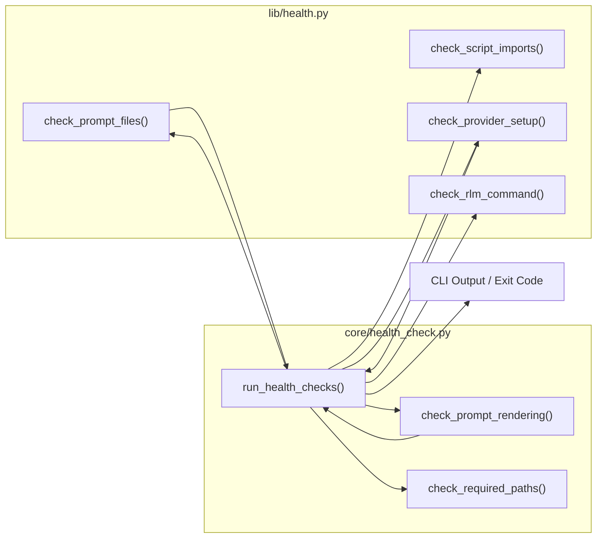
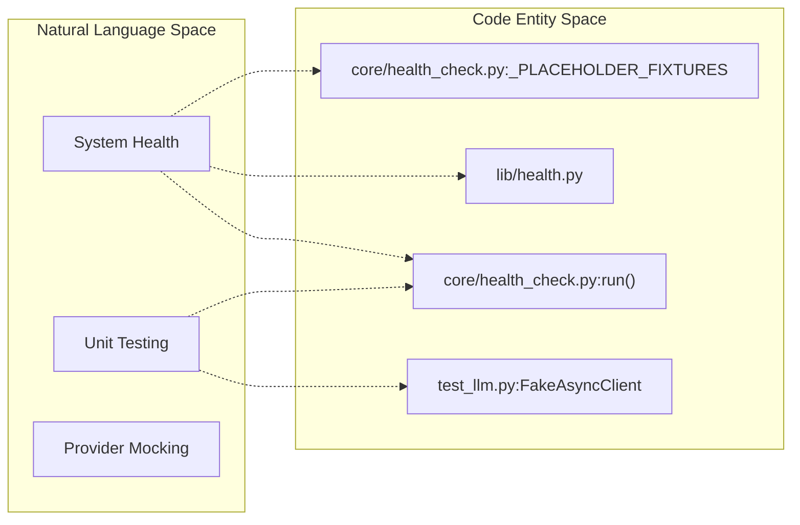

# Testing and Health Checks
Relevant source files
- [core/health_check.py](https://github.com/Cody-W-Tucker/Cognitive-Assistant/blob/a77ddaf6/core/health_check.py)
- [lib/__init__.py](https://github.com/Cody-W-Tucker/Cognitive-Assistant/blob/a77ddaf6/lib/__init__.py)
- [lib/health.py](https://github.com/Cody-W-Tucker/Cognitive-Assistant/blob/a77ddaf6/lib/health.py)
- [lib/prompts.py](https://github.com/Cody-W-Tucker/Cognitive-Assistant/blob/a77ddaf6/lib/prompts.py)

The Cognitive Assistant platform includes a comprehensive suite of automated tests and a profile-aware health check system to ensure pipeline integrity, provider connectivity, and template validity. These tools are designed to catch configuration errors and environmental issues before expensive LLM operations are initiated.

## Health Check System

The health check system provides a diagnostic layer that validates the entire environment for a specific `LayerProfile`. It is accessible via the CLI and is executed by `core/health_check.py`[core/health_check.py1-130](https://github.com/Cody-W-Tucker/Cognitive-Assistant/blob/a77ddaf6/core/health_check.py#L1-L130)

The system aggregates multiple check types to verify:

- **Script Imports**: Ensures all required core modules can be imported without errors [core/health_check.py20-28](https://github.com/Cody-W-Tucker/Cognitive-Assistant/blob/a77ddaf6/core/health_check.py#L20-L28)
- **Prompt Files**: Validates that all prompt templates declared in the profile exist on disk and are not empty [lib/health.py11-29](https://github.com/Cody-W-Tucker/Cognitive-Assistant/blob/a77ddaf6/lib/health.py#L11-L29)
- **Prompt Rendering**: Uses `_PLACEHOLDER_FIXTURES` to dry-run the Python string formatting for all templates, ensuring no missing keys or syntax errors [core/health_check.py31-79](https://github.com/Cody-W-Tucker/Cognitive-Assistant/blob/a77ddaf6/core/health_check.py#L31-L79)
- **Provider Setup**: Checks for required environment variables (e.g., `OPENAI_API_KEY`), verifies library installations, and attempts to instantiate LLM clients [lib/health.py43-74](https://github.com/Cody-W-Tucker/Cognitive-Assistant/blob/a77ddaf6/lib/health.py#L43-L74)
- **External Dependencies**: Verifies that the `rlm` binary is available in the system `PATH`[lib/health.py77-82](https://github.com/Cody-W-Tucker/Cognitive-Assistant/blob/a77ddaf6/lib/health.py#L77-L82)

For a deep dive into the implementation of these checks, see [Health Check System](/Cody-W-Tucker/Cognitive-Assistant/7.1-health-check-system).

### Health Check Execution Flow

The following diagram illustrates how the `run_health_checks` function aggregates disparate validation logic into a single report.

**Health Check Aggregation**

**Sources:**[core/health_check.py92-115](https://github.com/Cody-W-Tucker/Cognitive-Assistant/blob/a77ddaf6/core/health_check.py#L92-L115)[lib/health.py1-83](https://github.com/Cody-W-Tucker/Cognitive-Assistant/blob/a77ddaf6/lib/health.py#L1-L83)

## Test Suite

The test suite consists of unit and integration tests that mock external dependencies to verify the logic of individual pipeline stages. These tests are primarily located in the `tests/` directory (referenced by the `test_health.py` and `test_llm.py` patterns).

Key testing areas include:

- **LLM Mocking**: Using `FakeMessages` and `FakeAsyncClient` to simulate LLM responses without incurring costs or requiring network access.
- **Ingestion Logic**: Testing `ingest_substrate.py` to ensure graph data is correctly transformed into JSONL packets.
- **Prompt Generation**: Verifying that `PromptCreator` correctly ensembles responses from multiple providers.
- **Skill Creation**: Validating the parsing and formatting logic within `SkillsCreator`.

For details on running the suite and specific module coverage, see [Test Suite](/Cody-W-Tucker/Cognitive-Assistant/7.2-test-suite).

### Testing and Health Architecture

This diagram bridges the Natural Language concepts of "Health" and "Testing" to the specific code entities that implement them.

**Verification Logic Mapping**

**Sources:**[core/health_check.py32-44](https://github.com/Cody-W-Tucker/Cognitive-Assistant/blob/a77ddaf6/core/health_check.py#L32-L44)[core/health_check.py118-127](https://github.com/Cody-W-Tucker/Cognitive-Assistant/blob/a77ddaf6/core/health_check.py#L118-L127)[lib/health.py11-16](https://github.com/Cody-W-Tucker/Cognitive-Assistant/blob/a77ddaf6/lib/health.py#L11-L16)

## Summary Table of Verification Tools

| Tool / Function | Location | Purpose |
| --- | --- | --- |
| `run_health_checks` | `core/health_check.py`[core/health_check.py92](https://github.com/Cody-W-Tucker/Cognitive-Assistant/blob/a77ddaf6/core/health_check.py#L92-L92) | Aggregates all profile-specific diagnostics. |
| `check_provider_setup` | `lib/health.py`[lib/health.py43](https://github.com/Cody-W-Tucker/Cognitive-Assistant/blob/a77ddaf6/lib/health.py#L43-L43) | Validates API keys and client instantiation. |
| `check_prompt_rendering` | `core/health_check.py`[core/health_check.py53](https://github.com/Cody-W-Tucker/Cognitive-Assistant/blob/a77ddaf6/core/health_check.py#L53-L53) | Validates `.format()` compatibility for templates. |
| `check_rlm_command` | `lib/health.py`[lib/health.py77](https://github.com/Cody-W-Tucker/Cognitive-Assistant/blob/a77ddaf6/lib/health.py#L77-L77) | Ensures the RLM binary is executable. |
| `load_prompt` | `lib/prompts.py`[lib/prompts.py10](https://github.com/Cody-W-Tucker/Cognitive-Assistant/blob/a77ddaf6/lib/prompts.py#L10-L10) | Cached loader used by both runtime and health checks. |

**Sources:**[core/health_check.py1-130](https://github.com/Cody-W-Tucker/Cognitive-Assistant/blob/a77ddaf6/core/health_check.py#L1-L130)[lib/health.py1-83](https://github.com/Cody-W-Tucker/Cognitive-Assistant/blob/a77ddaf6/lib/health.py#L1-L83)[lib/prompts.py1-28](https://github.com/Cody-W-Tucker/Cognitive-Assistant/blob/a77ddaf6/lib/prompts.py#L1-L28)