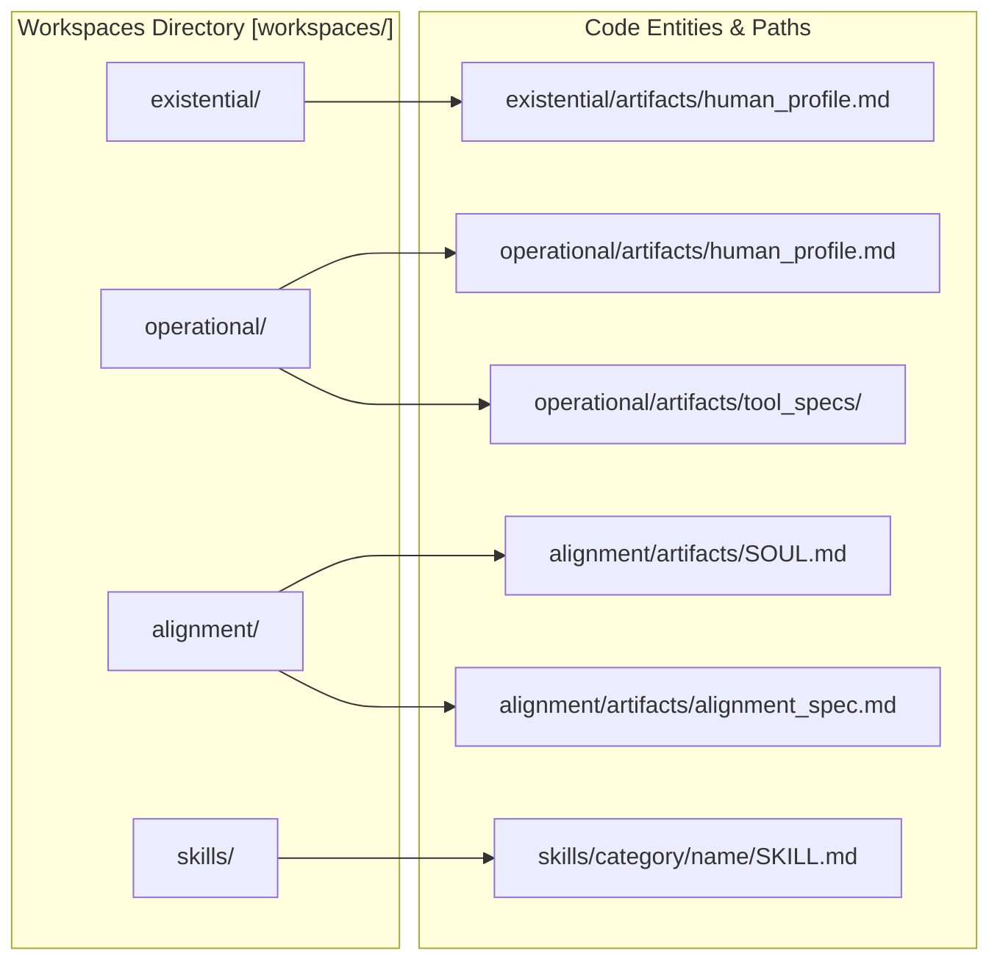
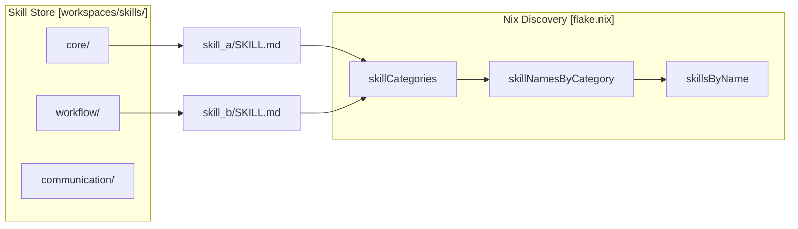

# Workspaces and Generated Artifacts
Relevant source files
- [flake.nix](https://github.com/Cody-W-Tucker/Cognitive-Assistant/blob/a77ddaf6/flake.nix)
- [workspaces/README.md](https://github.com/Cody-W-Tucker/Cognitive-Assistant/blob/a77ddaf6/workspaces/README.md?plain=1)

The `workspaces/` directory serves as the runtime output layer of the Cognitive Assistant system. While the `profiles/` directory contains static configuration and prompt templates, `workspaces/` is where the unified pipeline persists its generated knowledge, structured artifacts, and synthesized profiles. This directory is strictly separated from the core logic to ensure that runtime state can be cleared or versioned independently of the system code.

### Workspace Architecture

The workspace is divided into three primary functional areas and a unified skill store. Each area corresponds to a specific stage or perspective within the cognitive synthesis process.

| Workspace Area | Purpose | Key Artifacts |
| --- | --- | --- |
| `existential/` | Identity and cognitive framing | `human_profile.md` |
| `operational/` | Workflow patterns and tool specs | `human_profile.md`, `memory.md`, `tasks.md` |
| `alignment/` | Cross-profile synthesis and persona | `SOUL.md`, `alignment_spec.md` |
| `skills/` | Unified capability library | `SKILL.md` (categorized) |

**Sources:**[workspaces/README.md1-6](https://github.com/Cody-W-Tucker/Cognitive-Assistant/blob/a77ddaf6/workspaces/README.md?plain=1#L1-L6)[flake.nix32-40](https://github.com/Cody-W-Tucker/Cognitive-Assistant/blob/a77ddaf6/flake.nix#L32-L40)[flake.nix67-73](https://github.com/Cody-W-Tucker/Cognitive-Assistant/blob/a77ddaf6/flake.nix#L67-L73)

---

### Existential and Operational Workspaces

The `existential/` and `operational/` workspaces store the outputs of the two primary data ingestion and synthesis pipelines. Each contains an `artifacts/` subdirectory where the final synthesized `human_profile.md` is stored.

- **Existential Workspace:** Focuses on the "who" and "why" of the agent, derived from substrate ingestion (e.g., personal notes and cognitive graphs). [flake.nix67](https://github.com/Cody-W-Tucker/Cognitive-Assistant/blob/a77ddaf6/flake.nix#L67-L67)
- **Operational Workspace:** Focuses on the "how" and "what," containing workflow patterns and specialized tool specifications like `memory.md` and `tasks.md`. [flake.nix68-73](https://github.com/Cody-W-Tucker/Cognitive-Assistant/blob/a77ddaf6/flake.nix#L68-L73)

These artifacts are exposed via the Nix flake for downstream consumption by other services or deployment configurations. [flake.nix85](https://github.com/Cody-W-Tucker/Cognitive-Assistant/blob/a77ddaf6/flake.nix#L85-L85)

**Sources:**[flake.nix32-39](https://github.com/Cody-W-Tucker/Cognitive-Assistant/blob/a77ddaf6/flake.nix#L32-L39)[flake.nix67-73](https://github.com/Cody-W-Tucker/Cognitive-Assistant/blob/a77ddaf6/flake.nix#L67-L73)[workspaces/README.md3-4](https://github.com/Cody-W-Tucker/Cognitive-Assistant/blob/a77ddaf6/workspaces/README.md?plain=1#L3-L4)

---

### Unified Skills System

The `workspaces/skills/` directory is a unified store for discrete capabilities known as "Skills." Unlike the layer-specific artifacts, skills are categorized by their functional domain (e.g., core, workflow, communication) rather than their origin profile.

Each skill is a directory containing a `SKILL.md` file with mandatory frontmatter. The system uses a `SkillsCreator` and `SkillEnhancer` to generate and refine these files. The Nix flake automatically discovers these skills and exposes them as a structured attribute set for the alignment process.

For details on the taxonomy and generation lifecycle, see [Skills System](/Cody-W-Tucker/Cognitive-Assistant/4.1-skills-system).

**Sources:**[flake.nix40-66](https://github.com/Cody-W-Tucker/Cognitive-Assistant/blob/a77ddaf6/flake.nix#L40-L66)[flake.nix86-91](https://github.com/Cody-W-Tucker/Cognitive-Assistant/blob/a77ddaf6/flake.nix#L86-L91)

---

### Alignment Artifacts

The `alignment/` workspace serves as the synthesis point for the entire system. It consumes the outputs of the existential and operational layers to produce the agent's durable persona and verification logic.

- **SOUL.md:** The definitive representation of the agent's persona and identity.
- **SOUL_ARCHETYPE.md:** An intermediate representation used to bridge raw profile data and the final SOUL.
- **alignment_spec.md:** A personalized verification checklist used by the `verify-alignment` tool to ensure the agent's responses remain consistent with its defined persona and skills. [flake.nix78-84](https://github.com/Cody-W-Tucker/Cognitive-Assistant/blob/a77ddaf6/flake.nix#L78-L84)

The `alignment_spec.md` is particularly critical as it is used as a runtime environment variable for the alignment validator. [flake.nix101-102](https://github.com/Cody-W-Tucker/Cognitive-Assistant/blob/a77ddaf6/flake.nix#L101-L102)

For details on how these artifacts are generated and structured, see [Alignment Artifacts: SOUL, Archetype, and Alignment Spec](/Cody-W-Tucker/Cognitive-Assistant/4.2-alignment-artifacts:-soul-archetype-and-alignment-spec).

**Sources:**[flake.nix78-84](https://github.com/Cody-W-Tucker/Cognitive-Assistant/blob/a77ddaf6/flake.nix#L78-L84)[flake.nix101-105](https://github.com/Cody-W-Tucker/Cognitive-Assistant/blob/a77ddaf6/flake.nix#L101-L105)[workspaces/README.md5](https://github.com/Cody-W-Tucker/Cognitive-Assistant/blob/a77ddaf6/workspaces/README.md?plain=1#L5-L5)