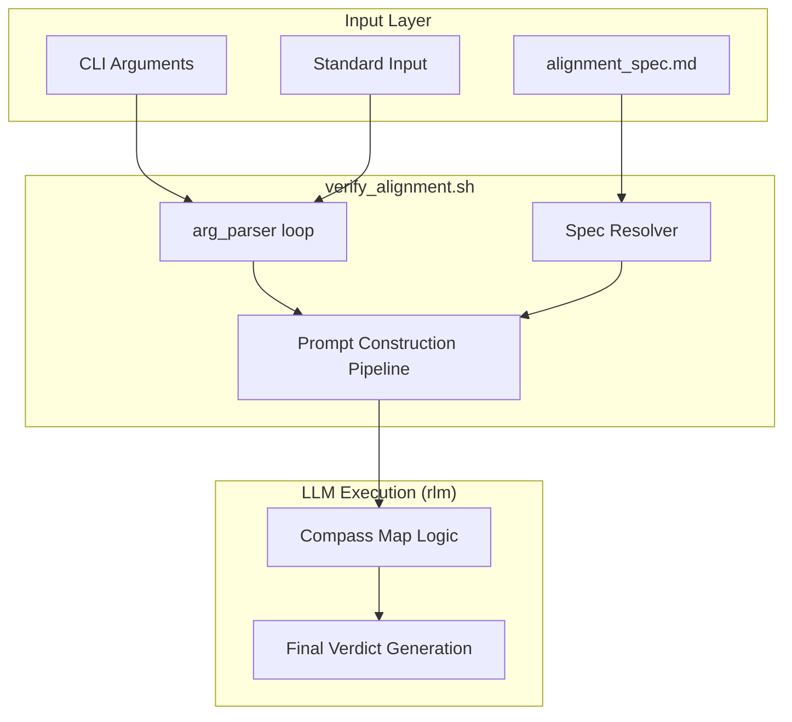
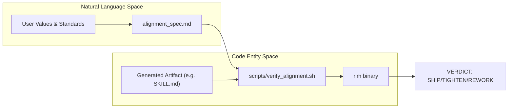

# verify-alignment Tool
Relevant source files
- [flake.nix](https://github.com/Cody-W-Tucker/Cognitive-Assistant/blob/a77ddaf6/flake.nix)
- [scripts/verify_alignment.sh](https://github.com/Cody-W-Tucker/Cognitive-Assistant/blob/a77ddaf6/scripts/verify_alignment.sh)
- [workspaces/alignment/artifacts/tool_specs/verify_alignment.md](https://github.com/Cody-W-Tucker/Cognitive-Assistant/blob/a77ddaf6/workspaces/alignment/artifacts/tool_specs/verify_alignment.md?plain=1)

The `verify-alignment` tool is a specialized shell utility designed to evaluate generated artifacts (documents, code, or plans) against the system's defined alignment standards. It serves as the final gate in the alignment verification pipeline, ensuring that any output produced by the agent or a user satisfies the specific taste, quality, and structural requirements defined in the `alignment_spec.md`.

## Overview and Purpose

The tool acts as a wrapper around the `rlm` (Reasoning Language Model) binary, forcing a specific "Compass" judgment methodology to provide objective, structured critiques. Its primary mission is to determine if an artifact is ready to "ship" or if it requires further refinement.

### Key Capabilities

- **Artifact Validation**: Compares any text-based input against the `alignment_spec.md` rubric.
- **Structured Verdicts**: Returns one of three verdicts: `SHIP`, `TIGHTEN`, or `REWORK`.
- **Context Flexibility**: Supports multiple input streams including local files, directories, URLs, and standard input.
- **Forced Methodology**: Enforces a four-quadrant "Compass Map" analysis before generating a final judgment to ensure deep reasoning.

Sources: [scripts/verify_alignment.sh2-12](https://github.com/Cody-W-Tucker/Cognitive-Assistant/blob/a77ddaf6/scripts/verify_alignment.sh#L2-L12)[workspaces/alignment/artifacts/tool_specs/verify_alignment.md3-12](https://github.com/Cody-W-Tucker/Cognitive-Assistant/blob/a77ddaf6/workspaces/alignment/artifacts/tool_specs/verify_alignment.md?plain=1#L3-L12)

---

## CLI Usage and Flags

The tool is packaged as a Nix application and can be invoked directly from the development environment.

### Command Syntax

```
verify-alignment [FLAGS] [OPTIONAL_INSTRUCTION]
```

### Flags

| Flag | Description |
| --- | --- |
| `--file PATH` | Loads a file, directory, or glob as the artifact to evaluate. |
| `--url URL` | Fetches content from a URL to use as context/artifact. |
| `--text TEXT` | Provides inline text for evaluation. |
| `--stdin` | Reads the artifact content from standard input. |
| `--model ID` | Overrides the default root LLM model. |
| `--provider NAME` | Overrides the configured LLM provider (e.g., `openai`, `anthropic`). |
| `--verbose` | Prints `rlm` progress events to `stderr`. |

Sources: [scripts/verify_alignment.sh62-78](https://github.com/Cody-W-Tucker/Cognitive-Assistant/blob/a77ddaf6/scripts/verify_alignment.sh#L62-L78)[workspaces/alignment/artifacts/tool_specs/verify_alignment.md29-36](https://github.com/Cody-W-Tucker/Cognitive-Assistant/blob/a77ddaf6/workspaces/alignment/artifacts/tool_specs/verify_alignment.md?plain=1#L29-L36)

---

## Technical Implementation

### Environment and Spec Resolution

The script resolves the `alignment_spec.md` (the rubric) using the following priority:

1. The `ALIGNMENT_SPEC` environment variable.
2. The default path at `workspaces/alignment/artifacts/alignment_spec.md`.

In the Nix flake configuration, the `verify-alignment` package is defined with a default `ALIGNMENT_SPEC` pointing to the workspace artifact to ensure it works out-of-the-box.

Sources: [flake.nix97-105](https://github.com/Cody-W-Tucker/Cognitive-Assistant/blob/a77ddaf6/flake.nix#L97-L105)[scripts/verify_alignment.sh117-125](https://github.com/Cody-W-Tucker/Cognitive-Assistant/blob/a77ddaf6/scripts/verify_alignment.sh#L117-L125)

### Data Flow: From CLI to RLM

The following diagram illustrates how the `verify-alignment.sh` script processes inputs and constructs the final prompt for the `rlm` engine.

**Alignment Verification Data Flow**



Sources: [scripts/verify_alignment.sh26-108](https://github.com/Cody-W-Tucker/Cognitive-Assistant/blob/a77ddaf6/scripts/verify_alignment.sh#L26-L108)[scripts/verify_alignment.sh139-172](https://github.com/Cody-W-Tucker/Cognitive-Assistant/blob/a77ddaf6/scripts/verify_alignment.sh#L139-L172)

---

## Compass Map Methodology

The tool forces the LLM to use a `compass` judgment style. Before rendering a verdict, the system must build an explicit knowledge map based on four cardinal directions:

| Direction | Focus Area | Implementation Detail |
| --- | --- | --- |
| **North** | **Origin** | Framing, context, and the artifact's intent. |
| **West** | **Coherence** | Adjacent patterns and what aligns with the spec. |
| **East** | **Friction** | Contradictions, omissions, and weak spots. |
| **South** | **Implications** | Downstream effects and operator impact if shipped. |

The script injects these instructions into the `QUERY` variable, ensuring the model "makes the implicit structure explicit" before evaluating the 10-point checklist found in the alignment spec.

Sources: [scripts/verify_alignment.sh145-162](https://github.com/Cody-W-Tucker/Cognitive-Assistant/blob/a77ddaf6/scripts/verify_alignment.sh#L145-L162)

---

## Post-Verification Procedures

Once `rlm` completes the evaluation, it returns a structured response. The system defines specific procedures for handling each verdict.

### Verdict Lifecycle

| Verdict | Meaning | Required Action |
| --- | --- | --- |
| **SHIP** | Alignment achieved. | No action; the artifact is ready. |
| **TIGHTEN** | Minor misalignments. | Apply provided `CORRECTIONS` inline. For documents, weave fixes into content. For code, apply fixes and document assumptions. |
| **REWORK** | Structural failure. | Stop. Present a summary of issues to the user and propose a new approach before proceeding. |

### System Integration Diagram

This diagram shows how the `verify-alignment` tool bridges the "Natural Language Space" (the user's taste in `alignment_spec.md`) with the "Code Entity Space" (the actual `scripts/verify_alignment.sh` and the generated artifacts).

**Verification Bridge**



Sources: [scripts/verify_alignment.sh144-172](https://github.com/Cody-W-Tucker/Cognitive-Assistant/blob/a77ddaf6/scripts/verify_alignment.sh#L144-L172)[workspaces/alignment/artifacts/tool_specs/verify_alignment.md40-92](https://github.com/Cody-W-Tucker/Cognitive-Assistant/blob/a77ddaf6/workspaces/alignment/artifacts/tool_specs/verify_alignment.md?plain=1#L40-L92)

---

## Integration with Nix

The tool is exposed via the project's `flake.nix`. It includes `rlm` as a `runtimeInput`, ensuring that the environment is always correctly configured when the tool is run.

```
verify-alignment = pkgs.writeShellApplication {
  name = "verify-alignment";
  runtimeInputs = [ rlm.packages.${pkgs.stdenv.hostPlatform.system}.default ];
  text = ''
    ALIGNMENT_SPEC="''${ALIGNMENT_SPEC:-${./workspaces/alignment/artifacts/alignment_spec.md}}"
    export ALIGNMENT_SPEC
    exec ${./scripts/verify_alignment.sh} "$@"
  '';
};
```

Sources: [flake.nix97-105](https://github.com/Cody-W-Tucker/Cognitive-Assistant/blob/a77ddaf6/flake.nix#L97-L105)